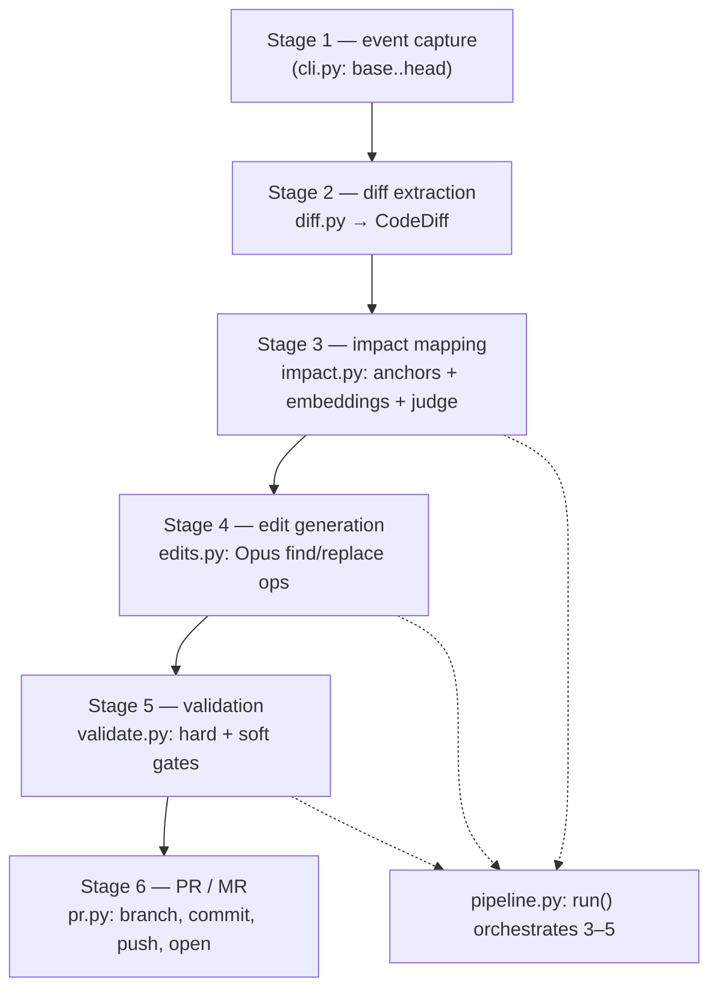

This page traces a single code change end to end through docsync's `run` pipeline, so you know which module owns each step and where to look when a sync behaves unexpectedly. Read it before diving into any individual stage file — it is the map the per-stage docs assume.

The flow is six stages. The CLI (`cli.py`) captures the event and extracts the diff; the pure core (`pipeline.py`) maps impact, generates edits, and validates; `pr.py` opens the review request. No git side effects happen until that final stage — everything in between is pure transformation over a `CodeDiff`.

## Stage 2 — diff extraction (`diff.py`)

**The job: turn a `base..head` comparison into a structured `CodeDiff`.** Two public entry points produce the same shape — `diff_local` shells out to `git diff --unified=3 -M` for the CLI dogfood path, and `diff_github` calls `gh api repos/{repo}/compare/...` for CI. Both delegate parsing to `parse_patchset`, which uses the `unidiff` library to build one `ChangedFile` per file in the patch.

`parse_patchset` is factored out deliberately so tests can feed an inline diff string with no git or subprocess. For each patched file it resolves the path (`_strip_ab_prefix` drops git's `a/`/`b/` markers and maps `/dev/null` to `None`), classifies the change with `_status_of` (`ADDED`/`REMOVED`/`RENAMED`/`MODIFIED`), records the previous path on renames, and captures the raw hunks. The subprocess helper `_run` centralizes error handling — a missing `git`/`gh` binary or non-zero exit becomes a clear `RuntimeError`.

### The load-bearing signal: changed symbols

`extract_changed_symbols` recovers the function, class, and module-level assignment names a set of hunks touch — and it does so from hunk text alone, never requiring the full post-image file. That portability is what lets the GitHub path (which only has per-file `patch` fragments) produce the same symbol signal as the local path.

It combines two complementary signals, heading first:

| Signal | Source | Why it matters |
|--------|--------|----------------|
| Enclosing scope | The heading git appends after the second `@@` (`@@ ... @@ def register_routes(app):`) | Names the function or class whose body changed even when its own signature line is untouched |
| Changed lines | Added (`+`) / removed (`-`) lines, skipping `+++`/`---` markers | Catches `def`/`class`/module-level `NAME = ...` introduced or deleted by the hunk |

The regex helpers `_symbols_from_text` (pulls `def`/`class` names anywhere, plus top-level assignments with no leading indentation) and `_add` (de-dupes while preserving order) implement those signals. Extraction is Python-only — `extract_changed_symbols` returns `[]` for any non-`.py` file. These symbols flow downstream as the high-precision matching key for impact mapping.

## Stage 3 — impact mapping (`impact.py`)

**The job: decide which doc pages a diff invalidates, cheaply and precisely.** `map_impact()` (the orchestrator `pipeline.py` calls) runs a hybrid, anchor-first strategy in three layers.

1. **Anchors (deterministic).** `find_anchor_candidates` matches the diff's changed paths against each manifest page's `source.globs` (via `fnmatch`) and changed symbols against `source.symbols`. `_symbol_matches` supports exact matches plus trailing-`*` prefixes (`ENV_*` matches `ENV_HOST`). The candidate's score is simply the number of hits, and the reason names what matched. When `config.anchor_autopass` is set, these high-precision hits skip the LLM judge entirely.
2. **Embeddings (optional recall-net).** `find_embedding_candidates` ranks pages by semantic similarity to the diff's identifier tokens, catching pages whose manifest anchors are stale or missing. `_query_tokens` builds the query from changed symbols plus changed-path basenames, dropping configured stopword symbols. It needs the `sentence-transformers` extra; the encoder is injectable for tests, and if the extra is absent it returns `[]` so the pipeline degrades gracefully to anchors only.
3. **Judge (Haiku).** Non-autopass candidates are confirmed by an LLM judge before reaching the expensive edit stage. The judge is told to answer `affected=true` only when the diff changes something the page documents, and to prefer `affected=false` for internal refactors.

### Repo scoping and mono-repo hygiene

Anchors are repo-scoped so a source for another repo can't match the wrong diff. `_repo_matches` compares normalized repo keys via `_repo_key`, which reduces any reference — a local checkout path, a fork, or canonical `owner/name` — to its bare lowercased name (stripping `.git`). An empty source repo is a wildcard, so single-repo manifests needn't repeat the repo on every anchor.

For mono-repo runs, `filter_docs_paths` drops files under `docs_root` from the diff before mapping (using the inner `_under_docs` predicate against the path and any `previous_path`). Without it, a merged doc change would map onto itself and spuriously drive further edits. A `docs_root` of `"."` is a no-op — there's no code subtree to separate.

## Stage 4 — edit generation (`edits.py`)

**The job: ask Opus for a small list of find/replace edit ops — never a full rewrite — and apply them with a strict uniqueness check.** `build_edit_prompt` returns `(system_prompt, user_prompt)` split out from generation so tests can assert prompt content without an API call. `_build_system_prompt` encodes the rules: every `find` must be a verbatim, unique substring; edit only what the diff invalidates; match the page's existing structure (add a row to a table that exists, not a prose paragraph); and either keep or never touch the YAML frontmatter depending on `allow_frontmatter_edit`.

`apply_edits` is the strict applier. For each `EditOp` in the `PageEdit`, `find` must occur in the current working text **exactly once** — it never fuzzy-matches and never replaces all. Ops apply sequentially against the evolving text, so a later op sees earlier results; an empty edit list returns the text unchanged.

:::warning
When a `find` can't be applied, `apply_edits` raises `EditApplicationError` with an `ambiguous` flag (set in its `__init__`) that drives the pipeline's retry decision. `ambiguous=False` means the `find` matched **zero** times — unfixable by re-prompting, so the page is dropped. `ambiguous=True` means it matched **more than once** — fixable, so the pipeline retries once with `NON_UNIQUE_RETRY_HINT` asking for longer, anchored `find` strings.
:::

To control cost, `should_cache_diff` decides whether to cache the run-invariant rendered diff as a shared prompt block. It returns `True` only when more than one page will be edited (so reads amortize the single cache write) **and** the rendered diff clears the model's ~4096-token cacheable-prefix floor (`_CACHE_DIFF_MIN_CHARS`). The pipeline primes the cache on page 1, then fans out the rest within the 5-minute ephemeral window.

## Stage 5 — validation and the orchestrator (`pipeline.py`)

**`run()` is the pure core that ties stages 3–5 together** and returns a `PipelineResult` describing, per page, the surgical edit and whether it passed validation. It performs no git side effects — the CLI decides whether to write files or open a PR. All LLM calls (judge, edit, critique) go through one injected `client`, wrapped in a `MeteredClient` so token usage and estimated cost land on `result.usage`.

`run()` sequences the work as follows:

- **Map impact** via `map_impact`, persisting the embeddings index under `.docsync/state/embeddings` so CI can cache it.
- **Sort and gate.** Pages are sorted highest-confidence first (with `page_path` as a deterministic tiebreak), partitioned by a confidence floor (`min_confidence` CLI flag or `config.min_edit_confidence`), then capped to `max_pages_per_run`. The cap counts only pages that reach the expensive edit stage, so below-floor pages never starve high-confidence ones.
- **Process each page** through `_process_page`.

`_process_page` runs stages 4–5 for one page and returns a self-contained `PageOutcome`. It is pure with respect to shared state and never raises — safe under the thread pool, since an escaping exception would abort the whole map. It reads the page off disk with `_read_page` (which returns `None` if the file is missing), calls `generate_page_edit`, optionally applies adversarial self-critique (best-effort — a failure keeps the original edit rather than blocking the page), applies the edits, and handles the bounded non-unique retry described above. Validation (`validate.py`) then enforces hard gates — frontmatter freeze, structural-signature integrity, diff-size guardrail, not-truncated — plus a soft broken-links gate.

## Stage 6 — PR creation (`pr.py`)

**The job: branch, commit the written pages plus the advanced cursor, push, and open a reviewable PR or MR.** `open_pr` checks out a branch, adds the changed paths and `.docsync/state/cursors.json`, commits, and pushes. The branch name is deterministic — `branch_name` produces `docsync/{repo-slug}-{head_sha[:8]}` — so a re-run on the same head force-pushes and **updates the existing review request in place** rather than erroring on a duplicate.

The host is chosen by `forge`: `_resolve_forge` honors an explicit `"github"`/`"gitlab"` and otherwise calls `detect_forge`, which inspects the `origin` remote URL — `"gitlab"` in the URL picks GitLab (MR via `glab`), everything else defaults to GitHub (PR via `gh`). The low-level `_git` helper runs every git command and raises a `RuntimeError` on failure.

In dry-run mode there is no PR: `write_patch` writes the working-tree diff to a `.patch` file for human inspection, returning `None` when the docs repo isn't a git repo (e.g. a fresh scaffold) so a missing patch never crashes the command.

:::note
Per the self-docs dogfood loop, docsync's own `docs:` PRs are **never auto-merged** — they are always human-reviewed. The deterministic branch name is what lets a follow-up push refresh that same open PR.
:::

## Sibling path: bootstrap ingest (`ingest.py`)

The `run` flow above starts from a *diff*. The `bootstrap` flow starts from a *snapshot* and uses `ingest.py` instead of `diff.py` — worth knowing so you don't confuse the two symbol extractors. `walk_repo` does a strictly read-only walk of a service repo, pruning excluded directories (`resolve_exclude_dirs` merges `DEFAULT_EXCLUDE_DIRS` with config-supplied names) and distilling each source file into a lightweight `SourceUnit` (path + kind + top-level symbol names, never the body). `walk_repos` runs the same over several repos for a cross-repo plan, and `read_excerpt` reads a single file's text — truncated to a budget — later, only for the pages the planner authors.

Its symbol extractor differs from the diff module's. `extract_symbols` dispatches by language (`_kind`): Python goes through `_python_symbols`, which is **AST-based** (more accurate than hunk regexes, with a regex fallback when a file doesn't parse), while TypeScript uses an export regex. `_add` de-dupes and `_matches_any` applies the include globs. The contrast is the key point: `ingest.extract_symbols` works on full file text, whereas `diff.extract_changed_symbols` works on hunks alone.

## Where it lives

| Stage | Module | Key entry points |
|-------|--------|------------------|
| 2 — diff extraction | `src/docsync/diff.py` | `diff_local`, `diff_github`, `parse_patchset`, `extract_changed_symbols` |
| 3 — impact mapping | `src/docsync/impact.py` | `map_impact`, `find_anchor_candidates`, `find_embedding_candidates`, `filter_docs_paths` |
| 4 — edit generation | `src/docsync/edits.py` | `build_edit_prompt`, `apply_edits`, `should_cache_diff`, `EditApplicationError` |
| 3–5 — orchestration | `src/docsync/pipeline.py` | `run`, `_process_page` |
| 6 — PR / MR | `src/docsync/pr.py` | `open_pr`, `branch_name`, `detect_forge`, `write_patch` |
| B1 — bootstrap ingest | `src/docsync/ingest.py` | `walk_repo`, `walk_repos`, `extract_symbols`, `read_excerpt` |

For the validation gates referenced in Stage 5, see `validate.py`; for the surgical-edit contract (`EditOp`/`PageEdit`) and `CodeDiff`/`ChangedFile`, see `models.py`.