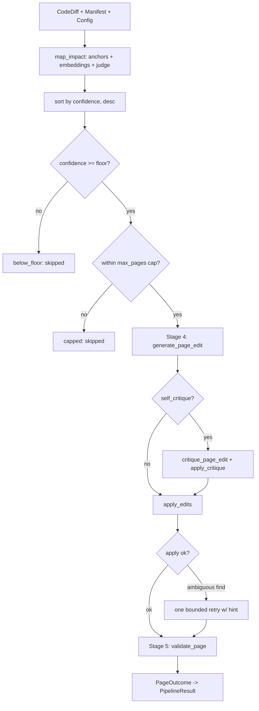

The `run` pipeline is docsync's diff-driven core: given a single `CodeDiff`, a manifest, and config, it figures out which doc pages a code change invalidated, rewrites them with surgical find/replace edits, and gates every result before it can reach a PR. Reach for this page when you need to understand *what each stage does, why it exists, and what it can drop a page for* — not how to invoke the CLI.

The orchestrator is `pipeline.run()` (`pipeline.py`). It is the pure core: no git side effects, no file writes. It returns a `PipelineResult` whose `.changed()` lists pages with applied, validated edits that the CLI may then write and open as a PR.

## Where this sits in the larger flow

The full lifecycle is six stages. This page covers stages 3–5, the part `run()` owns.

| Stage | What happens | Where |
|-------|--------------|-------|
| 1 — Event capture | A merged PR fires the run | CLI (`cli.py`) |
| 2 — Diff extraction | Build a `CodeDiff` | CLI |
| **3 — Impact** | Map the diff to candidate pages | `impact.py` |
| **4 — Edit** | Generate surgical find/replace ops | `edits.py` |
| **4b — Critique** | Drop ops not faithful to the diff (opt-in) | `critique.py` |
| **4c — Polish** | Readability-only second pass (opt-in) | `polish.py` |
| **5 — Validate** | Hard/soft gates before a page ships | `validate.py` |
| 6 — PR creation | Write files, open a reviewable PR | `pr.py` |

## End-to-end flow

`run()` maps the diff once, sorts impacted pages by confidence, applies a confidence floor and a per-run page cap, then processes each surviving page independently (under a thread pool) through stages 4–5.

A page can exit the pipeline at any stage with a `PageOutcome.note` explaining why — below the floor, over the cap, not found on disk, no edits returned, dropped by critique, unapplicable, or failed validation. Nothing here raises out of a page: `_process_page` is pure with respect to shared state and never throws, which is what makes it safe to fan out across a thread pool.

## Stage 3 — Impact: which pages does this diff affect?

Impact mapping is a **hybrid, anchor-first** mapper (`impact.py`) that answers "which doc pages did this code change invalidate?" It combines three signals so it is both precise and hard to fool.

- **Anchors (deterministic).** `find_anchor_candidates` matches the diff's changed paths against each manifest page's `source.globs` (via `fnmatch`) and changed symbols against `source.symbols`. Symbol matching is exact, plus trailing-`*` prefix matching (`_symbol_matches`: `ENV_*` matches `ENV_HOST`). The candidate's score is the number of matches; the reason names exactly what matched. When `config.anchor_autopass` is set, anchored pages skip the LLM judge entirely.
- **Embeddings (optional recall-net).** `find_embedding_candidates` ranks pages by semantic similarity to the diff's identifier tokens (`_query_tokens`: changed symbols + changed-path basenames, minus configured stopwords). It needs the `sentence-transformers` extra and **degrades to `[]` when that isn't installed** — the pipeline then runs anchors-only. `pages=None` scans the whole docs tree, catching pages the manifest never anchored.
- **Judge (Haiku LLM).** Non-autopass candidates are confirmed by a conservative judge before reaching the expensive edit stage. Its system prompt (`_JUDGE_SYSTEM`) tells it to answer `affected=true` only when the diff changes something the page documents, and to prefer `affected=false` for internal refactors.

Two repo-shape helpers keep matching honest. `_repo_matches`/`_repo_key` normalize a repo reference to its bare name so the same anchor matches whether the diff came from a local checkout path, a fork, or a `gh` path — and an empty `source.repo` acts as a wildcard for mono- and single-repo manifests. `filter_docs_paths` drops files under `docs_root` from the diff on mono-repo runs (by `path` and `previous_path`), so a merged doc change can't map onto itself and spuriously drive further edits; a `docs_root` of `"."` is a no-op.

## Confidence floor and page cap

Before any edit work, `run()` sorts impacted pages by `(-confidence, page_path)` and partitions them. Pages with `confidence >= confidence_floor` are eligible; the rest land in `below_floor` and are skipped. The cap (`max_pages`, defaulting to `config.max_pages_per_run`) then applies **only to eligible pages**, so low-confidence pages never starve high-confidence ones out of the budget. Anchor autopass scores 1.0, so the floor only ever gates judge- or embedding-sourced pages — useful for a conservative first rollout (`min_confidence` CLI flag overrides the config floor).

## Stage 4 — Edit: surgical find/replace, never a rewrite

Edit generation (`edits.py`) asks Opus for **a small list of find/replace `EditOp`s wrapped in a `PageEdit` — never a full rewrite.** The system prompt (`_build_system_prompt`) constrains the model hard: each `find` must be a verbatim, unique substring of the current page; edit only the rows/prose/fence lines the diff invalidates; match the page's existing structure when adding content; and never touch frontmatter unless the manifest opts in. If the page isn't actually invalidated, the model returns an empty edits list with a `no_change_reason`.

### Strict application

`apply_edits` is the safety contract: every op's `find` must occur in the current working text **exactly once**. Zero matches or more than one raises `EditApplicationError` — it never fuzzy-matches and never replace-alls. Ops apply sequentially, so a later op sees the result of earlier ones.

The error carries an `ambiguous` flag that drives the pipeline's recovery:

| `find` matched | `ambiguous` | Pipeline response |
|----------------|-------------|-------------------|
| 0 times (not found) | `False` | Drop the page — re-prompting can't fix a hallucinated anchor |
| >1 times (non-unique) | `True` | One bounded retry with `NON_UNIQUE_RETRY_HINT` asking for longer, anchored `find` strings |

### Diff caching

`should_cache_diff` decides whether to cache the run-invariant diff as a shared prompt block. It returns `True` only when more than one page will be edited (so there are cache reads to amortize the single write) **and** the rendered diff clears the model's ~4096-token cacheable-prefix floor (`_CACHE_DIFF_MIN_CHARS`). The pipeline primes the cache on page 1, then fans out the rest so reads land inside the 5-minute ephemeral window.

## Stage 4b — Critique: an adversarial faithfulness gate

Self-critique (`critique.py`, opt-in via `--self-critique` / `config.self_critique`) runs a cheap second Haiku call that judges each proposed op against the actual diff and drops the ones that aren't faithful. Its single question is *faithfulness, not quality*: keep an op if it reflects something the diff changed (even adding correct-but-undocumented detail about a real change), reject it only if it's about something the diff did **not** touch — a hallucinated symbol, an unrelated section, an over-reaching rewrite.

The contract is deliberately flat so the structured-output backend has nothing nested to validate:

- `CritiqueVerdict` — `faithful: bool`, `rejected_finds: list[str]` (the exact `find` strings to drop), and a short `reason`. `faithful` is `True` iff `rejected_finds` is empty.
- `build_critique_prompt` — assembles the user message (changed paths + symbols + rendered diff + every op's find/replace/rationale); split out so prompt content is unit-testable without a client.
- `critique_page_edit` — mirrors the `messages.parse(...)` idiom from `edits.py`, defaults to the Haiku judge model (`model` overrides; `system_extra` appends to the cached system prefix), and returns the parsed `CritiqueVerdict`.
- `apply_critique` — a pure helper that returns a new `PageEdit` with the `rejected_finds` ops removed (matched on exact `find`, original order preserved, input not mutated). If every op is rejected, the result is empty and the pipeline treats the page as no-change.

:::note
Critique is best-effort. In `_process_page`, any exception from the critique call is caught and the original edit is kept — a critique failure must never block a page.
:::

## Stage 4c — Polish: a fact-frozen readability pass

Polish (`polish.py`, opt-in via `--polish` / `config.readability_pass`) optionally runs one more LLM pass that revises a page for **readability only — without changing any facts.** It reuses the `PageEdit` contract and the strict `apply_edits` path, so it can only make surgical, reviewable changes. The system prompt enforces a hard constraint: add/remove/change no API, parameter, value, route, or behavior; never touch frontmatter or component/callout structure; only restructure, condense, clarify, or re-order what's already there (a new lead sentence is allowed only if it paraphrases existing content). The craft rubric (`style.INVERTED_PYRAMID`, `style.SCANNABILITY`, `style.kind_structure`) is shared with authoring and editing.

The three entry points:

- `build_polish_prompt(page_path, page_text, kind)` — returns `(system, user)`; split out for unit testing.
- `polish_page(...)` — asks the edit model for readability-only ops, metered under the `"polish"` stage, with a token budget scaled by the per-kind thoroughness level.
- `polish_text(...)` — runs the pass and returns `(text, polished, note)`.

`polish_text` is the safety wrapper: it **falls back to the input text** (`polished=False`) on *any* failure — an LLM error, ops that don't apply, changed frontmatter (`_frozen_frontmatter_ok`), a body trimmed below `_MIN_BODY_RATIO` of the original (`_body_not_gutted`), or a structural-gate failure from `validate_new_page`. A bad polish can never regress an already-valid page.

## Stage 5 — Validate: gates before a page ships

Validation (`validate.py`) is the last line of defense: every candidate must survive a battery of gates before it's allowed into a PR. There are two entry points for the two generation flows.

`validate_page` compares `original_text → new_text` for **edited** pages (the `run` path). Its hard gates — any failure sets `passed=False` and drops the page:

1. **Frontmatter freeze** (`_check_frontmatter`) — frozen keys must be unchanged unless the manifest opts in (`allow_frontmatter_edit`), and frontmatter must still parse.
2. **Component / mermaid integrity** — structural signatures must be identical; the fence count must be even.
3. **Diff-size guardrail** — net changed lines must stay within budget (a runaway rewrite is rejected).
4. **Non-empty / not-truncated** — new text must exist and not drop below `_TRUNCATION_MIN_RATIO` (0.5) of the original length.

`validate_new_page` validates a **from-scratch** page (the `bootstrap` path) with *absolute* gates, since there is no original to diff against: frontmatter parses and `title` + `description` are present and non-empty (`_check_frontmatter_complete`); components are well-formed and fences even (`_check_even_fences`, via `_fence_parity_failure`); and the page is at least `_NEW_PAGE_MIN_CHARS` (200) long, not a stub (`_check_min_length`). The small helpers — `_is_blank`, `_fence_parity_failure` — back these checks.

`get_adapter` resolves the adapter that owns a page (defaulting to mintlify); it raises `ValueError` for a page the active adapter doesn't own, so the caller can drop the page rather than silently skip it.

:::warning
The broken-link check is the one **soft** gate. When `check_links` and `docs_root` are supplied, its findings are appended to `.warnings` and `passed` stays `True` — a single patched page legitimately references sibling pages that haven't been written yet, so a broken link annotates the PR instead of blocking it.
:::

## Key design decisions

- **Surgical edits, not rewrites.** Every stage that touches a page emits find/replace ops applied with a single-occurrence check. This keeps changes reviewable and bounds the blast radius of a bad generation.
- **Cheap gates guard expensive ones.** Deterministic anchors short-circuit the judge; the judge guards the Opus editor; the flat-verdict critique guards validation. Each layer is cheaper than the one it protects.
- **Fail safe, per page.** Critique failures keep the original edit; polish failures fall back to the input; validation failures drop one page, not the run. Page processing never raises, so one bad page can't abort the fan-out.
- **Graceful degradation.** Missing the embeddings extra silently disables the recall-net rather than erroring — the pipeline runs anchors-only.

## Where it lives in the code

| Stage | Module | Key entry point |
|-------|--------|-----------------|
| Orchestration | `pipeline.py` | `run`, `_process_page`, `_read_page` |
| Impact | `impact.py` | `map_impact`, `find_anchor_candidates`, `find_embedding_candidates`, `filter_docs_paths` |
| Edit | `edits.py` | `apply_edits`, `build_edit_prompt`, `should_cache_diff`, `EditApplicationError` |
| Critique | `critique.py` | `critique_page_edit`, `apply_critique`, `CritiqueVerdict`, `build_critique_prompt` |
| Polish | `polish.py` | `polish_text`, `polish_page`, `build_polish_prompt` |
| Validate | `validate.py` | `validate_page`, `validate_new_page`, `get_adapter` |

To go deeper on any single stage, start at its entry point above; the prompt-building helpers (`build_*_prompt`) are split out specifically so you can read and test the exact instructions each LLM call receives without making a network request.