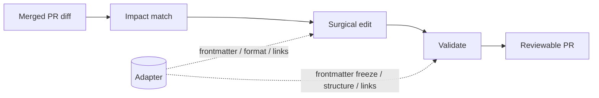

The **adapter** is the layer that holds docsync's framework-specific knowledge — where frontmatter lives, which components are legal, how internal links resolve — keeping the rest of the pipeline (impact matching, surgical editing, validation) format-agnostic. docsync edits real documentation files, so it has to know the conventions of the site it is writing into. This page explains what adapters are, which frameworks docsync targets today, and where the boundary sits so you can reason about what will and won't work against your site.

## What an adapter is and why it exists

An adapter answers framework-specific questions on behalf of the core pipeline. The edit and validate stages don't hard-code "this is a Mintlify site" — they ask the adapter. That separation means the find/replace editing engine, the structural-signature integrity check, and the link validator stay the same regardless of which documentation framework you publish with.

Concretely, an adapter is responsible for the parts of a page that differ between frameworks:

| Concern | What the adapter decides |
|---------|--------------------------|
| Frontmatter | Which keys are the page's frozen metadata (e.g. `title`, `description`) that edits must not touch |
| Page format | Whether pages are `.mdx` (components allowed) or plain `.md` (Markdown only) |
| Components | Which inline components are legal in the body, so edits and validation don't introduce something the site can't render |
| Links | How an internal cross-page link is written and resolved, so the broken-link soft gate can check it |

Because these concerns are localized, adding a framework is mostly a matter of teaching a new adapter these rules — the editing and validation guarantees come for free.

## How the adapter fits the pipeline

The adapter is consulted at the edges of a run: when docsync reads a page in, and when it validates the edited page before opening a PR. The LLM-driven middle — matching a diff to pages and producing surgical `EditOp`s — does not depend on the framework.

The dotted lines are the only places framework knowledge enters. Everything else is shared.

## The frameworks docsync targets

docsync targets MDX- and Markdown-based static documentation sites. Three flavors sit on a spectrum from "richest component support" to "lowest common denominator":

- **Mintlify** — the reference, fully-implemented adapter (`adapters/mintlify.py`). docsync's own self-docs site is a Mintlify site, so this path is the most exercised. Pages are `.mdx`, with YAML frontmatter and Mintlify components in the body.
- **Docusaurus** — Markdown/MDX with YAML frontmatter and its own admonition and `<Tabs>`/`<TabItem>` conventions. It shares the same editing and validation core; the adapter's job is to encode its component and link rules.
- **Plain Markdown** — the simplest target: `.md` files, optional frontmatter, no components. Anything the editor would add must be expressible as ordinary Markdown.

:::note
docsync ships one concrete adapter today — Mintlify (`adapters/mintlify.py`). Docusaurus and plain Markdown describe the format families the adapter abstraction is designed to cover; treat them as the shape a future adapter takes, not as turnkey support. When in doubt about your site, run `docsync doctor` to validate the manifest against your real checkout.
:::

## Why the editing core is framework-agnostic

The key design decision is that docsync makes **surgical find/replace edits, never full rewrites**, and validates them with structural rules rather than format-specific templates. That is what lets one editing engine serve several frameworks.

Two validation gates do the heavy lifting and apply the same way everywhere:

- **Frontmatter freeze** — the page's metadata block (whatever the adapter designates) cannot be altered by an edit. A `title` or `description` stays put even when the surrounding prose changes.
- **Structural-signature integrity** — the page's block structure (headings, code fences, components) is fingerprinted before and after. Additive, leaf-level growth is allowed; decreases or container/nesting changes are rejected. This is why an edit can add a balanced `:::note … :::` admonition or a new `<TabItem>` but cannot silently drop a code fence or reorder sections.

Because these gates reason about structure rather than a specific framework's syntax tree, the same guarantees hold whether the page is a Mintlify `.mdx` or a plain `.md`.

## Worked example: one edit, three frameworks

Suppose a code change renames an environment variable, and the affected page documents it. The surgical edit — replacing the old variable name with the new one in a single occurrence — is identical across frameworks; only the adapter-supplied context differs:

- On a **Mintlify** page, the edit lands inside an `.mdx` body and may sit next to Mintlify components; the frontmatter `title`/`description` are frozen.
- On a **Docusaurus** page, the same replacement applies, and if a callout is warranted it is written as a `:::warning … :::` admonition — balanced, additive, and accepted by the structural gate.
- On a **plain Markdown** page, the edit is the bare text replacement with no components introduced.

In every case the impact, edit, and validate stages run unchanged; the adapter only frames the page's metadata, legal components, and links.

## Where it lives in the code

- `adapters/mintlify.py` — the only concrete adapter; the reference implementation of the format-specific contract.
- `edits.py` — produces and applies surgical `EditOp`s with a strict single-occurrence check (framework-agnostic).
- `validate.py` — the hard gates (frontmatter freeze, structural-signature integrity, diff-size guardrail, not-truncated) and the soft broken-link gate.
- `style.py` — the documentation-craft rules shared by author, edit, and polish, independent of framework.

To check whether your site's pages line up with the manifest anchors docsync will edit, run `docsync doctor` against a real checkout before relying on a sync.