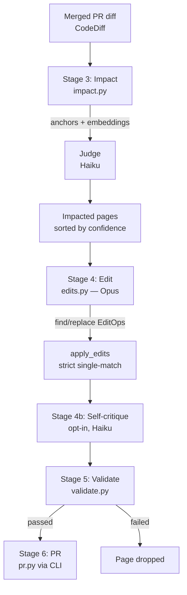

docsync keeps documentation in sync with code when the two live in **separate repos**. This page explains the `run` pipeline end to end — how a merged PR's diff becomes a small, reviewable set of edits to existing doc pages — so you understand what each stage decides and why before you tune config or read the code.

Reach for this page when you want the mental model: how a change is detected, how the affected pages are found, and why the edits that come out are surgical rather than rewrites. For the from-scratch authoring flow, see the `bootstrap` concept page instead.

## The problem docsync solves

Most doc tooling assumes code and docs share a repo and targets API reference only. docsync's niche is the **cross-repo** shape: a code change merges in a *service repo*, but the pages it invalidates live in a *different docs repo*. docsync ingests the merged diff, figures out which pages it touched, edits just those pages, validates the result, and opens a PR against the docs repo for a human to review.

The guiding constraint is **surgery, not rewrites**. An LLM asked to "update this page" will happily rewrite the whole thing, drifting tone and quietly dropping facts. docsync instead extracts a handful of find/replace operations and applies them with a strict single-occurrence check, so a reviewer sees a minimal, legible diff.

## The pipeline end to end

The CLI captures the event and extracts the diff (stages 1–2), then hands a `CodeDiff` to the pure core in `pipeline.py:run()`, which runs impact → edit → validate (stages 3–5). The CLI takes the result and opens the PR (stage 6). No stage in the core touches git — the CLI decides whether to write files or open a PR.



### Stage 3 — Impact: which pages does this diff affect?

Impact mapping is **anchor-first and hybrid**, combining three signals so it is both precise and resilient to stale config. `map_impact()` in `impact.py` orchestrates it:

| Signal | Mechanism | Role |
|--------|-----------|------|
| **Anchors** | `find_anchor_candidates()` matches the diff's changed paths against each page's `source.globs` (via `fnmatch`) and changed symbols against `source.symbols` (exact, plus trailing-`*` prefix). | Deterministic, high-precision. When `config.anchor_autopass` is set, anchor hits skip the judge entirely. |
| **Embeddings** | `find_embedding_candidates()` ranks pages by semantic similarity to the diff's identifier tokens (`_query_tokens()`). | Optional recall-net for pages whose anchors are stale or missing. Degrades to a no-op if `sentence-transformers` isn't installed. |
| **Judge** | A Haiku call confirms a candidate is genuinely invalidated before it reaches the expensive edit stage. | Conservative gate — prefers `affected=false` for pure refactors that change nothing a reader observes. |

Two details matter for correctness. Repo identity is reconciled loosely: `_repo_key()` compares only the final path component (and strips `.git`), so the same anchor matches whether the diff came from a local checkout, a fork, or a `gh` path — and an empty `source.repo` is a wildcard. And in mono-repo runs, `filter_docs_paths()` drops files under `docs_root` from the diff first, so a merged doc change can't map onto itself and spuriously drive more edits.

Page **kind** shapes how a page flows through here. Reference pages anchor to specific files and symbols and autopass; `concept`/`guide` pages anchor to broad subsystem globs and carry `judge_required`, so they stay live without firing an edit on every unrelated change in the subsystem.

### Stage 4 — Edit: surgical find/replace, never a rewrite

For each impacted page, `edits.py` asks Opus for a small list of find/replace `EditOp`s wrapped in a `PageEdit`. The system prompt (`_build_system_prompt`) is explicit: each `find` must be a verbatim, unique substring of the current page — as small as possible (ideally one table row, sentence, or code-fence line) — and the model must edit only what the diff invalidates. If the page isn't actually invalidated, the model returns an empty edit list with a `no_change_reason`.

`apply_edits()` enforces the contract that makes this safe:

- Every `find` must occur in the working text **exactly once**. Zero matches or more than one match raises `EditApplicationError` — never a fuzzy match, never replace-all.
- Ops apply sequentially against the evolving text, so a later op sees the result of earlier ones.
- An empty edit list returns the text unchanged.

The error carries an `ambiguous` flag that distinguishes the two failure modes. A `find` that matched **zero** times (`ambiguous=False`) is unfixable by re-prompting, so the page drops. A `find` that matched **more than once** (`ambiguous=True`) is fixable: the pipeline issues one bounded retry, appending `NON_UNIQUE_RETRY_HINT` to ask for longer, anchored `find` strings that occur exactly once.

:::note
The lead sentence of a page is treated specially. The edit prompt updates the opening lead only when the change alters what the page is fundamentally about — otherwise it's left untouched, preserving the page's "most important thing first" framing.
:::

**Stage 4b — self-critique** is an opt-in pass (`--self-critique`, default from `config.self_critique`). A Haiku judge drops ops not faithful to the diff. It is best-effort: if it errors, the pipeline keeps the original edit rather than blocking the page.

### Stage 5 — Validate: hard gates before a PR

Validation is the safety net against the specific failure modes an LLM edit introduces. `validate_page()` compares the original text to the new text and runs four **hard gates** — any failure drops the page:

1. **Frontmatter freeze** — frozen keys (e.g. `title`, `description`) must be unchanged unless the manifest page opts in via `allow_frontmatter_edit`, and the frontmatter must still parse.
2. **Component / mermaid integrity** — structural signatures must match (additive leaf growth is allowed; container changes and decreases are rejected) and the ` ``` ` fence count must be even.
3. **Diff-size guardrail** — net changed lines must stay within budget, catching a runaway edit.
4. **Non-empty / not-truncated** — the new text must exist and not fall below `_TRUNCATION_MIN_RATIO` (0.5) of the original length, which would signal a botched or truncated rewrite.

The **broken-link check is a soft gate**: a single patched page legitimately references pages that don't exist yet, so findings annotate the PR (via `.warnings`) instead of blocking it. It only runs when `check_links` and `docs_root` are both supplied.

Bootstrap-authored pages use a sibling, `validate_new_page()`, with **absolute** gates instead — there's no original to diff against, so it checks that frontmatter parses with non-empty `title` + `description` (`_check_frontmatter_complete`), components are well-formed with even fences (`_check_even_fences`), and the page clears `_NEW_PAGE_MIN_CHARS` (200) so a stub doesn't pass as a real page (`_check_min_length`).

## Key design decisions and trade-offs

- **Anchor-first, judge-second.** Deterministic anchors are cheap and precise; the LLM judge only confirms what anchors (or the embeddings recall-net) surface. This keeps token spend down and makes the common case explainable — a page maps because a glob or symbol matched, not because a model felt it should.
- **Surgical edits over rewrites.** The strict single-occurrence applier trades some model freedom for reviewable, minimal diffs and protection against silent fact loss. The cost is the occasional non-unique `find`, which the bounded retry handles.
- **Confidence floor + spend cap.** `run()` sorts impacted pages by confidence, gates them by a `min_confidence` floor (anchor autopass is `1.0`, so the floor only affects judge/embedding-sourced pages), then caps how many reach the expensive edit stage with `max_pages_per_run`. Below-floor pages never starve high-confidence ones out of the budget.
- **Cost is always accounted.** Every LLM call (judge, edit, critique) goes through one injected `client` wrapped in `MeteredClient`, so token usage and estimated cost land on `result.usage`. The same injection point lets tests pass a fake client and run the whole pipeline offline.
- **Prompt caching when it pays.** `should_cache_diff()` caches the run-invariant diff as a shared prompt block only when more than one page will be edited *and* the rendered diff clears the model's ~4096-token cacheable-prefix floor — primed on page 1, then read by the rest within the ephemeral window.

:::warning
The core is pure: `run()` produces a `PipelineResult` describing per-page edits and pass/fail, but performs **no git side effects**. Writing files and opening the PR is the CLI's job (stage 6, `pr.py`). Don't expect calling the pipeline to change anything on disk.
:::

## A worked example

Suppose a service PR renames an environment variable and adds a route. The diff carries the changed file path and the changed symbols. In stage 3, the gateway's reference page anchors on `src/routes/*.py` and the symbol `KEEP_*`, both match, and with autopass the page skips the judge. In stage 4, Opus returns two ops: one replacing the old env-var name in a config table row, one adding a row for the new route — each `find` a unique substring. `apply_edits()` confirms each matches exactly once and applies them. Stage 5 checks the frontmatter is untouched, the tables stayed balanced, and the diff is small — all pass. The CLI opens a docs PR with a two-line change for a human to approve.

## Where it lives in the code

| Stage | Module | Key entry points |
|-------|--------|------------------|
| Orchestration | `pipeline.py` | `run()`, `_process_page()`, `_read_page()` |
| Impact mapping | `impact.py` | `map_impact()`, `find_anchor_candidates()`, `find_embedding_candidates()`, `filter_docs_paths()` |
| Edit generation | `edits.py` | `apply_edits()`, `build_edit_prompt()`, `should_cache_diff()`, `EditApplicationError` |
| Validation | `validate.py` | `validate_page()`, `validate_new_page()`, `get_adapter()` |
| From-scratch authoring | `bootstrap.py` | `build_plan_prompt()`, `render_digests()` |

The shared building blocks sit alongside: `models.py` holds every Pydantic model (`CodeDiff`, `PageEdit`, `ImpactCandidate`, `PipelineResult`), `cost.py` provides the `MeteredClient` wrapper, and `style.py` carries the documentation-craft rules the edit and author prompts consume. Start in `pipeline.py:run()` to follow a single diff through the whole flow.