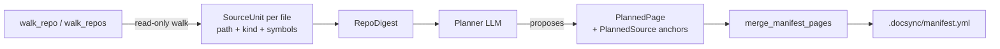

The manifest is how docsync answers one question: *given a code change, which doc pages does it touch?* Reach for this page when you're setting up `.docsync/manifest.yml`, deciding what globs and symbols to anchor a page to, or trying to understand why a change did (or didn't) route to a given page.

docsync lives in the **docs repo** but documents code in **separate service repos**. Because the two are decoupled, nothing in the file system tells docsync that `reference/alerts.mdx` documents `src/routes/alerts.py`. The manifest is that missing link — a hand-curated map from each page to the source code it's anchored to. Every anchor is a pair of *file globs* and *symbol names*, optionally scoped to a specific repo for multi-repo sites.

## What an anchor is

An anchor is a `PlannedSource` / `ManifestSource`: a repo-qualified set of file globs plus symbol names that, together, describe the slice of code a page is about.

| Field | Type | Meaning |
|-------|------|---------|
| `repo` | `str` | Which source repo this anchor belongs to (matches `CodeDiff.repo` / `RepoDigest.repo`). Empty for single-repo sites. |
| `globs` | `list[str]` | fnmatch globs over changed file paths, e.g. `src/routes/*.py`. |
| `symbols` | `list[str]` | Symbol names — function/class/module-level names. A trailing `*` means prefix match. |

A change matches a page when the diff's changed paths hit one of the page's `globs`, or the diff's changed symbols hit one of its `symbols`. The symbol signal is the durable one: it survives line-number churn and file moves in a way that raw path matching cannot, because `CodeDiff.all_symbols()` carries the function/class names a hunk actually touched, not just the file it lived in.

## How docsync knows a file's symbols

Both ends of the comparison — the diff and the manifest — speak in the same vocabulary of top-level symbol names, and `extract_symbols(path, text)` is what produces that vocabulary from a file.

`extract_symbols` dispatches on file extension:

- **Python** → AST parse via `_python_symbols`, returning only *module-level* functions, classes, and assignment targets. Nested helpers and methods are deliberately excluded — they're noise for anchoring. If the file fails to parse (syntax error, partial file, Python 2), it falls back to the `_PY_DEF_OR_CLASS` line regex so one bad file never crashes ingest.
- **TypeScript** (`.ts`/`.tsx`) → the `_TS_EXPORT_RE` regex over top-level `export` declarations (best-effort; there's no TS parser in-tree).
- **Anything else** → `[]`.

This is the same symbol vocabulary you write into a manifest anchor's `symbols` list. If `extract_symbols` would surface `load_manifest` from `config.py`, then `symbols: [load_manifest]` is a valid anchor that will match a diff touching that function.

:::note
`extract_symbols` works on **whole file text**, unlike the diff module's `extract_changed_symbols`, which parses `@@` hunks. They produce comparable names but from different inputs — full files at bootstrap time, hunks at update time.
:::

## Where anchors come from: ingest and bootstrap

You rarely write a manifest from scratch — `docsync bootstrap` generates one by walking your code. This is also the clearest way to see how anchors relate to real files.



`walk_repo(repo_path, ...)` does a strictly read-only walk of a checkout and returns a `RepoDigest` — a lightweight snapshot. For each file whose basename matches `include_globs` (default `*.py`, `*.ts`, `*.tsx`), it builds a `SourceUnit` carrying the path, a coarse `kind` tag, and the file's `symbols` (from `extract_symbols`) — **never the file body**. Directories in `exclude_dirs` (a large default set: `.git`, `node_modules`, `tests`, `migrations`, `.docsync`, …) are pruned in place so the walk never descends into them. `walk_repos(specs)` runs the same walk over several `(repo_id, path)` pairs to ingest a whole platform — for example all four Keep services — into one cross-repo plan.

The planner consumes these digests and proposes a `PlannedPage` for each page it wants, each carrying a list of `PlannedSource` anchors. `merge_manifest_pages(docs_repo, pages)` then appends those pages to `.docsync/manifest.yml`. The merge is comment-preserving (it uses a round-trip YAML instance, not the lossy safe loader) and idempotent on `path` — a page already in the manifest is skipped, and the function returns only the paths actually added.

:::warning
Anchors are kept minimal on write: `merge_manifest_pages` dumps each page with `exclude_defaults=True`, so empty `globs`/`symbols` and any guardrail left at its default are omitted from the YAML. An anchor with no globs and no symbols matches nothing — make sure a generated or hand-edited page actually carries one signal or the other.
:::

## Page kinds change how an anchor routes

A page's `kind` decides whether a matching anchor flows straight into a (costly) Opus edit or first passes through the Haiku judge.

| Kind | Anchor style | Routing on a match |
|------|-------------|--------------------|
| `reference` | Precise (specific files/symbols) | Autopass → Opus edit |
| `concept` | Broad (a whole subsystem) | Judge-required |
| `guide` | Loose (task-oriented) | Judge-required |

`PlannedPage.judge_required` returns `True` for `concept` and `guide`. The reasoning: a narrative page anchors to an entire subsystem, so autopassing would fire an expensive Opus edit on *every* change in that area. Routing through the judge means an edit only happens when the change actually invalidates the page. (This page you're reading is a `concept` — a broad anchor, judged.) Precise `reference` anchors can autopass safely because their match set is tight.

## Loading the manifest at runtime

`load_manifest(docs_repo)` reads `.docsync/manifest.yml` from the repo's `.docsync/` directory and validates it into a `Manifest`. It **raises `FileNotFoundError`** if the file is missing — a docsync-enabled docs repo must have one. Its sibling `load_config(docs_repo)` is more forgiving: it returns a default `DocsyncConfig` when `config.yml` is absent, and raises `ConfigError` (with the offending field named) only when the file exists but doesn't validate.

The manifest is read-only at runtime; the only mutable persisted state lives next to it in `state/cursors.json`, managed by `load_cursors` / `save_cursors` / `already_processed` / `advance_cursor` for idempotency (one PR per `head_sha` per repo). `resolve_repo_mode` reads the manifest's anchors to detect topology — `poly` when anchors span more than one distinct source repo, otherwise `single` (or `mono` when the diff's repo *is* the docs repo).

## A worked example

Suppose `keep-api-gateway` merges a PR that edits the `create_alert` and `list_alerts` functions in `src/routes/alerts.py`. The diff produces a `CodeDiff` whose `changed_paths()` includes `src/routes/alerts.py` and whose `all_symbols()` includes `create_alert` and `list_alerts`.

A manifest page anchored like this will match:

```yaml
pages:
  - path: reference/alerts.mdx
    kind: reference
    sources:
      - repo: keephq/keep-api-gateway
        globs:
          - src/routes/alerts.py
        symbols:
          - create_alert
          - list_alerts
```

The path glob matches on its own; the symbols give a second, churn-resistant signal. Because the page is `kind: reference`, the match autopasses into the edit stage. Had it been a `concept` page anchored at `src/routes/*.py`, the same change would instead be handed to the judge, which decides whether the narrative actually needs updating.

:::tip
After editing the manifest by hand, run `docsync doctor` to validate the anchors against real checkouts — it catches globs that match nothing and symbols that no longer exist.
:::

## Where this lives in the code

| Concern | Location |
|---------|----------|
| Load/merge manifest, cursors, topology | `src/docsync/config.py` (`load_manifest`, `merge_manifest_pages`, `resolve_repo_mode`, cursor helpers) |
| Repo walk + symbol extraction | `src/docsync/ingest.py` (`walk_repo`, `walk_repos`, `extract_symbols`, `read_excerpt`) |
| Anchor & page data models | `src/docsync/models.py` (`PlannedSource`, `PlannedPage`, `ManifestSource`, `SourceUnit`, `RepoDigest`, `CodeDiff`) |
| Impact matching | `src/docsync/impact.py` (consumes anchors; see the impact-mapping page) |

For how anchors are actually scored against a diff — autopass rules, the embeddings recall-net, and the Haiku judge — see the sibling page on impact mapping.