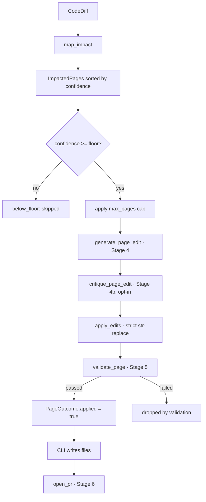

docsync moves information in one direction: **source code in, documentation pull requests out.** Between those two ends sit a handful of well-separated stages — ingest, analyze/plan, author, validate, and sync — each implemented as a pure function over data structures, with all the messy side effects (LLM calls, git, the filesystem) pushed to the edges.

There are actually two pipelines that share this shape:

<CardGroup cols={2}>
  <Card title="Update pipeline" icon="git-pull-request">
    Starts from a **code diff**. It maps changed code to the existing pages it affects and generates *surgical edits* to keep them current. Entry point: `pipeline.run`.
  </Card>
  <Card title="Bootstrap pipeline" icon="sparkles">
    Starts from a **whole-platform snapshot**. It plans a brand-new, sectioned docs site and authors every page from scratch. Entry point: `bootstrap` (stages B1–B6), planning via `plan_docs`.
  </Card>
</CardGroup>

Both converge on the same final step: write files to a docs checkout and open a PR via `pr.open_pr`.

<Note>
The two pipelines differ mainly in their *input* and how they *find* pages. Bootstrap ingests from a snapshot and plans an information architecture; the update pipeline ingests a diff and maps it to pages that already exist. Once content exists in memory, validation and the Git sync work the same way.
</Note>

## The update pipeline: from diff to PR

The update pipeline is the steady-state path. Code changes land in a service repo, a diff is extracted, and docsync surgically edits only the pages that diff touches.



The CLI handles event capture (Stage 1) and diff extraction (Stage 2) *before* calling into the pipeline, and PR creation (Stage 6) *after*. The `run` function is the pure core in between — given a diff, manifest, and config, it produces a `PipelineResult` and performs **no git side effects** of its own.

<Note>
In a **mono repo** (docs and code in one checkout) the extracted diff also carries the docs subtree. Before impact mapping, the CLI resolves the topology with `config.resolve_repo_mode` and, when it's `mono`, runs `impact.filter_docs_paths` to drop files under `docs_root` — otherwise a merged doc change would map onto itself and drive further edits. `config.repo_mode` (`auto` | `mono` | `single` | `poly`) pins or auto-detects this. A `docs_root` of `"."` is a no-op, since there's no code subtree to separate.
</Note>

### Stage 3 — map the diff to impacted pages

`run` begins by wrapping the injected LLM `client` in a `MeteredClient` so every judge, edit, and critique call accrues token usage and estimated cost onto `result.usage`. It then calls `map_impact`, which produces the list of pages the diff touches, each carrying a `confidence` score.

```python
impacted = map_impact(
    diff, manifest, docs_root, config,
    use_embeddings=use_embeddings, cache_dir=cache_dir, client=client,
)
# Edit highest-confidence pages first; secondary key makes drops deterministic.
impacted = sorted(impacted, key=lambda p: (-p.confidence, p.page_path))
```

The embeddings index is persisted under `.docsync/state/embeddings` so repeated runs (and CI caches) reuse it instead of recomputing.

### Confidence floor and the spend cap

Before spending any tokens on the expensive edit stage, `run` partitions the impacted pages and applies two budget controls:

<Steps>
  <Step title="Apply the confidence floor">
    Pages below `confidence_floor` (the CLI's `min_confidence` overrides the configured `min_edit_confidence`) are set aside as `below_floor`. Because anchor-sourced pages autopass at confidence `1.0`, this gate only affects judge- and embedding-sourced pages — useful for a conservative first rollout.
  </Step>
  <Step title="Apply the per-run cap">
    `max_pages` (or `config.max_pages_per_run`) caps how many of the surviving, above-floor pages reach the edit stage. The cap counts **only** pages that would reach the edit stage, so below-floor pages can never starve high-confidence ones out of the budget.
  </Step>
</Steps>

```python
eligible = [p for p in impacted if p.confidence >= confidence_floor]
below_floor = [p for p in impacted if p.confidence < confidence_floor]
cap = max_pages if max_pages is not None else config.max_pages_per_run
if cap and cap > 0:
    to_edit, capped = eligible[:cap], eligible[cap:]
else:
    to_edit, capped = eligible, []
```

### Stage 4–5 — edit, critique, apply, validate (per page)

Each surviving page runs through `_process_page`, which is deliberately **pure with respect to shared state and never raises** — an escaping exception would abort the whole concurrent map, so every failure is caught and recorded on the page's `PageOutcome.note` instead.

<Steps>
  <Step title="Stage 4 — generate the edit">
    `edits.generate_page_edit` is handed the page path, its current content, the diff, the impact record, the manifest entry, and config. It returns a structured edit. The configured `thoroughness` (`light` | `medium` | `high`) is woven into the edit prompt and sets the per-page token budget, tuning how deep the edits go. If the model returns no edits, the outcome records `no_change_reason` and the page is done.
  </Step>
  <Step title="Stage 4b — adversarial self-critique (opt-in)">
    When `self_critique` is on, `critique.critique_page_edit` reviews the proposed edit and `apply_critique` may drop weak edits. This is best-effort: if the critique call fails, the original edit is kept rather than blocking the page.
  </Step>
  <Step title="Apply edits (strict)">
    `edits.apply_edits` performs a strict string-replace against the original. If an edit no longer matches the source text, it raises `EditApplicationError` and the page is dropped with a note — docsync never applies a fuzzy or partial edit.
  </Step>
  <Step title="Stage 5 — validate">
    `validate_page` compares original vs. new content against the manifest and the format adapter (with optional link checking). Only a page whose validation `passed` gets `new_content` set, `applied = True`, and the note `"ready"`.
  </Step>
</Steps>

```python
edit = edits_mod.generate_page_edit(
    page.page_path, original, diff, page, manifest_page, config,
    cache_diff=cache_diff, client=client,
)
...
new_text = edits_mod.apply_edits(original, edit)
...
validation = validate_page(
    page.page_path, original, new_text, manifest_page, adapter,
    check_links=check_links, docs_root=docs_root,
)
if not validation.passed:
    outcome.note = "dropped by validation: " + "; ".join(validation.failures)
    return outcome
```

### Concurrency and the shared-diff cache

Pages are independent, so the edit stage fans out through the shared `run_parallel` helper (a thin wrapper over `ThreadPoolExecutor`). The thread-safety story rests on two facts: the shared `MeteredClient` is thread-safe and its meter is lock-guarded, and `_process_page` never mutates shared state.

One optimization shapes how the threads start. When the run is multi-page *and* the diff is large, `edits.should_cache_diff` returns true and the diff is cached as a shared prompt block. To avoid every thread re-writing the same block, page 1 is processed **serially first** to prime the cache, then the rest fan out and read it:

```python
if cache_diff and len(to_edit) > 1:
    # Prime the shared-diff cache on page 1 (serial), then fan out the rest.
    primed = _process_page(to_edit[0])
    rest = run_parallel(_process_page, to_edit[1:], config.max_parallel_requests)
    edited = [primed, *rest]
else:
    edited = run_parallel(_process_page, to_edit, config.max_parallel_requests)
```

`run_parallel` preserves input order, so the resulting `PipelineResult` is deterministic. `result.changed()` returns the pages with applied, validated edits — exactly the set the CLI will write to disk and open as a PR.

## The bootstrap pipeline: docs from a snapshot

When a platform has *no docs yet*, there's nothing to diff against. Bootstrap authors a structured, sequenced site from a whole-platform snapshot, in six stages:

| Stage | Name | What happens |
|-------|------|-------------|
| B1 | ingest | `ingest.walk_repos` → one `RepoDigest` per repo (read-only) |
| B2 | plan | `plan_docs` → an ordered, sectioned `DocPlan` (one judge-model call) + dedupe |
| B3 | author | full MDX per page via a kind-specific prompt (parallel, metered) |
| B4 | validate | `validate_new_page` — absolute gates, since there's no original to diff |
| B5 | emit | write files + ordered nav sections + manifest anchors |
| B6 | PR | `pr.open_pr` (wired by the CLI) |

### B1 — ingest a whole repo, cheaply

`walk_repo` does a strictly read-only walk of a checkout and distills each source file into a lightweight `SourceUnit` — its path, kind, and **top-level symbol names only, never the file body.** A whole repo of these is small enough to hand the planner in one prompt; actual file text is read later, per page, only for the pages the planner decides to author.

Excluded directories (`.git`, `node_modules`, `tests`, `migrations`, build output, `.docsync`, …) are *pruned in place* so `os.walk` never descends into them:

```python
for dirpath, dirnames, filenames in os.walk(root):
    dirnames[:] = sorted(d for d in dirnames if d not in exclude_dirs)
    for filename in sorted(filenames):
        if not _matches_any(filename, include_globs):
            continue
        ...
        units.append(
            SourceUnit(path=rel, kind=_kind(rel), symbols=extract_symbols(rel, text))
        )
```

Symbol extraction is language-dispatched in `extract_symbols`: Python uses the AST (module-level functions, classes, and assignments only — nested helpers are noise for anchoring), with a regex fallback when a file doesn't parse so one bad file can't crash the whole ingest. TypeScript uses a best-effort export regex. `walk_repos` runs this independently over each `(repo_id, path)` spec — for example, all four Keep services — returning the digests in spec order.

### B2 — plan the information architecture

`plan_docs` is the heart of bootstrap. It gathers what already exists (`_existing_page_paths` on disk plus the adapter's `nav_routes`), builds a planner prompt (its site-size target scaled by `config.thoroughness` — `light` plans a small essential spine, `high` a page per significant subsystem/API), and makes a **single judge-model call** that returns a `DocPlan`.

```python
raw_plan: DocPlan = llm.parse(
    client,
    stage="plan",
    model=config.models.judge_model,
    max_tokens=_PLAN_MAX_TOKENS,
    system=system,
    user=user,
    output_format=DocPlan,
    cache_system=False,
)
```

The prompt (built by `build_plan_prompt`) instructs the model to design a real reading flow organized into ordered **sections** (following `SECTION_ORDER`: Getting Started → Concepts → Architecture → Reference → Operations) using three page **kinds**:

<CardGroup cols={3}>
  <Card title="guide" icon="map">
    Task-oriented onboarding — Getting Started, how-to, setup/run.
  </Card>
  <Card title="concept" icon="book-open">
    Narrative explanations of a subsystem or cross-service flow — prose, not API tables. *(This very page is a concept page.)*
  </Card>
  <Card title="reference" icon="code">
    Code-anchored API and data-model pages, anchored to specific files and symbols.
  </Card>
</CardGroup>

Every page must declare its `page_path`, `title`, `kind`, `section`, `order`, a one-sentence summary, and `sources` — `{repo, globs, symbols}` entries anchoring it to real code. Reference pages anchor to specific files and symbols; concept/guide pages (like this one) anchor to **broader globs** over the subsystems they describe, carrying few or no symbols. Those broad anchors plus a `judge_required` flag are what let `docsync run` keep narrative pages live without firing an edit on every unrelated change.

After the model responds, `plan_docs` **dedupes**: any planned page whose path or route collides with an existing page/route or an earlier plan entry is dropped and reported in the returned `skipped` list. `max_pages` caps the result *after* dedupe.

<Warning>
The planner is explicitly told never to propose a page whose path or route already exists, but `plan_docs` still enforces this itself. The model's output is treated as untrusted — dedupe and the cap are applied in code, not assumed from the prompt.
</Warning>

### B3–B5 — author, validate, emit

For each planned page, bootstrap reads the actual source excerpts it needs. `read_excerpt` reads a file read-only, truncated to a per-file budget, and returns `""` if the file is missing or unreadable — so one bad path can't sink an otherwise-fine page. Authoring uses an Opus, kind-specific prompt — with a thoroughness directive and token budget set by `config.thoroughness_for(kind)` (so `thoroughness_by_kind` can deepen reference pages independently) — and runs in parallel through the shared `run_parallel` helper, metered like every other LLM call.

Because there's no original page to diff against, validation uses `validate_new_page` — **absolute gates** rather than the comparative checks of the update path. Surviving pages are written out by `write_bootstrap`, which also emits ordered nav sections and manifest anchors (`merge_manifest_pages` into `MANIFEST_FILE`), producing a `BootstrapResult`.

## Stage 6 — sync as Git commits and PRs

Both pipelines end in `pr.py`, which treats the docs repo as a real git checkout. The behavior depends on the mode.

<Tabs>
  <Tab title="Dry-run — write a patch">
    `write_patch` captures the working-tree diff (the written page changes) and saves it next to the report for a human to inspect. If the docs repo isn't a git repo — e.g. a fresh from-scratch scaffold — it returns `None` rather than crashing; the pages are written regardless.

    ```python
    def write_patch(docs_repo: Path, out_path: Path) -> Path | None:
        try:
            diff = _git(Path(docs_repo), "diff")
        except RuntimeError:
            return None
        out_path.write_text(diff, encoding="utf-8")
        return out_path
    ```
  </Tab>
  <Tab title="--open-pr — branch, commit, push, PR">
    `open_pr` checks out a deterministic branch, stages the changed `paths` plus the advanced cursor (`.docsync/state/cursors.json`), commits, force-pushes with lease, and opens a PR via `gh`.

    ```python
    repo = Path(docs_repo)
    _git(repo, "checkout", "-B", branch)
    for p in paths:
        _git(repo, "add", p)
    _git(repo, "add", "--", ".docsync/state/cursors.json")
    _git(repo, "commit", "-m", title, "-m", body)
    ```
  </Tab>
</Tabs>

### Deterministic branches and idempotent re-runs

The branch name comes from `branch_name(repo, head_sha)` — `docsync/<repo-slug>-<sha8>` — so a re-run on the same head SHA targets the *same branch*. That determinism is what makes re-runs idempotent: the force-push refreshes the existing PR's diff, and `_existing_pr_url` finds the open PR by head branch so docsync **updates it in place** instead of erroring on a duplicate `gh pr create`.

```python
_git(repo, "push", "-u", "origin", branch, "--force-with-lease")

# An open PR for this branch means the push just updated it — don't re-create.
existing = _existing_pr_url(repo, branch)
if existing:
    return existing
```

Robustness is the throughline here. Labels are created best-effort via `_ensure_labels` (a label that already exists exits non-zero from `gh`, which is ignored — labels are a convenience, never a blocker). If the post-push `gh pr create` still fails, `open_pr` re-checks for an existing PR (it may have lost a race to a concurrent run) and otherwise returns the branch name with the error surfaced. And if `gh` is missing or push is disabled, it returns the branch name rather than raising.

<Note>
`open_pr` assumes the changed files are **already written to the working tree** — it never authors content itself. This keeps the separation clean: the pipelines decide *what* the docs should say, the CLI decides *whether* to write and open a PR, and `pr.py` only does the Git mechanics.
</Note>

## How the stages fit together

The same discipline runs through every stage of both pipelines:

- **Read-only ingest.** Walking a source repo (`walk_repo`/`walk_repos`/`read_excerpt`) never writes to it, and symbol extraction degrades gracefully on files that don't parse.
- **Cheap first, expensive last.** Lightweight digests and impact mapping run before any per-page LLM authoring; confidence floors and page caps gate what reaches the costly edit/author stage.
- **Pure cores, side effects at the edges.** `run` and `plan_docs` produce data structures and perform no git I/O; only the CLI writes files and only `pr.py` touches git.
- **Everything metered.** Every LLM call flows through the injected `MeteredClient`, so token usage and estimated cost land on the result.
- **Failures isolated.** A bad page, an unreadable file, a failed critique, or a missing `gh` is recorded and skipped — never allowed to abort the run.

The net effect: code changes flow in as diffs or snapshots, and validated documentation flows out as reviewable, idempotent pull requests.