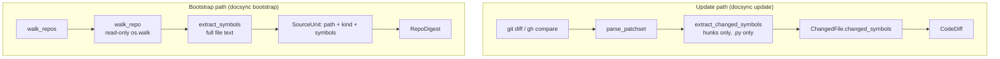

The **Ingestion Engine** is the part of docsync that turns raw source code into the small, structured signals the rest of the pipeline reasons about. It answers two related questions:

- **What changed?** Given a `base..head` comparison, which *symbols* (functions, classes, module-level names) did a set of diff hunks touch?
- **What exists?** Given a whole repository, what is each source file and which top-level symbols does it define?

The first question is answered by `extract_changed_symbols` in `diff.py` (the **update** path). The second is answered by `extract_symbols`, `walk_repo`, and `walk_repos` in `ingest.py` (the **bootstrap** path). Both deliberately avoid carrying full file bodies around — they distill code down to *names and kinds*, which are cheap to pass to a planner and stable across line-number churn.

<CardGroup cols={2}>
  <Card title="Update path — diff.py" icon="code-compare">
    Starts from a `git diff` / GitHub compare. Recovers changed symbols from **hunk text alone**, using regexes that survive line-number drift.
  </Card>
  <Card title="Bootstrap path — ingest.py" icon="folder-tree">
    Starts from a repo **snapshot**. Walks the tree read-only and distills each file into a lightweight `SourceUnit` using AST (Python) or export regex (TypeScript).
  </Card>
</CardGroup>

<Note>
Why two different extractors? A diff gives you fragments, not whole files — so it cannot be parsed by a real AST. A bootstrap walk gives you complete file text — so it can, and should, use the more accurate `ast` module. Each path picks the extraction technique its input allows.
</Note>

## The big picture



Both paths converge on the same idea: a compact description of code that a planner can consume in a single prompt, with the actual file text read later — and only for the pages that get authored.

## Update path: extracting changed symbols from a diff

When docsync processes a pull request or a local `base..head` range, it never assumes it has the full post-image of each file. On the CI path, all it gets is GitHub's per-file `patch` fragment. So symbol recovery must work from **hunk text alone**.

### Where it sits in the diff pipeline

`parse_patchset` walks every file in a unified diff, and for each one it collects the hunks and calls `extract_changed_symbols`:

```python
hunks = [str(hunk) for hunk in patched_file]
symbols = extract_changed_symbols(path, hunks)

files.append(
    ChangedFile(
        path=path,
        status=status,
        previous_path=previous_path,
        hunks=hunks,
        changed_symbols=symbols,
    )
)
```

This runs the same way whether the diff came from `diff_local` (which shells out to `git -C <repo> diff --unified=3 -M base head`) or from the GitHub compare path — both feed their diff text through `parse_patchset`, so symbol extraction is shared.

<Note>
`extract_changed_symbols` only handles **Python** files. It returns `[]` immediately for anything that does not end in `.py`. The richer, multi-language extraction lives on the bootstrap side.
</Note>

### Two complementary signals

The function combines two signals, in order, so that heading-derived names come first:

<Steps>
  <Step title="The enclosing-scope heading">
    Git appends the enclosing function or class after the second `@@` of each hunk, e.g. `@@ -2,6 +2,8 @@ def register_routes(app):`. This names the symbol whose *body* changed — even when its own signature line wasn't touched by the hunk.
  </Step>
  <Step title="The changed lines themselves">
    The added (`+`) and removed (`-`) lines are scanned for `def NAME`, `class NAME`, and module-level `NAME = ...` assignments introduced or deleted by the hunk. File markers (`+++` / `---`) are skipped so a raw patch's header lines don't masquerade as content.
  </Step>
</Steps>

The result is a **de-duplicated, order-preserving** list — heading symbols appear before line-derived ones because the heading is processed first.

### The matching rules

Three regexes do the work. They are intentionally lightweight — robust to fragments, not a full parser:

```python
# `def foo(` / `async def foo(` / `class Foo(` / `class Foo:` — capture NAME.
_DEF_OR_CLASS = re.compile(r"\b(?:async\s+def|def|class)\s+([A-Za-z_]\w*)")
# Module-level assignment: NAME = ...  (no leading whitespace -> top level).
_MODULE_ASSIGN = re.compile(r"^([A-Za-z_]\w*)\s*(?::[^=]+)?=(?!=)")
# The enclosing-scope heading git/unidiff append after the second `@@`.
_HUNK_HEADER = re.compile(r"^@@.*?@@\s*(.*)$")
```

A couple of subtleties worth calling out:

- **`def`/`class` match anywhere on the line**, because `_DEF_OR_CLASS` uses `\b` rather than anchoring to the start. This is what lets the heading (`def register_routes(app):`) and an indented method both register.
- **Assignments must be top-level.** `_symbols_from_text` only runs the `_MODULE_ASSIGN` regex when the line has no leading space or tab (`line[:1] not in (" ", "\t")`), so indented assignments inside functions are ignored as noise.
- **`=(?!=)`** ensures `FOO == BAR` (a comparison) doesn't get mistaken for an assignment, while `FOO: list = ...` and `FOO = BAR = ...` still match.

### A worked example

Suppose `parse_patchset` hands `extract_changed_symbols` a single hunk for `app/routes.py`:

```diff
@@ -10,7 +10,9 @@ def register_routes(app):
     app.add_url_rule("/health", view_func=health)
+    app.add_url_rule("/ready", view_func=ready)
+
+DEFAULT_TIMEOUT = 30
```

Tracing the logic:

1. The header line matches `_HUNK_HEADER`; its heading `def register_routes(app):` yields **`register_routes`**.
2. The first changed line (`+    app.add_url_rule(...)`) contains no `def`/`class` and is indented, so it contributes nothing.
3. The line `+DEFAULT_TIMEOUT = 30` has no leading whitespace and matches `_MODULE_ASSIGN`, yielding **`DEFAULT_TIMEOUT`**.

Final result: `["register_routes", "DEFAULT_TIMEOUT"]` — heading first, deduplicated, order preserved.

<Warning>
Because the heading reports the *enclosing* scope, a symbol can show up even when its definition line is untouched. That's intentional: a body change to `register_routes` is exactly the kind of thing the docs for `register_routes` may need to reflect. Treat `changed_symbols` as "symbols whose documentation might be affected," not "symbols whose signatures changed."
</Warning>

## Bootstrap path: ingesting a whole repository

The bootstrap command (`docsync bootstrap`) starts from a *snapshot* rather than a diff. It walks one or more service repos strictly read-only and distills each source file into a `SourceUnit` — **path + kind + top-level symbol names, never the file body**. A whole repo's worth of these is small enough to hand a planner in one prompt; the file text itself is read per-page, later, only for the pages the planner decides to author.

### Walking the tree

`walk_repo` is the workhorse. It resolves the root, walks it with `os.walk`, prunes uninteresting directories *in place*, and ingests files whose basename matches the include globs:

```python
for dirpath, dirnames, filenames in os.walk(root):
    # Prune excluded dirs in place so os.walk doesn't descend into them.
    dirnames[:] = sorted(d for d in dirnames if d not in exclude_dirs)
    for filename in sorted(filenames):
        if not _matches_any(filename, include_globs):
            continue
        abs_path = Path(dirpath) / filename
        rel = abs_path.relative_to(root).as_posix()
        try:
            text = abs_path.read_text(encoding="utf-8")
        except (OSError, UnicodeDecodeError):
            continue
        units.append(
            SourceUnit(path=rel, kind=_kind(rel), symbols=extract_symbols(rel, text))
        )
        if max_files and len(units) >= max_files:
            return RepoDigest(repo=repo_id, root=str(root), units=units)
```

Key behaviors:

- **Defaults to source only.** `DEFAULT_INCLUDE = ("*.py", "*.ts", "*.tsx")` — basenames are matched with `fnmatch`.
- **Prunes whole subtrees.** Mutating `dirnames[:]` stops `os.walk` from descending into excluded directories, so docsync never even *stats* the thousands of files under them. `DEFAULT_EXCLUDE_DIRS` covers VCS and tooling dirs (`.git`, `.github`, `node_modules`, `.venv`, `__pycache__`, `dist`, `build`, `.next`, …) and, notably, **test and migration directories** (`tests`, `test`, `__tests__`, `migrations`) plus `.docsync` itself.
- **Deterministic order.** Both directory and file names are sorted, so `units` come back in stable path order regardless of filesystem iteration order.
- **Fault-tolerant reads.** A file that fails to read as UTF-8 (`OSError` / `UnicodeDecodeError`) is skipped rather than crashing the walk.
- **Optional cap.** `max_files > 0` stops ingestion early once that many units are collected; `0` means unlimited.

<Warning>
`walk_repo` is strictly read-only — it never writes to the repo it walks. This matters because bootstrap is pointed at real service checkouts (e.g. the four Keep repositories), and ingest must not mutate them.
</Warning>

### Ingesting several repos at once

`walk_repos` is a thin loop over `walk_repo`, one `RepoDigest` per `(repo_id, path)` spec, returned in spec order:

```python
def walk_repos(specs, *, include_globs=DEFAULT_INCLUDE,
               exclude_dirs=DEFAULT_EXCLUDE_DIRS, max_files=0):
    return [
        walk_repo(
            path, repo=repo_id, include_globs=include_globs,
            exclude_dirs=exclude_dirs, max_files=max_files,
        )
        for repo_id, path in specs
    ]
```

Each walk is independent and read-only. This is how bootstrap ingests an entire platform — for example all four Keep services — to feed a single cross-repo documentation plan.

```python
digests = walk_repos([
    ("keep-api-gateway", "/path/to/keep-api-gateway"),
    ("keep-event-handler", "/path/to/keep-event-handler"),
    ("keep-workflows", "/path/to/keep-workflows"),
    ("keep-ui", "/path/to/keep-ui"),
])
# -> one RepoDigest per service, in the order given
```

## Per-language symbol extraction

`extract_symbols` is the language dispatcher used by the bootstrap walk. Unlike `diff.extract_changed_symbols`, it works on **full file text**, so it can afford a real parser for Python:

```python
def extract_symbols(path, text):
    kind = _kind(path)
    if kind == "python":
        return _python_symbols(text)
    if kind == "typescript":
        # export-regex scan, de-duplicated, order-preserving
        ...
    return []
```

`_kind` is the single source of truth for language classification: `.py` → `"python"`, `.ts`/`.tsx` → `"typescript"`, everything else → `"other"` (which yields `[]`).

<Tabs>
  <Tab title="Python (AST, with regex fallback)">
    Python files are parsed with the `ast` module, and only **module-level** definitions and assignments are collected — nested helpers and methods are deliberately treated as noise for anchoring:

    ```python
    try:
        tree = ast.parse(text)
    except (SyntaxError, ValueError):
        for m in _PY_DEF_OR_CLASS.finditer(text):
            _add(m.group(1))
        return out

    for node in tree.body:  # module level only
        if isinstance(node, (ast.FunctionDef, ast.AsyncFunctionDef, ast.ClassDef)):
            _add(node.name)
        elif isinstance(node, ast.Assign):
            for target in node.targets:
                if isinstance(target, ast.Name):
                    _add(target.id)
        elif isinstance(node, ast.AnnAssign) and isinstance(node.target, ast.Name):
            _add(node.target.id)
    ```

    - Functions (sync and async), classes, plain assignments (`FOO = ...`), and annotated assignments (`FOO: int = ...`) at the top of `tree.body` are captured.
    - If the file doesn't parse — a partial file, a syntax error, or Python 2 source — it falls back to the `_PY_DEF_OR_CLASS` line regex so one bad file never crashes ingest.
    - Names are de-duplicated and order-preserving via the local `_add` helper.
  </Tab>
  <Tab title="TypeScript (export regex)">
    There is no TypeScript parser in-tree, so docsync uses a best-effort regex over top-level exports:

    ```python
    _TS_EXPORT_RE = re.compile(
        r"^export\s+(?:default\s+)?(?:async\s+)?"
        r"(?:function|const|let|var|class|interface|type|enum)\s+([A-Za-z_$][\w$]*)",
        re.MULTILINE,
    )
    ```

    This captures the names of exported `function`, `const`/`let`/`var`, `class`, `interface`, `type`, and `enum` declarations — including `export default` and `export async function` forms. Matches are collected into a de-duplicated, order-preserving list. Non-exported (internal) symbols are intentionally skipped: exports are the documentable surface.
  </Tab>
</Tabs>

<Note>
**Why module-level only?** Both extractors anchor documentation to top-level symbols. Methods on a class and helpers nested inside a function are implementation detail — surfacing them would bury the names a reader actually navigates by. Keeping the symbol set small also keeps the digest cheap to hand to the planner.
</Note>

## Reading file text — later, and on a budget

Symbol extraction never carries file bodies. When the author stage eventually needs the real text of a file the planner selected, it calls `read_excerpt`, which reads read-only and truncates to a budget:

```python
def read_excerpt(root, rel_path, *, max_chars=_EXCERPT_MAX_CHARS):
    fp = Path(root) / rel_path
    try:
        text = fp.read_text(encoding="utf-8")
    except (OSError, UnicodeDecodeError):
        return ""
    if len(text) > max_chars:
        return text[:max_chars] + "\n… (truncated)\n"
    return text
```

- The default budget is `_EXCERPT_MAX_CHARS = 8_000` characters — generous enough to show a route module's signatures without blowing the author prompt.
- A missing or unreadable file returns `""` rather than raising, so one bad path can't sink the author of an otherwise-fine page.
- When the file exceeds the budget, a `… (truncated)` marker is appended so the consumer knows the content was capped.

This completes the engine's central design principle: **distill names eagerly, read bodies lazily**. Symbols flow into the planner in bulk; full text is pulled only for the handful of pages that actually get written.

## How the two extractors compare

| | `extract_changed_symbols` (`diff.py`) | `extract_symbols` (`ingest.py`) |
|---|---|---|
| Input | Diff **hunks** (fragments) | **Full file** text |
| Languages | Python only (`.py`) | Python and TypeScript |
| Python technique | Regex on hunk lines + `@@` heading | `ast.parse`, regex fallback on parse failure |
| Captures | Changed `def`/`class`/module assignments + enclosing scope | Top-level `def`/`class`/assign/annotated-assign or TS exports |
| Output | De-duplicated, order-preserving list (heading first) | De-duplicated, order-preserving list |
| Used by | `parse_patchset` → `ChangedFile.changed_symbols` → `CodeDiff` | `walk_repo` → `SourceUnit.symbols` → `RepoDigest` |

Same output shape — a clean list of symbol names — produced by whichever technique the input format allows. That shared shape is what lets the downstream planner treat "what changed" and "what exists" uniformly.