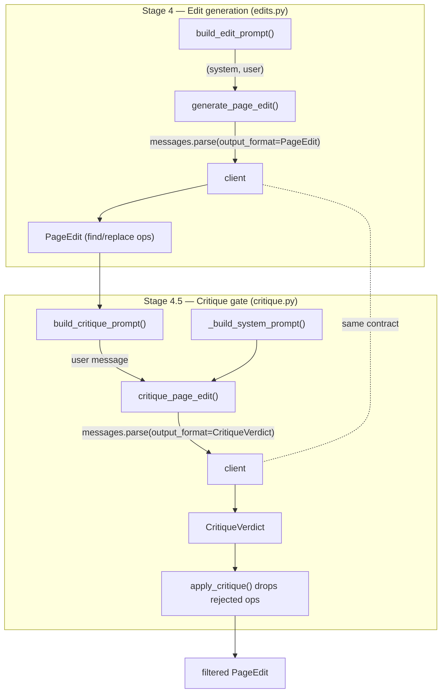

docsync keeps documentation in sync with code by handing two questions to a language model: *"which surgical edits bring this page back in line with this diff?"* and *"is that edit actually faithful to the diff?"* This page explains how those calls are made — the narrow client interface every stage depends on, the three interchangeable backends behind it, and the prompt-construction helpers that shape each request.

<Note>
docsync deliberately depends on only a **tiny slice** of the Anthropic client surface. That small contract is what makes the backend pluggable — a real API client and two CLI-shelling dev clients all satisfy it.
</Note>

## The client contract

Every LLM stage in docsync — the impact judge, edit generation, and critique — speaks the same minimal dialect of the Anthropic SDK:

```python
resp = client.messages.parse(
    model=...,
    system=[...],
    messages=[...],
    output_format=SomePydanticModel,
    **ignored,
)
resp.parsed_output  # a validated SomePydanticModel instance
```

That is the whole interface. A stage builds a `system` block and a `messages` list, names an `output_format` Pydantic model, and reads back a validated instance from `resp.parsed_output`. Because the contract is this small, any object exposing a `messages.parse(...)` method that returns something with a `.parsed_output` attribute can stand in as the backend — which is exactly how the three shipped backends coexist.

## Three backends, one interface

<CardGroup cols={3}>
  <Card title="anthropic.Anthropic()" icon="cloud">
    The **production** backend. A real Anthropic API client with schema-enforced structured outputs. This is the product path and the default for `generate_page_edit` when no client is injected.
  </Card>
  <Card title="ClaudeCodeClient" icon="terminal">
    A **dev-only** backend that shells out to the local `claude` CLI in headless mode. Reuses your existing Claude Code authentication so you can run the full pipeline **without** an `ANTHROPIC_API_KEY`.
  </Card>
  <Card title="CursorClient" icon="terminal">
    A **dev-only** backend that shells out to the Cursor CLI (`cursor-agent`) in headless mode. Reuses your Cursor subscription (`cursor-agent login` or `CURSOR_API_KEY`) — also no `ANTHROPIC_API_KEY` needed.
  </Card>
</CardGroup>

A backend selector — `get_client` — chooses between them, returning the production `anthropic.Anthropic()` client for real runs and the dev-only `ClaudeCodeClient` or `CursorClient` for local dogfooding. Which one it returns is set by the `backend` config field (default `api`, values `api` / `claude-code` / `cursor`) or the `--backend` CLI flag, which wins over config when both are given. Whichever it returns, the calling stage code is identical, because all three honor the `messages.parse(...)` / `parsed_output` contract above.

### Why the CLI backends are dev-only

`ClaudeCodeClient` and `CursorClient` are convenient, but the module is explicit that they are **not** the product path:

<Warning>
- **No schema-enforced structured outputs.** A CLI can't enforce a JSON schema, so the client prompts for JSON and validates with pydantic itself, retrying **once** on a parse or validation miss.
- **Per-call overhead.** The CLIs inject their own system prompt and tooling, so each call costs more tokens and latency than a raw API call.
- **They bill your subscription/credits.** Automated or batch use of subscription auth has Terms-of-Service limits. Use them for **local dogfooding only**.
</Warning>

## How `ClaudeCodeClient` fakes structured output

The production API can simply enforce a schema. The CLI can't, so `ClaudeCodeClient` reconstructs the same guarantee through prompting, validation, and a single retry. It runs the local binary like this:

```python
cmd = [
    self._cli, "-p",
    "--output-format", "json",
    "--model", model,
    "--system-prompt", system,
    *self._extra_args,
]
proc = subprocess.run(cmd, input=prompt, capture_output=True, text=True, timeout=_CLI_TIMEOUT_S)
```

A few design choices are worth calling out:

- **The user prompt is piped via STDIN**, not passed as a CLI argument — so a long or multiline prompt is never mis-parsed as flags.
- **The system prompt replaces** Claude Code's default and forbids tools, so a pure JSON (or pure text) completion needs none.
- The CLI's JSON envelope is parsed for `result` (the model's reply) and `usage` (token accounting, surfaced on the response so a metered client can account for it). A non-zero exit code, an `is_error` envelope, or non-JSON stdout is raised as a `RuntimeError`.
- Each call is capped at 600s (`_CLI_TIMEOUT_S`), so a hung CLI (e.g. one blocking on an interactive login prompt) fails the call instead of stalling a pipeline worker forever.

`parse()` then branches on the **shape of the output model**, because two very different kinds of output need different handling.

<Tabs>
  <Tab title="Structured (multi-field) output">
    For models with several fields — like the critique verdict — the client asks for a single JSON object and validates it:

    ```python
    schema = json.dumps(output_format.model_json_schema(), separators=(",", ":"))
    sys_text = (
        _system_text(system)
        + "\n\nYou are a JSON API. Respond with ONLY a single JSON object that "
        "validates against the schema below — no prose, no code fences, no tools.\n"
        f"JSON schema: {schema}"
    )

    for _ in range(2):  # one retry on a parse/validation miss
        raw, usage = self._run(mdl, sys_text, user_text)
        try:
            obj = output_format.model_validate_json(_extract_json(raw))
            return _Resp(obj, usage=usage)
        except (ValueError, ValidationError) as exc:
            last_err = exc
            user_text += "\n\nYour previous reply was not valid JSON ..."
    ```

    `_extract_json` pulls the object out of the reply, tolerating ```` ```json ```` fences, then scans from the first `{` with brace/string awareness so trailing prose — which may itself contain stray braces — can't be swept into the candidate (as an old first-`{` … last-`}` slice would). An unterminated object raises; after two failed attempts the call raises.
  </Tab>
  <Tab title="Whole-document output">
    `_single_text_field` detects "whole-document" models — those whose **sole required field is a `str`** (e.g. an authored page whose only field is `content`). Coaxing a full MDX document *inside JSON* is fragile: the document itself contains braces, quotes, and code fences. So for these the client takes the **raw reply as the field value** instead of parsing JSON, and only strips an outer ```` ``` ```` fence that wraps the *entire* reply:

    ```python
    sys_text = (
        _system_text(system)
        + "\n\nRespond with ONLY the complete document content — the exact text "
        "of the file, starting at its first character. No commentary, no JSON, and "
        "do NOT wrap the whole document in a code fence."
    )
    ```

    The `_OUTER_FENCE_RE` is anchored to start and end of the reply, so an *internal* fence (a code sample in the body) is never mistaken for the wrapper.
  </Tab>
</Tabs>

The `_system_text` and `_user_text` helpers flatten the SDK's structured `system` (a string or a list of text blocks) and `messages` arguments down to the plain strings the CLI expects, discarding the cache-control metadata the API would otherwise use.

<Note>
Some gateway-served models (MiniMax / DeepSeek-R1 style) emit `<think>`/`<thinking>` reasoning **inline** in the text reply. Both CLI backends run every reply through `_strip_reasoning` before extraction, so those blocks — and the braces inside them — can't corrupt JSON parsing or land in an authored page; a reply that is *only* an unterminated reasoning block strips to empty and triggers the retry. Set `DOCSYNC_LLM_DEBUG=<dir>` to capture each call's command, prompt, and raw stdout/stderr — the only window into what an opaque gateway-served model actually returned.
</Note>

## How `CursorClient` differs

`CursorClient` inherits the entire `parse()` machinery above — the JSON-schema prompting, the whole-document path, and the single retry — and swaps only the CLI invocation. Four differences from `ClaudeCodeClient` matter:

- **No `--system-prompt` flag.** `cursor-agent` has none, so the system text is prepended to the stdin prompt inside a delimited `<system-instructions>` block.
- **Model names are translated.** Anthropic model ids from `ModelConfig` are mapped to Cursor-native names (`claude-opus-4-*` → `opus`, `claude-haiku-4-*` → `haiku-4.5`, …); unknown ids pass through verbatim, so you can put Cursor-native names like `gpt-5` or `auto` directly in `models.edit_model`.
- **No token usage.** Cursor's JSON envelope carries no usage field, so cursor runs meter as zero and the cost section is omitted from reports.
- **Kept a pure text generator.** `cursor-agent` is a coding *agent* with tools; the client never passes `--force` and runs every call in a fresh empty temp directory, so there is no workspace for the agent to read or edit.

## Where the calls come from: prompt construction

The backend is only half the story. Each stage owns a pair of pure prompt-building functions, deliberately split out from the call site so prompt content is **unit-testable without a client**. This separation is the recurring pattern across `edits.py` and `critique.py`.



### Stage 4 — `build_edit_prompt`

`build_edit_prompt` returns a `(system_prompt, user_prompt)` tuple. The **system** prompt encodes the invariants that keep edits surgical:

- Return a list of **find/replace edit operations** — never rewrite the whole file.
- Each `find` must be a **verbatim, unique** substring of the current page: long enough to be unique, as small as possible (ideally a single table row, sentence, or code-fence line).
- Edit **only** the rows, prose, or code-fence lines the diff invalidates; never touch unrelated content.
- **Never** alter MDX component tag structure (`<CardGroup>`, `<Card>`, `<Warning>`, `<Note>`, …) or break mermaid fences; preserve inline backtick references unless the symbol was renamed.
- Frontmatter `title`/`description` may be edited **only** if `manifest_page.allow_frontmatter_edit` is set — otherwise the prompt forbids it outright.
- If the page is not actually invalidated, return an **empty edits list** with a `no_change_reason`.

The **user** prompt carries the per-page context: the page path, why it was flagged (`impacted.source`, `impacted.confidence`, `impacted.reason`), the current page content in an `mdx` fence, and the rendered code change.

`generate_page_edit` then calls `messages.parse(..., output_format=PageEdit)` against Claude Opus 4.8. The returned `PageEdit` is applied by `apply_edits`, which enforces the uniqueness contract at apply time:

<Steps>
  <Step title="Locate the find string">
    For each op, count occurrences of `op.find` in the current working text.
  </Step>
  <Step title="Reject zero or multiple matches">
    Zero occurrences → `EditApplicationError` ("not found"). More than one → `EditApplicationError` ("ambiguous"). docsync **never** fuzzy-matches and **never** replace-alls.
  </Step>
  <Step title="Apply sequentially">
    Replace the single occurrence and continue — so a later op sees the result of the earlier ones. An empty edit list returns the text unchanged.
  </Step>
</Steps>

#### Prompt caching across a run

The invariant system prompt is identical for every page in a run, so it is cached with `cache_control: ephemeral`. For the **diff** itself, `should_cache_diff` decides whether to lift it into a shared, cached system block:

```python
def should_cache_diff(diff: CodeDiff, n_pages: int) -> bool:
    if n_pages <= 1:
        return False
    return len(render_diff(diff, max_chars=_EDIT_DIFF_MAX_CHARS)) >= _CACHE_DIFF_MIN_CHARS
```

Caching the diff is worth it only when **both** hold: more than one page will be edited (so there are cache *reads* to amortize the one *write*), and the rendered diff clears the model's ~4096-token cacheable-prefix floor (`_CACHE_DIFF_MIN_CHARS`). When the diff is cached, `build_edit_prompt` is called with `include_diff=False`, replacing the diff in the user message with a pointer to the system context. The pipeline primes the cache on page 1 before fanning out the rest, so reads land within the 5-minute ephemeral window.

<Note>
Opus 4.8 uses **adaptive thinking only** — reasoning depth is controlled via `output_config.effort`, with no `budget_tokens` and no sampling params.
</Note>

### Stage 4.5 — `build_critique_prompt` and the critique gate

After the Opus editor proposes a `PageEdit`, docsync runs a cheap **adversarial self-critique** — a second LLM call (the Haiku judge, `claude-haiku-4-5`) that checks each edit op against the actual diff. The question is narrow: *does this edit faithfully reflect THIS diff, and touch only what the diff changed?* Hallucinated or over-reaching ops get flagged and dropped before validation, cutting false positives at low cost.

`build_critique_prompt` assembles the **user** message: the page path, the diff's changed paths and symbols, the rendered diff, and every proposed edit op rendered as a numbered block of `find` / `replace` / `rationale`. It closes by instructing the judge to list the exact `find` string of every op that is **not** directly justified by the diff.

The **system** prompt (`_build_system_prompt`) fixes the judge's stance:

- Judge **faithfulness to the diff only** — not writing quality, not style.
- **KEEP** an op if it reflects something the diff actually changed; an op that merely *adds* correct, undocumented information about a real change is acceptable and must be kept.
- **REJECT** an op only if it concerns something the diff did **not** change — a hallucinated symbol, an unrelated section, or an over-reaching rewrite.
- Put each rejected op's exact `find` string in `rejected_finds`; set `faithful` true **iff** that list is empty.

`critique_page_edit` mirrors the same `messages.parse(...)` idiom — a cached invariant system prefix plus a per-page user message — with `output_format=CritiqueVerdict`. It defaults to the Haiku judge (overridable via `model`), keeps the budget small (`_MAX_TOKENS = 2000`), and optionally appends a caller-supplied `system_extra` to the cached prefix.

#### The flat verdict and applying it

`CritiqueVerdict` is intentionally **flat** — `faithful: bool`, `rejected_finds: list[str]`, `reason: str` — so the structured-output backend has nothing nested to validate. `apply_critique` is a pure helper that consumes it:

```python
def apply_critique(page_edit: PageEdit, verdict: CritiqueVerdict) -> PageEdit:
    rejected = set(verdict.rejected_finds)
    kept = [op for op in page_edit.edits if op.find not in rejected]
    return PageEdit(edits=kept, no_change_reason=page_edit.no_change_reason)
```

Ops are matched on their **exact `find` string** and kept in their original order; the input `PageEdit` is never mutated. If every op is rejected, the result has an empty edits list — and the pipeline then treats the page as no-change.

## Putting it together

The whole LLM-facing surface of docsync reduces to three ideas working in concert:

<CardGroup cols={3}>
  <Card title="A narrow contract" icon="plug">
    `messages.parse(..., output_format=Model)` → `resp.parsed_output`. The only client surface any stage touches.
  </Card>
  <Card title="Swappable backends" icon="arrows-rotate">
    `get_client` returns the production `anthropic.Anthropic()` or a dev-only CLI client (`ClaudeCodeClient`, `CursorClient`); all satisfy the contract.
  </Card>
  <Card title="Testable prompts" icon="vial">
    `build_edit_prompt` and `build_critique_prompt` are pure functions, asserted on without ever hitting a client.
  </Card>
</CardGroup>

Because the contract is so small, the same stage code runs unchanged against a real API or a local CLI; because prompts are built by pure helpers, every invariant the models are asked to honor can be tested directly; and because the critique gate reuses the exact same call idiom, adding a cheap second opinion costs almost nothing in code — just one more `messages.parse` and a flat verdict to apply.