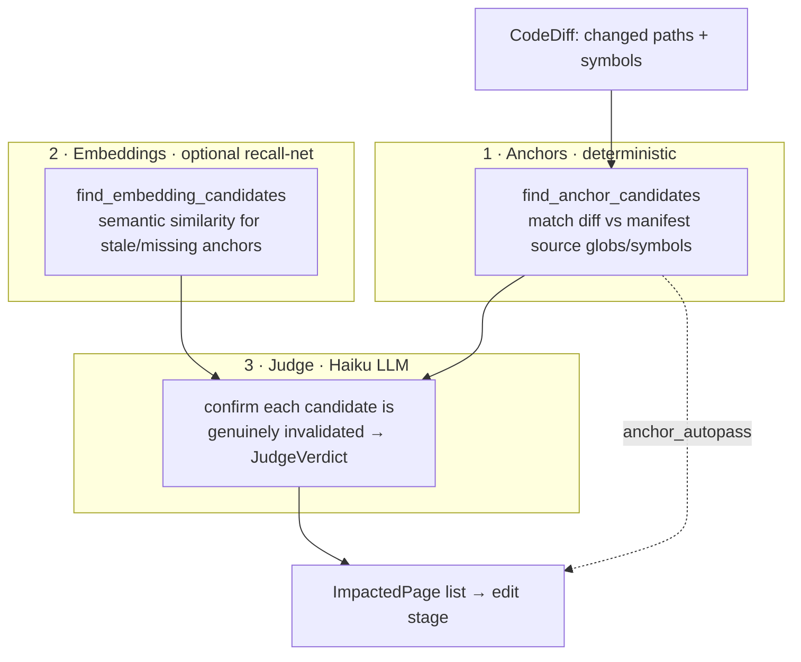

The **planning engine** is the part of docsync that decides _what documentation should exist_ and _which pages a change touches_ — without a human curating either answer. It does this twice in the product's lifecycle:

- **From scratch** (`docsync bootstrap`): given a snapshot of every source repo, it designs a sectioned, ordered documentation site — an information architecture (IA) — and anchors each planned page back to real code.
- **On every change** (`docsync run`): given a code diff, it maps that diff onto the existing pages most likely to be invalidated, so only the right pages get re-authored.

Both halves combine **deterministic code analysis** (file/symbol matching, no LLM) with **LLM reasoning** (a judge model that designs or confirms). The split is deliberate: cheap, high-precision mechanics narrow the field; the model is reserved for the judgment calls machines are bad at.

<CardGroup cols={2}>
  <Card title="Planning (bootstrap)" icon="sitemap">
    `build_plan_prompt` + `plan_docs` turn per-repo digests into a `DocPlan`: ordered sections, page kinds, and code anchors.
  </Card>
  <Card title="Impact mapping (run)" icon="diagram-project">
    `find_anchor_candidates` + the judge confirm which existing pages a diff genuinely invalidates before the expensive edit stage.
  </Card>
</CardGroup>

## Where planning sits in the pipeline

Bootstrap authors a brand-new site from a whole-platform snapshot. Planning is stage **B2**, sandwiched between ingestion and authoring:

```
B1 ingest  → RepoDigest per repo (read-only)
B2 plan    → DocPlan: an ordered, sectioned IA (one judge-model call) + dedupe
B3 author  → full MDX per page (kind-specific prompt)
B4 validate→ absolute gates (no original to diff)
B5 emit    → write files + ordered nav + manifest anchors
B6 PR      → open a pull request
```

Planning's job is narrow and high-leverage: emit a `DocPlan` — _the_ blueprint every later stage consumes. Get the IA wrong here and B3–B6 faithfully author the wrong site.

<Note>
Every LLM call in planning goes through an injectable `client` (wrapped in `MeteredClient`), so token cost is attributed back onto `result.usage`. Planning uses the **judge model** (`config.models.judge_model`) — the cheaper reasoning tier — not the authoring model.
</Note>

## Step 1 — Feed the planner a compact view of the code

The planner never sees raw source. Ingestion produces a `RepoDigest` per repo — a list of `units`, each a file path plus its top-level `symbols`. `render_digests()` flattens these into a terse, per-repo listing:

```text
## repo: keep-api-gateway
- src/main.py  ::  get_app, lifespan
- src/routes/alerts.py  ::  create_alert, get_alerts, delete_alert
- src/services/rules_engine.py  ::  RulesEngine, evaluate
… (412 files in this repo; list truncated)
```

Two guardrails keep this affordable and bounded:

- Only the **first 12 symbols** of each unit are shown (`unit.symbols[:12]`).
- Each repo's block is capped at `_DIGEST_MAX_CHARS_PER_REPO` (12,000 chars). When the running total would overflow, the remaining files are collapsed into a `… (N files in this repo; list truncated)` line.

<Warning>
The digest cap exists so a large platform can't overflow the planner's context window. On a big repo the planner sees a representative prefix of files, not the exhaustive list — the IA is designed from a sample, then refined by later stages.
</Warning>

## Step 2 — Build the planner prompt

`build_plan_prompt(digests, existing_routes=…, existing_pages=…, thoroughness=…)` returns a `(system, user)` pair. `plan_docs` passes `config.thoroughness_for()`, so the configured thoroughness level shapes how big a site the planner targets. The **system** prompt is where the engine encodes its opinion about what good documentation looks like. It instructs the model to act as a senior technical writer and to:

- Design a real **reading flow**, not a flat list of API pages.
- Organize pages into ordered **sections**, drawn from the `SECTION_ORDER` vocabulary (Getting Started → Concepts → Architecture → Reference → Operations).
- Assign each page one of three **kinds**:

| Kind | Purpose | Anchoring |
|------|---------|-----------|
| `guide` | Task-oriented onboarding (Getting Started, how-to, setup/run) | Broad globs |
| `concept` | Narrative explanation of a subsystem or cross-service flow — prose, not API tables | Broad globs, few/no symbols |
| `reference` | Code-anchored API / data-model pages | Specific files + symbols |

For **each** page the model must produce: a new kebab-case `.mdx` `page_path` under a section folder, a `title`, a `kind`, a `section` (nav heading), an integer `order` within that section, a one-sentence summary, and `sources` — a list of `{repo, globs, symbols}` that anchors the page to real code.

The prompt enforces two hard rules that make planning idempotent and collision-free:

1. **Every page must have at least one source whose `repo` is in the list.** No ungrounded pages.
2. **Do not propose a path or route that already exists.** The **user** prompt lists existing pages and routes verbatim under a `Pages/routes that ALREADY EXIST (do not propose these)` heading, so re-running bootstrap on a partially-documented site only proposes net-new pages.

<Note>
The anchoring distinction is the engine's core IA idea. Reference pages bind tightly to specific symbols so they re-author when that symbol changes. Concept/guide pages bind to **broad subsystem globs** with few or no symbols — they describe how things fit together, so they should stay live across a subsystem without firing on every unrelated edit.
</Note>

## Step 3 — Call the judge and dedupe the result

`plan_docs()` orchestrates the call. It gathers the existing surface, builds the prompt, and asks the judge model for structured output:

<Steps>
  <Step title="Resolve what already exists">
    `_existing_page_paths(docs_root)` walks the docs tree for every `.mdx`/`.md` (skipping anything under `.docsync`), and the adapter's `nav_routes()` returns the extensionless routes. Both feed the prompt's "do not propose these" block.
  </Step>
  <Step title="One structured planner call">
    Through the shared `llm.parse` helper (metered under the `"plan"` stage), the client `parse`s the response into a `DocPlan` (`output_format=DocPlan`, capped at `_PLAN_MAX_TOKENS` = 6,000). The model is forced into the schema, so no brittle text parsing is needed. An **empty plan is rejected**: because `DocPlan.pages` defaults to `[]`, a model that under-fills the schema would otherwise "succeed" into a silent 0-planned run, so `plan_docs` raises a `RuntimeError` naming the judge model and pointing at the config/`DOCSYNC_LLM_DEBUG` knobs an operator behind a gateway needs.
  </Step>
  <Step title="Dedupe collisions and cap">
    The raw plan is filtered: any planned page whose path or route collides with an existing page/route — or with an earlier entry in the same plan — is dropped. `max_pages`, if given, caps the count **after** dedupe.
  </Step>
</Steps>

`plan_docs` returns `(plan, skipped)`, where `skipped` lists the page paths that were dropped for colliding. Normalization helpers keep paths clean throughout: `_normalize_page_path` guarantees a docs-root-relative path with an `.mdx`/`.md` extension and no leading slash — appending the active adapter's `page_extension` (e.g. `.mdx` for Mintlify, `.md` for the plain-Markdown adapter) only when the model omitted one — and `_route_of` strips the extension to produce the nav route used for collision checks.

The output, a `DocPlan`, is the ordered, sectioned set of `PlannedPage`s the authoring stage will turn into MDX — each carrying the section, order, kind, and code anchors decided here.

## The other half: mapping a diff onto existing pages

Once a site exists, the planning engine runs in reverse. Instead of "what pages should exist?", it answers "**which existing pages does this diff invalidate?**" — the job of `impact.py`, whose orchestrator `map_impact()` the update pipeline calls. It's an **anchor-first** mapper with three layers:



### Layer 1 — Anchors (deterministic, high-precision)

`find_anchor_candidates(diff, manifest)` is pure mechanics, no LLM. For each page in the manifest it walks the page's declared `sources` and matches them against the diff:

- **Repo scoping first.** A source only participates if its repo matches the diff's repo. `_repo_matches` compares via `_repo_key`, which normalizes any repo reference down to its bare final path component (stripping a trailing `.git` and lowercasing). That reconciles a manifest's canonical `owner/name` with a diff `repo` that might be a local checkout path, a fork `otherowner/name`, or a `gh`-style `owner/name`.
- **Paths** are matched with `fnmatch` against each `source.globs` entry.
- **Symbols** are matched against `source.symbols` by `_symbol_matches`: exact equality, plus a trailing-`*` prefix rule so `ENV_*` matches `ENV_HOST`.

The **score** is simply the number of matches (`len(path_hits) + len(symbol_hits)`); pages with zero matches are dropped. Each surviving candidate carries a human-readable `reason` naming exactly what matched:

```text
paths: src/routes/alerts.py ~ src/routes/*.py; symbols: create_alert (=create_alert)
```

Candidates are emitted as `ImpactCandidate` with `source=CandidateSource.ANCHOR`. Because anchors are high-precision, when `config.anchor_autopass` is set they can **skip the LLM judge entirely** and pass straight to the edit stage.

### Layer 2 — Embeddings (optional recall-net)

Anchors only fire when the manifest's globs/symbols are accurate. `find_embedding_candidates` is the safety net for pages whose anchors are **stale or missing**. It builds (or loads a cached) embedding index over the docs and queries it with the diff's identifier tokens from `_query_tokens` — changed symbols plus changed-path basenames, minus configured `stopword_symbols`, deduped in order.

<Tabs>
  <Tab title="When it runs">
    Ranked pages above `config.embedding_floor` become `ImpactCandidate`s with `source=CandidateSource.EMBEDDING` and a cosine-score reason. Passing `pages=None` scans the **whole** docs tree — recall over pages the manifest doesn't anchor at all. A `cache_dir` persists the index across runs unless the docs content changed.
  </Tab>
  <Tab title="When it doesn't">
    The encoder needs the optional `sentence-transformers` extra. If that import fails, `find_embedding_candidates` returns `[]` and the pipeline **degrades gracefully to anchors only**. It also returns early when the diff yields no query tokens.
  </Tab>
</Tabs>

### Layer 3 — The judge (LLM confirmation)

Anchors and embeddings produce _candidates_ — pages that _might_ be affected. The judge stage is the gate that confirms a candidate is genuinely invalidated before it reaches the expensive edit stage. It runs a small, cheap model (Haiku) with a deliberately conservative system prompt:

> _"You decide whether a documentation page is invalidated by a code change. Answer affected=true only if the diff changes something the page documents (routes, env vars, schemas, metrics, behavior). Be conservative: prefer affected=false when the change is internal/refactoring… Provide a calibrated confidence in [0, 1] and a one-sentence reason."_

Each judged page returns a `JudgeVerdict` (affected, confidence, reason). To keep the prompt cheap and inside Haiku's window, the page text handed to the judge is capped at `_MAX_PAGE_CHARS` (6,000) while preserving enough of the page to judge relevance.

<Warning>
The judge is tuned to **prefer `affected=false`** on internal refactors. This is intentional: a false positive re-authors a page that didn't need it (wasted cost and a noisy diff), whereas the conservative bias keeps the edit stage focused on changes a reader would actually observe.
</Warning>

## Why the deterministic/LLM split matters

The two halves of the engine share one design principle: **let cheap, exact code analysis do the narrowing, and spend LLM reasoning only on judgment.**

- In **bootstrap**, deterministic work (digesting repos, capping context, listing existing routes, deduping by path) frames a single judge call so the model spends its tokens designing a reading flow rather than bookkeeping.
- In **run**, deterministic anchor matching produces high-precision candidates — optionally skipping the LLM altogether via `anchor_autopass` — and the judge is reserved for confirming the ambiguous remainder.

The result is a planning engine that is cheap where it can be exact and smart where it must reason — and that stays idempotent across re-runs because every "what already exists" check is grounded in the docs tree and manifest, not the model's memory.