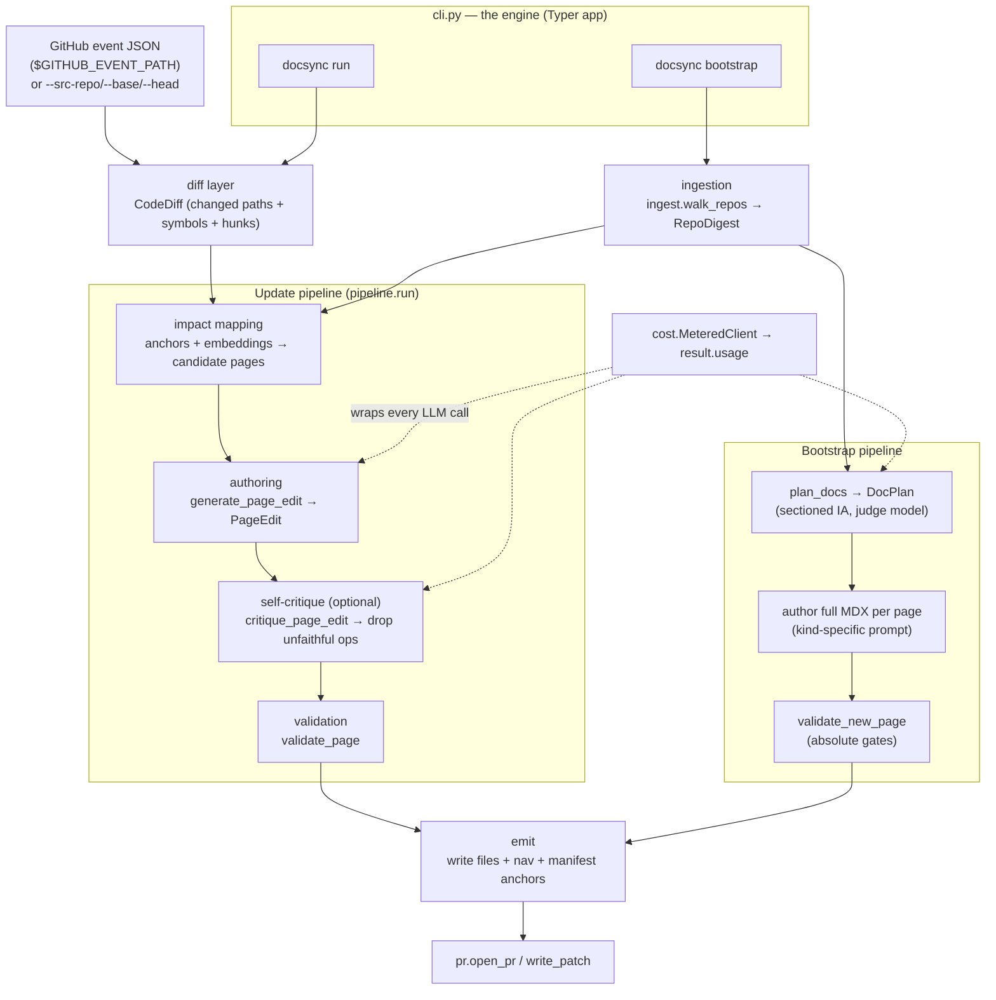

docsync keeps a documentation site in sync with the code it describes. It runs as a CLI (`docsync run`, `docsync bootstrap`, `docsync map`, `docsync index`) — dogfooded locally and wrapped by an `action.yml` for CI — and turns a code change into a reviewed documentation pull request without a human having to notice the drift first.

This page is a tour of how the pieces fit together. It is deliberately narrative: read it to build a mental model, then dive into the reference pages for individual modules.

## The two flows

docsync has two distinct entry points that share most of their machinery. Keeping them straight is the key to understanding the rest of the system.

<CardGroup cols={2}>
<Card title="Update an existing site" icon="pen-to-square">
`docsync run` — the day-to-day path. Given a **code diff**, it finds the doc pages that diff touches, edits *only those pages*, validates the edits, and opens a PR. This is the "triggered by commits" goal.
</Card>
<Card title="Author a site from scratch" icon="sparkles">
`docsync bootstrap` — the cold-start path. Given a **whole-platform snapshot** (no diff, no existing docs), it plans an information architecture, authors full pages, validates them against absolute gates, and opens a PR.
</Card>
</CardGroup>

<Note>
The update flow edits existing pages from a diff; bootstrap authors a structured, sequenced docs site from a whole-platform snapshot. They converge on the same emit-and-PR machinery but differ in everything upstream of it.
</Note>

## The layers

Both flows are organized as a pipeline of layers, each with a narrow responsibility. The diagram below shows how a request moves through them.



### 1 · The CLI (`app`)

Everything starts at the Typer application defined in `cli.py`:

```python
app = typer.Typer(add_completion=False, help="Keep documentation in sync with code changes.")
```

The `run` command wires the full update pipeline together: `diff -> impact -> edits -> validate -> (PR | patch + report)`. It is also where all the operational knobs live — `--dry-run`, `--open-pr`, `--self-critique`, `--min-confidence`, `--max-pages`, `--max-parallel`, `--backend`, and a `--preflight` gate. The `bootstrap` command (in `bootstrap.py`) drives the from-scratch flow.

Before any model spend, `run` does two cheap safety checks:

<Steps>
<Step title="Preflight the manifest">
With `--preflight` (on by default), it runs the doctor over `.docsync/manifest.yml`. If the manifest references doc pages that no longer exist, it aborts with exit code `2` — because a missing page silently disables its anchor, and "a missed doc update reads as no drift."
</Step>
<Step title="Idempotency cursor">
`cfg.already_processed(docs_repo, diff.repo, diff.head_sha)` checks the per-repo cursor in `.docsync/state/cursors.json`. If this exact `head_sha` was already turned into a PR, the run exits early. The cursor is advanced (`cfg.advance_cursor`) only after changes are written.
</Step>
</Steps>

### 2 · Ingestion

Ingestion reads source repositories — read-only — and reduces them to a compact, structured digest. In the update flow this surfaces as the `CodeDiff` (changed paths, changed symbols, and hunks); in bootstrap it surfaces as a list of `RepoDigest` objects produced by `ingest.walk_repos`.

A `RepoDigest` holds the repo id, its root, and a list of *units* (files) each carrying its top-level `symbols`. `bootstrap.render_digests` flattens these into a compact, per-repo listing for the planner — and crucially **caps the size** so a large platform cannot overflow the model's context:

```python
_DIGEST_MAX_CHARS_PER_REPO = 12_000  # cap the digest handed to the planner
```

When the cap is hit, the listing is truncated with an explicit `… (N files in this repo; list truncated)` marker rather than silently dropping files.

### 3 · The diff source (update flow only)

`run` resolves where the diff comes from with a clear precedence, implemented in `_resolve_diff`:

> explicit `--from-event` > explicit `--src-repo/--base/--head` flags > `$GITHUB_EVENT_PATH`

This is what makes CI "just work": the only thing wired up in a GitHub Action is the event JSON, so repo / base / head / PR are derived from it automatically with no flags. Locally, `_build_diff` decides between a local checkout (`diff_local`, when `src_repo` is a path containing `.git`) and a GitHub fetch (`diff_github`).

### 4 · Impact mapping (update flow only)

Given a diff, docsync must decide *which pages could be affected*. Two complementary strategies feed the candidate list (see `impact.find_anchor_candidates` and `impact.find_embedding_candidates`):

<CardGroup cols={2}>
<Card title="Manifest anchors" icon="anchor">
The primary signal. Each page in `.docsync/manifest.yml` declares the source `globs` and `symbols` it documents; a diff that touches them flags the page.
</Card>
<Card title="Embeddings recall-net" icon="radar">
An optional second net (`--use-embeddings`, default on) that surfaces drift on pages the manifest doesn't anchor. It degrades gracefully to anchors-only if the embeddings extra isn't installed.
</Card>
</CardGroup>

Candidates can be filtered by `--min-confidence` and capped by `--max-pages` (highest-confidence first; the rest are reported, not edited).

### 5 · Authoring

This is where the LLM writes documentation.

In the **update flow**, `generate_page_edit` proposes a `PageEdit` for each impacted page — a list of find/replace `EditOp`s, each with a `rationale`, plus an optional `no_change_reason` when the page needs no edit. Edits are surgical: they change existing prose rather than rewriting whole files.

In the **bootstrap flow**, authoring is a separate stage (B3) that writes **full MDX per page** using a kind-specific prompt, runs on Opus, in parallel, and is metered. Each page carries a *kind*:

| Kind | Purpose | Source anchoring |
|------|---------|------------------|
| `guide` | Task-oriented onboarding (Getting Started, how-to, setup/run) | broad globs |
| `concept` | Narrative explanation of a subsystem or cross-service flow — prose, not API tables | broad globs, few/no symbols |
| `reference` | Code-anchored API / data-model pages | specific files + symbols |

The plan that drives bootstrap authoring comes from `plan_docs`.

#### `plan_docs` — the information architecture call

`plan_docs` asks the **judge model** (a single call) for a `DocPlan`: an ordered, sectioned set of pages. The system prompt instructs a "senior technical writer" to design a real reading flow across ordered sections (`SECTION_ORDER`: Getting Started → Concepts → Architecture → Reference → Operations), not a flat list of API pages.

After the model responds, `plan_docs` does deterministic clean-up that the model can't be trusted to get right:

```python
def plan_docs(digests, docs_root, config, *, client, max_pages=None) -> tuple[DocPlan, list[str]]:
    """Ask the judge model for a sectioned DocPlan, then dedupe collisions + cap.

    Returns (plan, skipped). `skipped` lists planned page paths dropped for colliding
    with an existing page/route or an earlier plan entry. `max_pages` caps AFTER dedupe.
    """
```

It collects the routes and `.mdx`/`.md` paths that already exist on disk (`_existing_page_paths`, which skips anything under `.docsync`), feeds them into the prompt as "do not propose these", and then **drops any planned page that still collides** with an existing page/route or an earlier plan entry. `max_pages` is applied *after* dedupe, so the cap counts only real, new pages.

<Note>
Concept and guide pages anchor to broad subsystem globs and carry `judge_required`. That flag is what lets `docsync run` keep narrative pages live without firing an edit on every unrelated change — a judge call decides whether the change actually matters to that page.
</Note>

### 6 · Self-critique (optional update gate)

With `--self-critique`, each proposed `PageEdit` passes through an adversarial second opinion before validation. `critique.critique_page_edit` runs a cheap Haiku call that judges every edit op against the actual diff and asks one question only: *does this edit faithfully reflect THIS diff, and touch only what the diff changed?*

The verdict is intentionally flat so the structured-output backend has nothing nested to validate:

```python
class CritiqueVerdict(BaseModel):
    faithful: bool
    rejected_finds: list[str] = Field(default_factory=list)
    reason: str = ""
```

`apply_critique` is a pure helper: it returns a new `PageEdit` with every op whose `find` string appears in `rejected_finds` removed, preserving order and never mutating the input. If every op is rejected, the page becomes a no-change. The reviewer's rule is narrow — keep an op if it reflects something the diff actually changed (even if it merely *adds* correct, undocumented detail); reject only hallucinated symbols, unrelated sections, or over-reaching rewrites.

### 7 · Validation

Validation is the last gate before anything is written.

- **Update flow:** `validate_page` checks each surviving edit. Validation runs through a docs-format **adapter** (`validate.get_adapter`) that knows how to parse the target format and resolve nav routes.
- **Bootstrap flow:** `validate_new_page` applies *absolute* gates — there is no original page to diff against, so the page must stand on its own.

An optional broken-link soft gate runs when `--check-links` is set.

<Warning>
The validation adapter is format-aware, and bootstrap's gates are stricter than the update flow's: editing a page can lean on the original as a baseline, but a freshly authored page has nothing to fall back on, so it must pass on its own merits.
</Warning>

### 8 · Emit & PR

Validated changes are written and turned into a pull request.

In the update flow, `run` snapshots the originals of every changed page *before* overwriting, so the report can show a real before/after diff:

```python
originals = {
    o.page_path: (docs_root / o.page_path).read_text(encoding="utf-8")
    for o in result.changed()
}
```

It then writes the changes (`pipeline.write_changes`), advances the cursor, and either opens a PR or writes a patch:

<Tabs>
<Tab title="--open-pr">
`pr.open_pr` branches, commits, pushes, and opens a docs PR — with a generated title (`docs: sync with <repo> #<pr>`), the markdown report as the body, and `reviewers` / `pr_labels` from config.
</Tab>
<Tab title="default (patch)">
Without `--open-pr`, `pr.write_patch` writes `docsync.patch` to the docs repo so the change can be inspected or applied manually.
</Tab>
<Tab title="--dry-run">
The default. docsync computes and reports only — it does not write files or open a PR. Use `--no-dry-run` / `--open-pr` to apply.
</Tab>
</Tabs>

Bootstrap's emit step (B5) additionally writes ordered nav sections and appends manifest anchors. `config.merge_manifest_pages` appends new pages to `.docsync/manifest.yml` **comment-preserving** — it uses a separate round-trip YAML instance so the hand-authored manifest comments and key order survive the edit, and it is idempotent on `path`.

## The cost spine

One concern cuts across every layer: every LLM call goes through an injectable `client`, and that client is wrapped **once** in `MeteredClient` (from `cost.py`). This is a transparent proxy around anything exposing `.messages.parse` — it records the `usage` off each response and leaves `.parsed_output` untouched, so metering is added with zero changes to individual call sites.

Two mechanisms make per-stage attribution work:

- A `stage(...)` context manager sets a `ContextVar` (`current_stage`) around each call — `"plan"`, `"judge"`, `"edit"`, `"critique"`. Because it's a `ContextVar`, the value set inside a `ThreadPoolExecutor` worker is the one its own `parse()` sees, so stages can run concurrently and still be metered separately.
- `UsageMeter` accumulates token counts keyed by `(model, stage)` under a lock, then `finalize()` collapses them into a serializable `RunUsage` (cost-sorted, with a prompt-cache hit rate).

```python
class MeteredClient:
    def __init__(self, inner, meter):
        self._inner = inner
        self.messages = _MeteredMessages(inner.messages, meter)

    def __getattr__(self, name):  # pass-through for everything else
        return getattr(self._inner, name)
```

<Warning>
Costs are an **estimate**. `PRICING` is a built-in table of USD per *million* tokens, unknown models fall back to opus-class pricing so cost is never under-reported, and `RunUsage.estimated` is always `True`. Update `PRICING` when Anthropic's rates change.
</Warning>

The `--backend` flag chooses where the client comes from: `api` (an `ANTHROPIC_API_KEY` client) or `claude-code` (reusing local Claude Code CLI auth, no API key). Both response shapes — the SDK's `usage` object and the `claude-code` CLI envelope's `usage` dict — are handled by the same metering code.

## Putting it together

For the common case — a commit lands in a service repo and CI runs `docsync run` — the journey is:

<Steps>
<Step title="Resolve the diff">
The GitHub event JSON yields repo / base / head / PR; preflight and the idempotency cursor decide whether to proceed at all.
</Step>
<Step title="Map impact">
Manifest anchors (plus the embeddings recall-net) produce a confidence-ranked list of candidate pages, filtered and capped by the CLI knobs.
</Step>
<Step title="Author edits">
`generate_page_edit` proposes surgical `PageEdit`s; with `--self-critique` an adversarial Haiku pass drops unfaithful ops.
</Step>
<Step title="Validate">
`validate_page` (via a format adapter) gates each edit; broken-link checks run if requested.
</Step>
<Step title="Emit & report">
Originals are snapshotted, changes written, the cursor advanced, and a PR (or patch) is produced with a cost-annotated report.
</Step>
</Steps>

Bootstrap follows the same backbone but replaces impact-mapping with `plan_docs` and per-page editing with full-page authoring against the absolute `validate_new_page` gates — proof that the layers are genuinely modular: swap the front of the pipeline, reuse the emit-and-PR tail, and meter the whole thing through the same client wrapper.