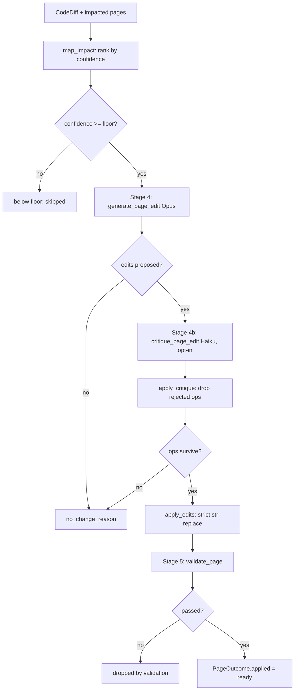

When source code changes, the prose that describes it goes stale. The **authoring pipeline** is the part of docsync that closes that gap: given a code diff and the set of documentation pages it touched, it asks an LLM to propose *surgical* edits, runs a cheap adversarial check to catch hallucinations, applies the edits with a strict safety rule, and validates the result — all before anything is written to disk or opened as a pull request.

This page follows one page through that journey, then zooms out to how the whole run is orchestrated.

## The shape of the pipeline

The pipeline is the pure core of docsync — Stages 3–5 over a single `CodeDiff`. Stage 1 (event capture) and Stage 2 (diff extraction) happen in the CLI before it; Stage 6 (PR creation) happens after, in `pr.py`. The pipeline itself performs **no git side effects**: it just returns a `PipelineResult` describing, per impacted page, the surgical edit and whether it passed validation.

<CardGroup cols={3}>
  <Card title="Generate" icon="pen-nib">
    `generate_page_edit` asks Claude Opus for a small list of find/replace ops — never a full rewrite.
  </Card>
  <Card title="Critique" icon="gavel">
    `critique_page_edit` runs a cheap Haiku judge that drops ops not justified by the diff.
  </Card>
  <Card title="Apply &amp; validate" icon="circle-check">
    `apply_edits` performs strict string replacement; `validate_page` gates the result.
  </Card>
</CardGroup>



## Stage 4 — generating surgical edits

The contract for an edit is deliberately small. The model never returns a rewritten file; it returns a `PageEdit`, which wraps a list of find/replace `EditOp`s. `generate_page_edit` is the only place in this module that talks to the Anthropic SDK for edit generation, and it is injectable with a fake `client` for tests (defaulting to `anthropic.Anthropic()`).

The system prompt encodes the rules that keep edits surgical:

- Each `find` must be a **verbatim, unique** substring of the current page — copied exactly, including whitespace — and as small as possible (ideally a single table row, sentence, or code-fence line).
- Edit **only** the rows, prose, or code-fence lines the diff invalidates; leave unrelated content alone.
- Never alter MDX component tag structure (`<CardGroup>`, `<Card>`, `<Warning>`, `<Note>`…) or break mermaid code fences.
- Preserve inline backtick code references unless the underlying symbol was renamed in the diff.
- If the page is *not* actually invalidated, return an empty edits list and set `no_change_reason` explaining why.

Whether the model may touch the YAML frontmatter `title`/`description` is decided per page: `build_edit_prompt` only allows it when the page's `ManifestPage` has `allow_frontmatter_edit` set, and otherwise the prompt explicitly forbids it.

<Note>
Opus 4.8 uses adaptive thinking only — depth is controlled via `output_config.effort`, with no `budget_tokens` and no sampling params. The invariant system prompt is cached (`cache_control: ephemeral`) because it is identical across every page in a run.
</Note>

### Caching the shared diff

For multi-page runs over a large diff, rendering the same diff into every page's prompt is wasteful. `should_cache_diff` decides whether to hoist the diff into a cached, shared prompt block:

```python
def should_cache_diff(diff: CodeDiff, n_pages: int) -> bool:
    if n_pages <= 1:
        return False
    return len(render_diff(diff, max_chars=_EDIT_DIFF_MAX_CHARS)) >= _CACHE_DIFF_MIN_CHARS
```

Caching only pays off when (a) more than one page will be edited, so there are reads to amortize the single cache *write*, and (b) the rendered diff clears the model's ~4096-token cacheable-prefix floor (`_CACHE_DIFF_MIN_CHARS = 16_000`). Below that floor the API silently won't cache, and a write with no reads is a net loss. When caching is on, `build_edit_prompt` is called with `include_diff=False` so the per-page user message points at the diff in the cached system context instead of repeating it.

## Stage 4b — adversarial self-critique

LLM editors sometimes propose edits that *sound* right but describe something the diff never changed. Stage 4.5 is a cheap gate against that: a second, smaller model (Haiku) reviews each proposed op against the actual diff and answers one narrow question — *does this edit faithfully reflect THIS diff, and touch only what the diff changed?*

The judge's job is intentionally narrow. The system prompt instructs it to judge **faithfulness to the diff only** — not writing quality, not style, not whether the docs could be better:

<Tabs>
  <Tab title="Keep an op">
    The op reflects something the diff actually changed. An op that merely **adds** undocumented-but-correct information about a real diff change is acceptable and must be kept.
  </Tab>
  <Tab title="Reject an op">
    The op is about something the diff did **not** change — a hallucinated symbol, an unrelated section, or an over-reaching rewrite of content the diff never touched.
  </Tab>
</Tabs>

The verdict contract is a flat `CritiqueVerdict` so the structured-output backend has nothing nested to validate:

```python
class CritiqueVerdict(BaseModel):
    faithful: bool
    rejected_finds: list[str] = Field(default_factory=list)
    reason: str = ""
```

`faithful` is true **iff** `rejected_finds` is empty — i.e. there is nothing left to reject. `rejected_finds` holds the exact `find` strings of the ops to drop, and `reason` is a short human-readable explanation. Like `generate_page_edit`, `critique_page_edit` mirrors the `messages.parse(...)` idiom, caches its invariant system prefix, and is injectable with a fake `client`.

Applying the verdict is a pure helper — it never mutates its input:

```python
def apply_critique(page_edit: PageEdit, verdict: CritiqueVerdict) -> PageEdit:
    rejected = set(verdict.rejected_finds)
    kept = [op for op in page_edit.edits if op.find not in rejected]
    return PageEdit(edits=kept, no_change_reason=page_edit.no_change_reason)
```

Ops are matched on their exact `find` string and kept in original order. If every op is rejected, the returned `PageEdit` has an empty edits list, and the pipeline then treats the page as a no-change.

<Note>
Self-critique is **opt-in** (the `self_critique` flag) and best-effort. If the critique call raises, the pipeline keeps the original edit rather than blocking the page — the page records a `"self-critique skipped"` note and moves on.
</Note>

## Applying edits — strict and unforgiving

Once an edit survives critique, `apply_edits` turns it into new text. This is where the "surgical" contract is enforced mechanically: every op is an **exact, single-occurrence** string replacement.

```python
def apply_edits(text: str, edit: PageEdit) -> str:
    working = text
    for index, op in enumerate(edit.edits):
        count = working.count(op.find)
        if count == 0:
            raise EditApplicationError(...)   # not found
        if count > 1:
            raise EditApplicationError(...)   # ambiguous
        working = working.replace(op.find, op.replace, 1)
    return working
```

The rules are absolute:

- If `find` occurs **zero** times, raise `EditApplicationError` (not applicable).
- If it occurs **more than once**, raise `EditApplicationError` (ambiguous).
- Never fuzzy-match, never replace-all.

Ops are applied sequentially against the evolving text, so a later op sees the result of earlier ones. An empty edit list returns the text unchanged.

<Warning>
Because matching is exact and unique, an op whose `find` isn't a verbatim, one-of-a-kind substring of the *current* working text fails hard. In the pipeline this isn't fatal to the run — the failure is caught and the page is simply dropped with an `"edit not applicable (dropped)"` note — but it means a sloppy `find` costs you the whole page rather than producing a subtly wrong edit.
</Warning>

## Putting it together: one page's outcome

The pipeline's `run()` ties the stages together. It maps the diff to impacted pages, sorts them so the highest-confidence pages are edited first (with `page_path` as a deterministic tiebreaker), partitions by a confidence floor, and applies a spend cap to what survives. All LLM calls — judge, edit, and critique — go through a single injected `client`, wrapped once in a `MeteredClient` so the run's token usage and estimated cost land on `result.usage`.

Each page is then processed by `_process_page`, which is written to be **pure with respect to shared state and to never raise**, so it is safe to fan out across a thread pool. Here is the journey for a single page:

<Steps>
  <Step title="Read the page">
    `_read_page` loads the `.mdx` from disk. If it's missing, the outcome notes `page not found on disk` and stops.
  </Step>
  <Step title="Generate (Stage 4)">
    `generate_page_edit` proposes the edit. On an API error the page records `edit generation failed` and stops. If the model returns no edits, the `no_change_reason` becomes the note.
  </Step>
  <Step title="Critique (Stage 4b, opt-in)">
    If `self_critique` is on, `critique_page_edit` then `apply_critique` drop unfaithful ops. If nothing survives, the page is `dropped by self-critique`. A critique exception is swallowed — the original edit is kept.
  </Step>
  <Step title="Apply">
    `apply_edits` performs the strict str-replace. An `EditApplicationError` drops the page with an explanatory note.
  </Step>
  <Step title="Validate (Stage 5)">
    `validate_page` (via the format-specific adapter from `get_adapter`) checks the result. If it fails, the page is `dropped by validation` with the joined failures.
  </Step>
  <Step title="Mark ready">
    On success the outcome gets `new_content`, `applied = True`, and the note `"ready"`.
  </Step>
</Steps>

Every branch produces a self-contained `PageOutcome`; even an unexpected error is caught and turned into an `unexpected error: …` note rather than aborting the whole map. `result.changed()` then lists exactly the pages with applied, validated edits — the set the CLI can write to disk and open as a PR.

### Concurrency and the cache prime

Pages are independent, so the edit stage runs concurrently — `map()` preserves order. The worker count is `max(1, min(config.max_parallel_requests, len(to_edit)))`. There's a subtlety when the shared-diff cache is in play:

- **Single worker:** pages are processed serially in a simple list comprehension.
- **Cache enabled:** page 1 is processed **serially first** to *prime* the cache, then the rest fan out across the thread pool — so they read the cached diff block instead of each re-writing it, and the reads land inside the 5-minute ephemeral window.
- **No cache:** all pages fan out across the pool directly.

<Note>
The confidence floor is a ship-safety valve. Anchor-sourced pages autopass at confidence `1.0`, so the floor only gates judge- or embedding-sourced pages — handy for a conservative first rollout. The spend cap counts only pages that would reach the expensive edit stage, so below-floor pages never starve high-confidence ones out of the budget.
</Note>

## Why three steps instead of one

Each stage exists to neutralize a specific failure mode of LLM-authored docs:

| Stage | Symbol | Guards against |
|-------|--------|----------------|
| Generate | `generate_page_edit` | Whole-file rewrites and frontmatter churn — by forcing small, unique find/replace ops. |
| Critique | `critique_page_edit` / `apply_critique` | Hallucinated or over-reaching edits — by cheaply re-checking each op against the diff. |
| Apply | `apply_edits` | Silent, wrong, or duplicated replacements — by demanding an exact, single match. |

The result is a pipeline that fails *safely* and *locally*: a bad edit costs one page a drop and a note, never a corrupted file or an aborted run — and the surviving edits are the ones grounded in the code that actually changed.