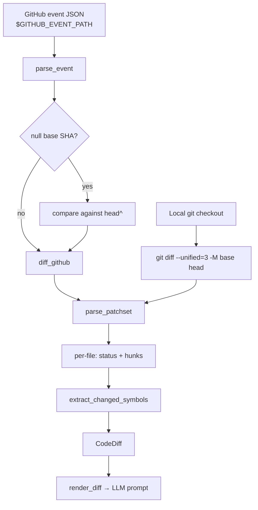

docsync's job is to keep documentation in step with code. Before it can decide
*what* to rewrite, it has to answer a narrower question: **what actually
changed?** This page walks through that early part of the pipeline — Stage 1.5
(event ingestion) and Stage 2 (diff extraction) — where a `base..head`
comparison becomes a structured `CodeDiff`, and where docsync recovers the
function, class, and assignment names a change touches.

<Note>
Everything downstream — the Opus editor, the Haiku critic — builds against the
`CodeDiff` produced here. Get this stage right and the rest of the pipeline has
a clean, uniform signal to reason about, regardless of whether the change
arrived from a local checkout or a GitHub webhook.
</Note>

## The shape of the problem

A change can reach docsync two ways, and the early pipeline is organized so both
funnel into the same structure:

<CardGroup cols={2}>
<Card title="Local checkout" icon="folder">
The primary CLI path. docsync shells out to `git diff` and parses the unified
diff. Entry point: `diff_local`.
</Card>
<Card title="GitHub event" icon="github">
The CI path. A push or `repository_dispatch` event drives the comparison, which
is fetched with `gh api .../compare/...`. Entry points: `diff_from_event` →
`diff_github`.
</Card>
</CardGroup>

Both paths converge on a single `CodeDiff`: a record of the repo, the `base` and
`head` SHAs, optional PR metadata, and a list of `ChangedFile`s — each carrying
its path, status, raw hunks, and the symbols it touched.



## Stage 1.5 — ingesting a GitHub event

The project's guiding goal is *triggered by commits, not many parameters*. In
CI you should not have to hand docsync `--src-repo`, `--base`, `--head`, and so
on — all of that is already in the event GitHub writes to the file named by
`$GITHUB_EVENT_PATH`. The `events` module derives every diff parameter from that
JSON.

`parse_event` is pure (no I/O) and understands two event shapes, checked in
order:

<Steps>
<Step title="repository_dispatch">
A hand-rolled trigger that carries an explicit `client_payload`. When
`event["client_payload"]` is present, docsync reads `repo`, `base_sha`,
`head_sha`, `pr_number`, and `pr_title` straight from it.
</Step>
<Step title="push">
The native push event. When the event has `before`/`after` keys, `repo` comes
from `repository.full_name`, the base from `before`, the head from `after`, and
`pr_title` from `head_commit.message` (`pr_number` is `None`).
</Step>
<Step title="Neither">
If the event matches neither shape, `parse_event` raises `ValueError` rather
than guessing.
</Step>
</Steps>

The recovered parameters are returned as an `EventInfo` dataclass — *before* one
important fixup.

### The null-base fallback

GitHub represents "there is no prior commit" with an all-zeros SHA. This shows
up as `before` on a branch's very first push, and as the base of a
`repository_dispatch` payload that has no real ancestor.

```python
NULL_SHA = "0" * 40

def is_null_sha(sha: str | None) -> bool:
    """True if sha is git's all-zeros null SHA (any length of only zeros)."""
    return bool(sha) and set(sha) == {"0"}
```

`is_null_sha` deliberately matches a string of *only* zeros of any length, not
just the canonical 40-character form. When `diff_from_event` sees a null base, it
compares against `<head>^` — the head commit's first parent — so the diff stays
meaningful instead of diffing against the empty tree:

```python
info = parse_event(load_event(event_path))

base = info.base_sha
if is_null_sha(base):
    base = f"{info.head_sha}^"
```

<Note>
`diff_from_event` takes an optional `runner` callable and otherwise resolves the
module-level `diff_github` at call time. That seam keeps the module
network-free and fully testable — a test can pass a stub `runner` or
monkeypatch `docsync.events.diff_github`.
</Note>

## Stage 2 — extracting the diff

Once the comparison parameters are known, Stage 2 produces the `CodeDiff`. Both
entry points return one, and both share the load-bearing helper underneath.

<Tabs>
<Tab title="Local (git diff)">
`diff_local` runs `git diff` in a local checkout and hands the result to
`parse_patchset`:

```python
diff_text = _run(
    ["git", "-C", repo_path, "diff", "--unified=3", "-M", base, head]
)
```

The `-M` flag enables rename detection, so a rename surfaces as a single
`FileStatus.RENAMED` entry rather than an add/remove pair. `_run` wraps
`subprocess.run` and raises a clear `RuntimeError` if the command is missing
(e.g. `git` not installed) or exits non-zero.
</Tab>
<Tab title="Remote (GitHub)">
`diff_github` (the CI path) calls `gh api repos/{repo}/compare/...` and parses
GitHub's per-file `patch` fragments. Crucially, those fragments are *hunks
only* — there is no guarantee of the full post-image file text.
</Tab>
</Tabs>

### Parsing the patch set

`parse_patchset` is factored out of `diff_local` so it can be exercised with an
inline diff fixture — no git, no subprocess — and `pipeline.py` plus the tests
depend on its exact signature. It feeds the unified-diff text to the `unidiff`
library's `PatchSet` and, for each patched file, records:

- **status** — derived by `_status_of` into `ADDED`, `REMOVED`, `RENAMED`, or
  `MODIFIED`.
- **path** — `unidiff` already strips the `a/`/`b/` prefix and prefers the
  target side; `_strip_ab_prefix` is the fallback (and maps `/dev/null` to
  `None`).
- **previous_path** — only set for renames, from the source side.
- **hunks** — each hunk stringified.
- **changed_symbols** — from `extract_changed_symbols` (next section).

```python
hunks = [str(hunk) for hunk in patched_file]
symbols = extract_changed_symbols(path, hunks)

files.append(
    ChangedFile(
        path=path,
        status=status,
        previous_path=previous_path,
        hunks=hunks,
        changed_symbols=symbols,
    )
)
```

## Symbol extraction — the cross-boundary signal

Line numbers churn constantly; they're a poor key for "did the docs about
`register_routes` go stale?" The durable signal is the **name** of the
function, class, or module-level value a change touched. `extract_changed_symbols`
recovers those names, and it does so **from the hunk text alone** — never
requiring the full file. That's what makes it work equally well on GitHub's
bare `patch` fragments and on local `git diff` output.

It only handles Python (`.py`) files; anything else returns `[]`.

It combines two complementary signals, heading symbols first:

<Steps>
<Step title="The enclosing-scope heading">
git and `unidiff` append the enclosing scope after the second `@@` of a hunk
header — for example `@@ -2,6 +2,8 @@ def register_routes(app):`. This names the
function or class whose body changed *even when its own signature line is
untouched*.
</Step>
<Step title="The changed lines themselves">
The added (`+`) and removed (`-`) lines are scanned for `def NAME`,
`class NAME`, and module-level `NAME = ...` assignments introduced or deleted by
the hunk. The `+++`/`---` file markers a raw patch may carry are skipped.
</Step>
</Steps>

The matching is driven by three small regexes:

```python
# def foo( / async def foo( / class Foo( / class Foo:  — capture NAME.
_DEF_OR_CLASS = re.compile(r"\b(?:async\s+def|def|class)\s+([A-Za-z_]\w*)")
# Module-level assignment: NAME = ...  (no leading whitespace -> top level).
_MODULE_ASSIGN = re.compile(r"^([A-Za-z_]\w*)\s*(?::[^=]+)?=(?!=)")
# The enclosing-scope heading git/unidiff append after the second @@.
_HUNK_HEADER = re.compile(r"^@@.*?@@\s*(.*)$")
```

A few deliberate details worth noting:

- **`def`/`class` names are matched anywhere on the line**, but module-level
  assignments only count when the line has **no leading indentation** — that's
  how a top-level constant is distinguished from an attribute set inside a
  method.
- The assignment pattern tolerates type annotations and multiple targets
  (`FOO: list = ...`, `FOO = BAR = ...`) while the `(?!=)` lookahead avoids
  matching the `==` comparison operator.
- Results are **de-duplicated and order-preserving** — the `_add` helper tracks
  a `seen` set so each name appears once, with heading symbols listed first.

### A worked example

Given a hunk like this for `routes.py`:

```diff
@@ -10,7 +10,9 @@ def register_routes(app):
     app.add_route("/health", health)
-    app.add_route("/alerts", alerts)
+    app.add_route("/alerts", alerts_v2)
+
+    DEFAULT_TIMEOUT = 30
```

`extract_changed_symbols("routes.py", [hunk])` yields:

```python
["register_routes", "DEFAULT_TIMEOUT"]
```

`register_routes` comes from the enclosing-scope heading (its signature line was
never edited), and `DEFAULT_TIMEOUT` comes from the newly added module-level
assignment. The two `app.add_route(...)` edits contribute no symbols — they are
neither `def`/`class` definitions nor top-level assignments.

<Warning>
Symbol extraction is explicitly **best-effort**. It is regex-driven, not a full
Python parse, so it favors robustness on partial diffs over completeness. Treat
`changed_symbols` as a strong hint about what a change touched, not a guaranteed
exhaustive list.
</Warning>

## Rendering the diff for the model

A `CodeDiff` eventually has to be shown to an LLM. To keep the two
consuming stages — the Opus editor (`edits.py`) and the Haiku critic
(`critique.py`) — from drifting, both use one shared renderer, `render_diff`,
which lives in `diffrender.py`.

`render_diff` emits a compact, per-file rendering: a header with the repo and PR
title, then one section per file showing its path, status, changed symbols, and
hunks.

```text
repo: keep-api-gateway
pr_title: Add v2 alerts route

## file: routes.py (modified)
changed symbols: register_routes, DEFAULT_TIMEOUT
@@ -10,7 +10,9 @@ def register_routes(app):
...
```

The renderer is capped so a giant PR can't blow up the prompt. The cap defaults
to `MAX_DIFF_CHARS` (12,000) and is enforced as sections accumulate:

```python
if used + len(section) > max_chars:
    remaining = max_chars - used
    if remaining > 0:
        parts.append(section[:remaining])
    parts.append("\n... (diff truncated)")
    break
```

When the budget is exceeded, the current section is sliced to whatever space
remains and an explicit `... (diff truncated)` marker is appended — the model is
told the view is partial rather than being silently shortchanged. A file with no
recovered symbols renders its symbol line as `(none)`.

## Putting it together

<CardGroup cols={2}>
<Card title="One structure, two sources" icon="diagram-project">
Local `git diff` and GitHub `compare` both land in `parse_patchset`, producing
an identical `CodeDiff`. Downstream stages never have to care where the change
came from.
</Card>
<Card title="Names over line numbers" icon="signature">
`extract_changed_symbols` recovers def/class/assignment names from hunk text
alone, giving a stable signal that survives line-number churn and works on
partial diffs.
</Card>
<Card title="Event-native CI" icon="bolt">
`diff_from_event` derives every parameter from the GitHub event file and handles
the null-base first-push case by diffing against `head^`.
</Card>
<Card title="Bounded prompts" icon="ruler">
`render_diff` gives both LLM stages the same capped view of the diff, with
explicit truncation when a PR is too large.
</Card>
</CardGroup>

The result is a clean contract for the rest of docsync: given any change, the
pipeline knows the files, their status, the raw hunks, and — most importantly —
the named symbols that moved, all in one structure that's ready to render into a
prompt.