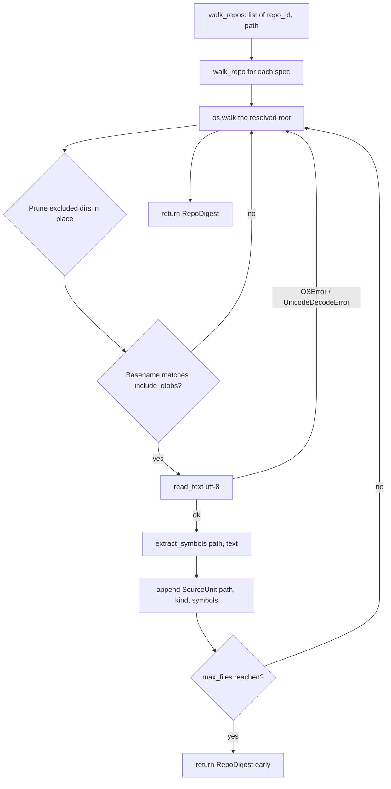

When you run `docsync bootstrap`, the tool needs to understand a whole repository — or several repositories at once — before it can decide which documentation pages to write. It can't simply hand every file's contents to a language model: a platform like Keep spans four services and thousands of source files, far more than fits in a single prompt. Instead, docsync performs **code ingestion**: a strictly read-only walk that distills each source file into a compact summary of its path, language, and top-level symbol names — never the file body.

This page explains how that ingestion stage works, what a "symbol" means here, and how the pieces fit together.

<Note>
Ingestion is **Stage B1** of `docsync bootstrap`. Where the *update* pipeline starts from a git **diff**, bootstrap starts from a **snapshot** of the repository as it exists on disk. The full file text is read later, per-page, and only for the pages the planner actually decides to author.
</Note>

## The shape of the problem

A documentation planner needs a map of the codebase, not the codebase itself. The key insight behind ingestion is that **a whole repo's worth of summaries is small enough to fit in one prompt**, even when the repo's source is not.

Each file becomes a `SourceUnit` — a lightweight record of:

- `path` — the file's path, relative to the repo root, in POSIX form
- `kind` — the language: `"python"`, `"typescript"`, or `"other"`
- `symbols` — the names of the file's top-level functions, classes, and module-level variables

A whole repo of these becomes a `RepoDigest` (carrying the repo identifier, resolved root path, and the list of units). The planner reads digests; the author stage later reads real file text on demand.

<CardGroup cols={3}>
  <Card title="walk_repo" icon="folder-tree">
    Read-only walk of one repository → a single `RepoDigest`.
  </Card>
  <Card title="walk_repos" icon="layer-group">
    Walk several repositories → one `RepoDigest` per repo, in spec order.
  </Card>
  <Card title="extract_symbols" icon="code">
    Language-dispatched extraction of top-level symbol names from one file's text.
  </Card>
</CardGroup>

## The ingestion flow



### Walking a single repository

`walk_repo` is the workhorse. It takes a repo path and returns a `RepoDigest`. The walk is governed by a few deliberate rules:

<Steps>
  <Step title="Resolve the root and pick an identifier">
    The path is resolved to an absolute path. The `repo` identifier stamped onto the digest defaults to the directory name if you don't pass one explicitly.
  </Step>
  <Step title="Prune excluded directories in place">
    During `os.walk`, the list of subdirectories is rewritten in place so the walker never descends into directories that can't hold documentable source. This avoids reading — or even stat-ing — thousands of irrelevant files. The pruned set is also sorted, which keeps traversal deterministic.
  </Step>
  <Step title="Match files by basename glob">
    Only files whose **basename** matches one of the include globs are considered. By default that means `*.py`, `*.ts`, and `*.tsx`.
  </Step>
  <Step title="Read each match once and extract symbols">
    Each matching file is read a single time as UTF-8. If reading fails (`OSError` or `UnicodeDecodeError`), the file is silently skipped so one unreadable file can't sink the whole walk. The text is passed to `extract_symbols`, and a `SourceUnit` is appended.
  </Step>
  <Step title="Honor the optional file cap">
    If `max_files > 0`, the walk returns as soon as that many units have been collected. A value of `0` means no cap.
  </Step>
</Steps>

<Warning>
`walk_repo` **never writes to the repo**. The entire ingestion stage is read-only by design — it opens files only to read their text, and prunes directories rather than touching them. The same guarantee holds for `walk_repos` and `read_excerpt`.
</Warning>

#### Defaults you can override

The function signature exposes the knobs that shape a walk:

```python
def walk_repo(
    repo_path: str | Path,
    *,
    repo: str | None = None,
    include_globs: tuple[str, ...] = DEFAULT_INCLUDE,      # ("*.py", "*.ts", "*.tsx")
    exclude_dirs: frozenset[str] = DEFAULT_EXCLUDE_DIRS,
    max_files: int = 0,
) -> RepoDigest:
    ...
```

`DEFAULT_EXCLUDE_DIRS` prunes the usual non-source suspects — `.git`, `.github`, `node_modules`, virtualenvs, caches, build output (`dist`, `build`, `.next`), and notably **test and migration directories** (`tests`, `test`, `__tests__`, `migrations`) as well as docsync's own `.docsync` working directory. These are excluded because they aren't the subject of conceptual documentation.

<Note>
`exclude_dirs` matches **directory names anywhere in the tree**, while `include_globs` matches **file basenames**. They operate on different things: one decides where the walk goes, the other decides which files it reads.
</Note>

### Walking several repositories at once

`walk_repos` is a thin convenience over `walk_repo`. You give it a list of `(repo_id, path)` pairs and it returns one `RepoDigest` per spec, in spec order. Each walk is independent and read-only.

```python
from docsync.ingest import walk_repos

digests = walk_repos([
    ("keep-api-gateway", "/Users/yarin/keep-namespace/keep-api-gateway"),
    ("keep-event-handler", "/Users/yarin/keep-namespace/keep-event-handler"),
    ("keep-workflows", "/Users/yarin/keep-namespace/keep-workflows"),
    ("keep-ui", "/Users/yarin/keep-namespace/keep-ui"),
])

for d in digests:
    print(d.repo, "→", len(d.units), "source units")
```

This is exactly how `docsync bootstrap` ingests a whole platform — all four Keep services — so the planner can produce a single cross-repo documentation plan.

## What counts as a "symbol"

`extract_symbols` is the heart of ingestion. It dispatches on file kind and returns the **top-level** symbol names for the file. The emphasis on *top-level* is intentional: nested helpers and methods are noise when the goal is to anchor a documentation page to recognizable, importable names.

```python
def extract_symbols(path: str, text: str) -> list[str]:
    kind = _kind(path)
    if kind == "python":
        return _python_symbols(text)
    if kind == "typescript":
        # top-level export names via regex
        ...
    return []                # "other" → no symbols
```

Unlike the diff pipeline's `extract_changed_symbols`, which works on hunk fragments, `extract_symbols` operates on **whole file text** — so it can use a real parser instead of line-level heuristics.

<Tabs>
  <Tab title="Python (AST-based)">
    For Python files, `_python_symbols` parses the source with `ast.parse` and walks **only the module body** (`tree.body`), collecting:

    - top-level `def` and `async def` functions
    - top-level `class` definitions
    - module-level assignments (`ast.Assign`) where a target is a plain name
    - module-level annotated assignments (`ast.AnnAssign`) with a name target

    Names are de-duplicated as they're collected (a `seen` set preserves first-seen order), so a name assigned twice appears once.

    AST parsing is more accurate than regex because it understands Python's structure — it won't be fooled by `def` appearing inside a string or a nested function.

    ```python
    # All four of these become symbols:
    DEFAULT_TIMEOUT = 30           # ast.Assign
    retries: int = 3               # ast.AnnAssign

    def process_alert(...):        # FunctionDef
        def _helper():             # NOT a symbol (nested)
            ...

    class AlertDeduplicator:       # ClassDef
        def run(self):             # NOT a symbol (method)
            ...
    ```
  </Tab>
  <Tab title="Python fallback (regex)">
    If `ast.parse` raises `SyntaxError` or `ValueError` — a partial file, a syntax error, or Python 2 source — extraction does **not** crash. It falls back to a line-oriented regex that matches top-of-line `def`, `async def`, and `class` declarations:

    ```python
    _PY_DEF_OR_CLASS = re.compile(
        r"^(?:async\s+def|def|class)\s+([A-Za-z_]\w*)",
        re.MULTILINE,
    )
    ```

    The fallback captures fewer kinds of symbol than the AST path (no module-level assignments), but it guarantees ingestion survives one bad file rather than aborting the whole walk.
  </Tab>
  <Tab title="TypeScript (export regex)">
    There is no TypeScript parser in-tree, so symbol extraction for `.ts` / `.tsx` is a best-effort regex over **top-level exports**:

    ```python
    _TS_EXPORT_RE = re.compile(
        r"^export\s+(?:default\s+)?(?:async\s+)?"
        r"(?:function|const|let|var|class|interface|type|enum)\s+([A-Za-z_$][\w$]*)",
        re.MULTILINE,
    )
    ```

    This matches exported `function`, `const`/`let`/`var`, `class`, `interface`, `type`, and `enum` declarations, optionally preceded by `default` and/or `async`. Names are de-duplicated, first-seen order preserved.

    ```typescript
    export function useAlerts() { ... }        // useAlerts
    export const ApiClient = ...               // ApiClient
    export default class Widget { ... }        // Widget
    export interface AlertDto { ... }          // AlertDto
    const internalHelper = ...                 // NOT exported → ignored
    ```
  </Tab>
</Tabs>

### How language is detected

Language detection is purely extension-based, via the small `_kind` helper:

| Extension        | `kind`         |
| ---------------- | -------------- |
| `.py`            | `"python"`     |
| `.ts`, `.tsx`    | `"typescript"` |
| anything else    | `"other"`      |

A file whose kind is `"other"` yields an empty symbol list from `extract_symbols`. In practice such files rarely reach extraction at all, because the default include globs only let Python and TypeScript files through the walk in the first place.

## Reading file text later: `read_excerpt`

Ingestion deliberately avoids carrying file bodies around. When the author stage finally needs the real source of a page, it calls `read_excerpt` to pull the text back from disk — again, read-only:

```python
def read_excerpt(root, rel_path, *, max_chars: int = 8_000) -> str:
    fp = Path(root) / rel_path
    try:
        text = fp.read_text(encoding="utf-8")
    except (OSError, UnicodeDecodeError):
        return ""                              # one bad path can't sink the page
    if len(text) > max_chars:
        return text[:max_chars] + "\n… (truncated)\n"
    return text
```

Two properties matter here:

- **Failure is silent and empty.** A missing or unreadable file returns `""` rather than raising, so a single bad path can't prevent docsync from authoring an otherwise-fine page.
- **Output is budgeted.** The text is capped at `_EXCERPT_MAX_CHARS` (8,000 characters) — generous enough to show a route module's signatures without blowing the author prompt. When truncated, a `… (truncated)` marker is appended so the reader (human or model) knows content was cut.

## Putting it together

The division of labor across the stage is what keeps `docsync bootstrap` able to reason about large, multi-repo platforms:

<Steps>
  <Step title="Ingest cheaply, repo-wide">
    `walk_repos` / `walk_repo` produce `RepoDigest`s containing only paths, kinds, and symbol names — small enough to hand the planner in one prompt.
  </Step>
  <Step title="Extract structurally, not textually">
    `extract_symbols` uses Python's AST (with a regex safety net) and a TypeScript export regex to surface just the top-level names worth anchoring documentation to.
  </Step>
  <Step title="Read full text only when needed">
    Once the planner has chosen its pages, `read_excerpt` fetches the actual source per-page, truncated to a budget — so the expensive, large reads happen only for the files that will be documented.
  </Step>
</Steps>

The result is a pipeline that scales to a whole platform's worth of code while keeping every prompt small and every operation strictly read-only.