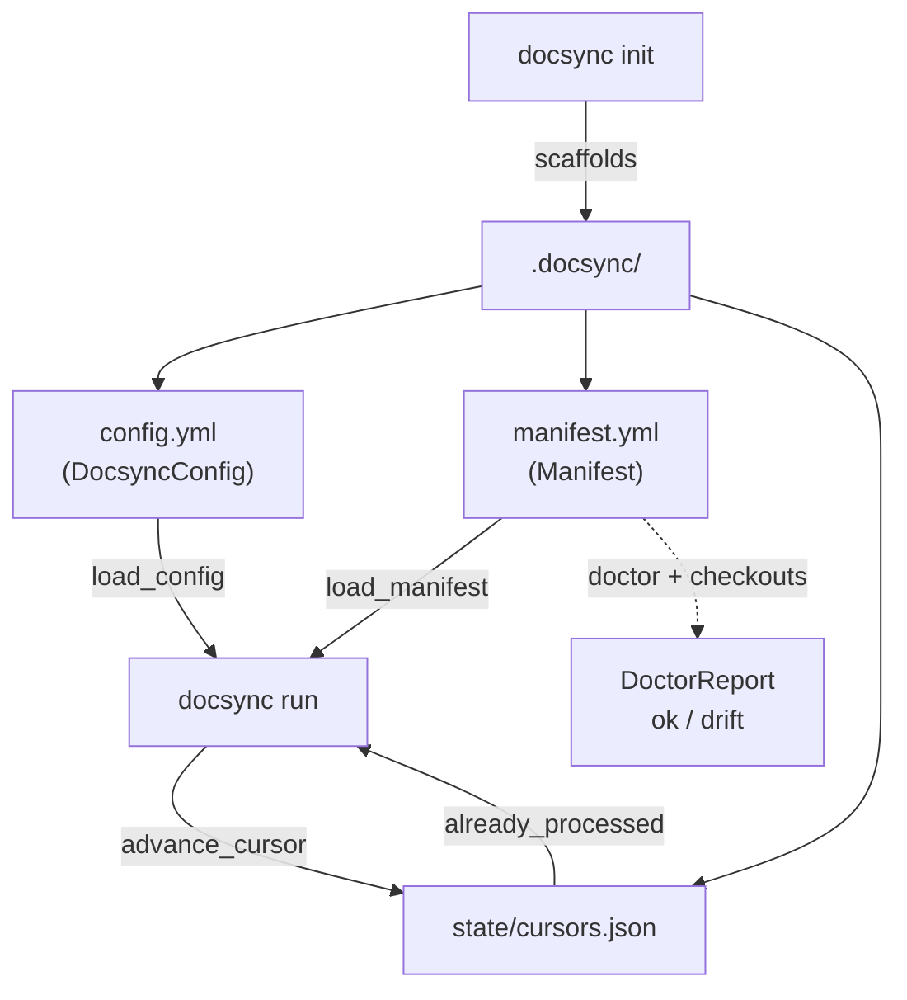

Everything docsync needs to keep your documentation in sync with your code lives in a single directory inside your **docs repository**: `.docsync/`. There is no global install state and no database — the config, the page-to-source mapping, and the "what have I already processed" bookkeeping are all plain files you can read, diff, and commit.

This page explains what each file does, how docsync loads it, and which knobs to turn when you adopt docsync for a new project.

## The `.docsync/` directory

The location is fixed by the `DOCSYNC_DIR` constant (`.docsync`) and resolved relative to your docs repo root by `docsync_dir(docs_repo)`. Three artifacts live inside it:

<CardGroup cols={3}>
  <Card title="config.yml" icon="sliders">
    Models, cost thresholds, reviewers, and PR settings — the `DocsyncConfig` model. Loaded by `load_config`.
  </Card>
  <Card title="manifest.yml" icon="map">
    The heart of mapping: every doc page paired with the source code it documents. Loaded by `load_manifest`.
  </Card>
  <Card title="state/cursors.json" icon="bookmark">
    The only mutable, persisted state — last processed commit per source repo, for idempotency.
  </Card>
</CardGroup>

```
.docsync/
  config.yml          # DocsyncConfig (models, thresholds, reviewers)
  manifest.yml        # Manifest (page <-> source mapping) — the heart of mapping
  state/cursors.json  # last processed head_sha per source repo (idempotency)
```

<Note>
  These filenames are not magic strings scattered through the codebase — they are the `CONFIG_FILE`, `MANIFEST_FILE`, and `CURSORS_FILE` constants in `docsync/config.py`. The scaffolding and validation helpers import those same constants, so the layout the tools create always matches the layout the loaders expect.
</Note>

## How the files are loaded

docsync uses **two** YAML parsers on purpose, and the distinction matters when you understand why your manifest comments survive an automated edit.

```python
_yaml = YAML(typ="safe")   # fast, strips comments — used for reading

_rt_yaml = YAML()          # round-trip mode — preserves comments + key order
_rt_yaml.preserve_quotes = True
_rt_yaml.indent(mapping=2, sequence=4, offset=2)
```

- **Reading** (`load_config`, `load_manifest`, `doctor`) goes through the safe loader. It is fast and just produces plain data for validation.
- **Editing the manifest in place** (`merge_manifest_pages`) goes through the round-trip loader so your hand-authored comments and key order are preserved on dump.

<Warning>
  Never merge manifest edits through the safe `_yaml` instance — it strips comments. The curated header and inline guidance in `manifest.yml` are part of how the file stays maintainable, and the round-trip instance exists specifically to protect them.
</Warning>

The two loaders also differ in how they treat a missing file, which encodes a design decision about what is optional and what is mandatory:

| Loader | If the file is missing |
|--------|------------------------|
| `load_config` | Returns `DocsyncConfig()` — **defaults**. Config is optional. |
| `load_manifest` | Raises `FileNotFoundError`. A docsync-enabled repo **must** map pages to source. |

In other words: you can run docsync with no `config.yml` at all and get sensible defaults, but you cannot run it without a manifest — there would be nothing to map.

## `config.yml` — models, cost, and PR behavior

`config.yml` deserializes into the `DocsyncConfig` model. The scaffolder seeds a starter file directly from the model's real defaults (`_config_template` reads `DocsyncConfig().models` rather than hardcoding ids), so the template never drifts from the code. Here is what `docsync init` writes:

```yaml
# docsync config — see DocsyncConfig in models.py for all options.
models:
  edit_model: <from model defaults>
  judge_model: <from model defaults>
  edit_effort: <from model defaults>
# Root of the docs tree, relative to this repo (where page paths resolve).
docs_root: "."
# GitHub handles requested as reviewers on opened doc-update PRs.
reviewers: []
# Labels applied to opened docs PRs (auto-created in this repo if missing).
pr_labels: [docsync]
# Ship-safety: skip the edit stage for pages below this impact confidence
# (0-1). 0 = off. Raise (e.g. 0.7) for a conservative first rollout.
min_edit_confidence: 0.0
# Max concurrent LLM requests across the judge + edit stages.
max_parallel_requests: 4
# Cap on pages edited per run (0 = unlimited); highest-confidence first.
max_pages_per_run: 0
```

### What each knob controls

<Steps>
  <Step title="Doc adapter: docs_root">
    Page paths in the manifest resolve relative to `docs_root` under the docs repo. Set it to `"."` when your `.mdx` files sit at the repo root, or to a subdirectory (e.g. `"docs"`) when they are nested.
  </Step>
  <Step title="Models & effort">
    `edit_model` drives the page-editing stage, `judge_model` the evaluation stage, and `edit_effort` tunes how hard the editor works. Defaults come from the `ModelConfig` model — leave them unless you have a reason to override.
  </Step>
  <Step title="Cost & throughput thresholds">
    Three settings bound how much work — and spend — a single run can incur:
    - `max_parallel_requests` caps concurrent LLM calls across the judge **and** edit stages.
    - `max_pages_per_run` caps how many pages get edited per run (`0` = unlimited), processing **highest-confidence pages first**.
    - `min_edit_confidence` (0–1) skips the edit stage entirely for low-confidence pages; `0` disables the gate.
  </Step>
  <Step title="PR settings">
    `reviewers` are GitHub handles requested on each opened doc-update PR, and `pr_labels` are applied to those PRs (auto-created in the repo if they don't exist yet).
  </Step>
</Steps>

<Note>
  For a conservative first rollout, raise `min_edit_confidence` (the comment suggests `0.7`) and set a small `max_pages_per_run`. Because pages are edited highest-confidence-first, a low cap still spends your budget on the changes docsync is most sure about.
</Note>

## `manifest.yml` — mapping pages to source code

The manifest is where docsync learns *which code each doc page describes*. Each entry is a `ManifestPage`: a doc `path` plus a list of `sources`, where every source names a `repo` and optionally narrows to specific `globs` and `symbols`.

```yaml
pages:
  - path: example-page.mdx          # page path, relative to docs_root
    sources:
      - repo: owner/your-service    # matches the source repo (owner/name)
        globs:                      # fnmatch globs over changed file paths
          - "src/routes/*.py"
        symbols:                    # symbol names (trailing * = prefix)
          - get_app
    max_diff_lines: 60              # per-page net-changed-lines guardrail
```

These three fields are the **anchors** that drive impact mapping: when a source repo changes, docsync matches the changed files against each page's `globs` (using `fnmatch`) and `symbols` (a trailing `*` means prefix match) to decide which pages a commit could have invalidated.

### Per-page guardrails

`ManifestPage` carries a few optional knobs beyond the source mapping. `merge_manifest_pages` only writes them when they differ from the model defaults, keeping the manifest diff small:

| Field | Purpose |
|-------|---------|
| `max_diff_lines` | A per-page guardrail on net changed lines for an edit. Only emitted when it differs from the model default. |
| `allow_frontmatter_edit` | Permits edits to the page's YAML frontmatter. Off by default; only written when `True`. |
| `judge_required` | Forces the judge stage for this page. Off by default; only written when `True`. |

### Appending pages without clobbering comments

`merge_manifest_pages` adds new pages to an existing manifest while preserving its curated comments. It is **idempotent on `path`** — a page already present is skipped — and returns only the paths it actually added:

```python
existing = {p.get("path") for p in data["pages"] if isinstance(p, dict)}
added: list[str] = []
for page in pages:
    if page.path in existing:
        continue
    data["pages"].append(_manifest_page_dict(page))
    existing.add(page.path)
    added.append(page.path)
```

If the manifest doesn't exist yet, it is created with the `_FRESH_MANIFEST_HEADER` explaining what the file is for and how it is maintained (`docsync bootstrap` to add anchors, `docsync doctor` to keep them honest).

## `state/cursors.json` — idempotency

Cursors are the one piece of mutable state docsync persists, and they exist to prevent re-processing the same commit twice. The file is a flat map of source repo → last processed `head_sha`:

```json
{
  "owner/your-service": "a1b2c3d4..."
}
```

Four helpers manage it:

- `load_cursors` / `save_cursors` — read and write the JSON (sorted keys, trailing newline).
- `already_processed(docs_repo, repo, head_sha)` — the idempotency check: has this exact commit for this repo already produced a PR?
- `advance_cursor(docs_repo, repo, head_sha)` — record a commit as processed after a successful run.

<Note>
  Cursors are committed back to the docs repo by the GitHub Action. That's what makes a docsync run safe to re-trigger: `already_processed` returns `True` for a `head_sha` it has seen, so a replay produces no duplicate PR.
</Note>

## Onboarding: scaffold then validate

Two helpers sit in front of the rest of the pipeline so adopting docsync doesn't mean hand-authoring config and manifest from scratch.

<Tabs>
  <Tab title="docsync init — scaffold">
    `init_docs_repo(docs_repo, force=False)` writes a minimal, **valid** `.docsync/` skeleton: a `config.yml` seeded from real model defaults, a commented `manifest.yml` template, and `state/cursors.json` containing `{}`.

    Existing files are left untouched unless `force=True`, and only files actually written are returned — so re-running `init` won't overwrite work you've already done.

    ```python
    created = init_docs_repo(Path("keep-developer-docs"))
    # -> [.docsync/config.yml, .docsync/manifest.yml, .docsync/state/cursors.json]
    ```

    The manifest template intentionally points at a **placeholder** repo and page, so `doctor` will flag it until you edit it to real values.
  </Tab>
  <Tab title="docsync doctor — validate">
    `doctor(docs_repo, checkouts)` re-resolves your manifest against real source checkouts and reports drift that would silently break anchor mapping. It returns a `DoctorReport`:

    ```python
    class DoctorReport(BaseModel):
        ok: bool = True
        missing_pages: list[str]      # page path not found under docs_root
        dead_globs: list[DeadGlob]    # glob matches no file in its checkout
        missing_symbols: list[MissingSymbol]  # symbol not found textually
        unmapped_repos: list[str]     # source repo has no provided checkout
    ```

    Crucially, `ok` is `True` **iff there are no hard issues** — missing pages or dead globs. Missing symbols are *warnings only*: symbol drift degrades anchor recall but does not by itself break mapping, so it does not flip `ok`.
  </Tab>
</Tabs>

### How doctor matches repos to checkouts

Both `doctor` and the live mapping must agree on what counts as "the same repo," even when one side says `owner/name` and the other provides a bare `name` checkout. They reconcile through the **same** normalization function — `_repo_key` from the impact module:

```python
def _resolve_checkout(source_repo, checkouts):
    target = _repo_key(source_repo)
    for key, path in checkouts.items():
        if _repo_key(key) == target:
            return Path(path)
    return None
```

<Warning>
  Because `doctor` reuses `docsync.config`'s path constants and `docsync.impact._repo_key`, its diagnostics match how mapping actually behaves at runtime. A glob `doctor` calls dead is genuinely dead for impact mapping; a repo it calls unmapped is genuinely skipped. Treat a non-`ok` report as a real break, not a lint nit.
</Warning>

## Putting it together



A typical adoption looks like: run `docsync init` to scaffold the directory, edit `manifest.yml` so each page points at the real code it documents, tune `config.yml` thresholds for a cautious first run, then use `docsync doctor` to confirm every anchor still resolves before you let the pipeline open PRs. From then on, cursors keep each run idempotent and the round-trip YAML loader keeps your manifest's comments intact as docsync appends new pages over time.