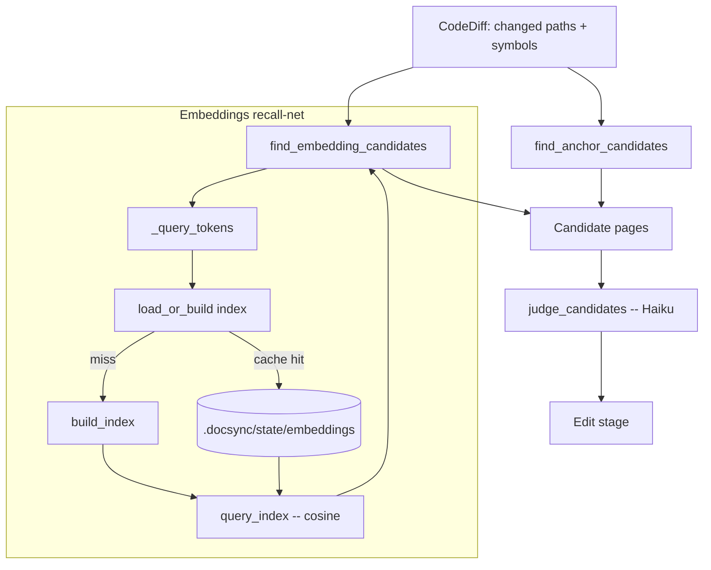

When a code diff lands, docsync has to answer one question: **which documentation pages does this change invalidate?** The deterministic answer comes from *anchors* — manifest-declared globs and symbols. But anchors only cover pages someone remembered to wire up. Pages with stale or missing anchors silently drift out of date.

The embeddings layer is the **recall-net** that catches that drift. It builds a semantic index over the docs, ranks every page against the identifier tokens in the diff, and surfaces the closest matches — even when no anchor points at them. Because semantic similarity is fuzzy, every page it surfaces is then handed to an LLM judge for confirmation before it reaches the expensive edit stage.

<Note>
The embeddings layer is **optional**. It depends on the `sentence-transformers` extra. When that extra isn't installed, the recall-net returns nothing and docsync degrades gracefully to anchors only.
</Note>

## Where it fits in the pipeline

Doc-impact mapping (`impact.py`) is a hybrid, anchor-first pipeline with three stages. Embeddings are stage 2 — a semantic fallback between deterministic anchors and the LLM judge.

<CardGroup cols={3}>
  <Card title="1. Anchors" icon="anchor">
    Deterministic. Match the diff's changed paths and symbols against each manifest page's declared `globs` and `symbols`. High precision; can auto-pass straight past the judge.
  </Card>
  <Card title="2. Embeddings" icon="magnifying-glass">
    Optional recall-net. Rank doc chunks by cosine similarity to the diff's identifier tokens. Catches pages the manifest doesn't anchor.
  </Card>
  <Card title="3. Judge" icon="gavel">
    A Haiku LLM confirms each candidate page is genuinely invalidated by the change before it reaches the edit stage.
  </Card>
</CardGroup>



## The encoder is injectable

The whole module is built around one type alias:

```python
# An encoder turns a list of texts into a 2-D float array (n_texts, dim).
Encoder = Callable[[list[str]], "np.ndarray"]
```

Indexing, caching, and querying never import `torch` or `sentence-transformers` directly — they only call whatever `Encoder` they're handed. That decoupling has two payoffs:

- **Testability** — a tiny deterministic fake encoder exercises the full index/cache/query path with no model download and no heavy dependency.
- **Graceful degradation** — production calls `default_encoder()`, which *lazily* loads `all-MiniLM-L6-v2`. If the optional extra is missing, the import raises `ImportError`, which callers treat as "recall-net unavailable."

```python
def default_encoder(model_name: str = DEFAULT_MODEL) -> Encoder:
    from sentence_transformers import SentenceTransformer  # optional extra
    model = SentenceTransformer(model_name)

    def _encode(texts: list[str]) -> np.ndarray:
        return np.asarray(model.encode(list(texts)), dtype=np.float32)

    return _encode
```

<Note>
Vectors are **L2-normalized at build time** (`_normalize`), so a query reduces to a single dot product — cosine similarity becomes plain matrix multiplication at query time. Zero-norm rows are clamped to `1e-12` to avoid division by zero.
</Note>

## Building the index

`build_index` turns a docs tree into a `DocIndex` — a normalized matrix plus the provenance needed to cache it.

<Steps>
  <Step title="Chunk the docs by heading">
    `iter_doc_chunks` walks every `*.mdx` under `docs_root` (or just the pages you pass in) and yields `(relative_page_path, chunk_text)` pairs. A chunk runs from one `#`-prefixed heading to the next, so each section becomes its own embeddable unit.
  </Step>
  <Step title="Compute a content hash">
    `chunks_content_hash` builds a stable SHA-256 over every `(page_path, chunk_text)` pair plus the model name. It is **content-based, not mtime-based**, so two checkouts with identical docs produce the same key and can share a cache across machines and CI runs.
  </Step>
  <Step title="Encode and normalize">
    The encoder turns all chunk texts into vectors, which `_normalize` scales to unit length. The result is a `DocIndex` carrying the model name, content hash, one `page_path` per row, and the `(n_chunks, dim)` matrix.
  </Step>
</Steps>

```python
def build_index(docs_root, *, model_name=DEFAULT_MODEL, encoder=None, page_paths=None) -> DocIndex:
    chunks = list(iter_doc_chunks(docs_root, page_paths))
    enc = encoder or default_encoder(model_name)
    content_hash = chunks_content_hash(chunks, model_name)
    if not chunks:
        return DocIndex(model_name, content_hash, [], np.zeros((0, 0), dtype=np.float32))
    vectors = _normalize(enc([c for _, c in chunks]))
    return DocIndex(model_name, content_hash, [p for p, _ in chunks], vectors)
```

An empty docs tree is handled explicitly: no chunks means an empty `(0, 0)` matrix rather than a crash.

### Caching on disk

`DocIndex` persists as two files in a cache directory: `vectors.npy` (the matrix, via `np.save`) and `index.json` (the model name, content hash, and page paths). This is exactly what the CI `actions/cache` step on `.docsync/state/embeddings` snapshots between runs.

`load_or_build` ties caching together. It recomputes the *expected* content hash from the current docs, then decides whether the cache is still valid:

```python
def load_or_build(docs_root, cache_dir, *, model_name=DEFAULT_MODEL, encoder=None, page_paths=None):
    want = chunks_content_hash(list(iter_doc_chunks(docs_root, page_paths)), model_name)
    if cache_dir is not None:
        cached = DocIndex.load(cache_dir)
        if cached is not None and cached.content_hash == want and cached.model_name == model_name:
            return cached
    index = build_index(docs_root, model_name=model_name, encoder=encoder, page_paths=page_paths)
    if cache_dir is not None:
        index.save(cache_dir)
    return index
```

A cached index is reused **only** if both its content hash and model name still match. Any drift in the docs (or a model swap) invalidates the cache and triggers a fresh embedding pass. Passing `cache_dir=None` disables caching entirely and always rebuilds. `DocIndex.load` is defensive: a missing file or corrupt JSON/`.npy` returns `None`, which falls through to a rebuild rather than an error.

## Querying the index

`query_index` ranks pages by their **best-chunk** cosine similarity to a query string. Because vectors are pre-normalized, a query is one encode plus one dot product against the matrix.

```python
def query_index(index, query_text, *, encoder=None, model_name=DEFAULT_MODEL,
                top_k: int = 5, floor: float = 0.2) -> list[tuple[str, float]]:
    """Rank pages by best-chunk cosine similarity to `query_text`.

    Returns up to `top_k` (page_path, score) pairs with score >= `floor`, highest first.
    """
```

Two parameters keep the output tight:

- **`floor`** (default `0.2`) drops weak matches — anything below the cosine floor is noise.
- **`top_k`** (default `5`) caps how many pages survive, highest score first.

Because each page can contribute several chunks, scoring takes the *best* chunk per page so one strongly-matching section is enough to surface a page.

## From diff to candidates

`find_embedding_candidates` in `impact.py` is the bridge between a `CodeDiff` and the index. It decides *what to embed*, runs the query, and wraps the results as `ImpactCandidate`s tagged `CandidateSource.EMBEDDING`.

### What gets embedded: identifier tokens

The query is not the raw diff — it's a deduplicated bag of **identifier tokens**: the diff's changed symbols, plus the *basenames* (stems) of changed file paths, minus any configured stopword symbols.

```python
def _query_tokens(diff: CodeDiff, config: DocsyncConfig) -> list[str]:
    stop = {s.lower() for s in config.stopword_symbols}
    tokens: list[str] = []

    for symbol in diff.all_symbols():
        if symbol.lower() not in stop:
            tokens.append(symbol)

    for path in diff.changed_paths():
        base = Path(path).name
        stem = base.rsplit(".", 1)[0] if "." in base else base
        if stem and stem.lower() not in stop:
            tokens.append(stem)

    # Dedupe, preserving order.
    seen, out = set(), []
    for tok in tokens:
        if tok not in seen:
            seen.add(tok); out.append(tok)
    return out
```

If there are no usable tokens, `find_embedding_candidates` returns `[]` immediately — there's nothing to search for.

### Whole-tree vs. scoped recall

The `pages` argument controls breadth:

- `pages=None` scans the **whole docs tree** — the true recall-net over pages the manifest never anchors.
- A list of `ManifestPage`s narrows the index to just those pages' paths.

<Warning>
Excluding pages that anchors already matched is the **caller's job**, not this function's. `find_embedding_candidates` happily re-ranks anchored pages if you don't filter them out first.
</Warning>

### Putting it together

```python
def find_embedding_candidates(diff, docs_root, pages, config, *,
                              cache_dir=None, encoder=None, top_k=None):
    query_tokens = _query_tokens(diff, config)
    if not query_tokens:
        return []

    enc = encoder
    if enc is None:
        try:
            enc = embeddings_mod.default_encoder(config.embedding_model)
        except ImportError:
            return []  # `embeddings` extra absent — recall-net unavailable

    page_paths = [p.path for p in pages] if pages is not None else None
    index = embeddings_mod.load_or_build(
        docs_root, cache_dir,
        model_name=config.embedding_model, encoder=enc, page_paths=page_paths,
    )
    ranked = embeddings_mod.query_index(
        index, " ".join(query_tokens), encoder=enc,
        model_name=config.embedding_model,
        top_k=top_k or config.embedding_top_k,
        floor=config.embedding_floor,
    )
    return [
        ImpactCandidate(
            page_path=page_path,
            source=CandidateSource.EMBEDDING,
            score=score,
            reason=f"semantic match (cos={score:.2f}) on: {', '.join(query_tokens[:8])}",
        )
        for page_path, score in ranked
    ]
```

Notice the configuration knobs all flow from `DocsyncConfig`: `embedding_model`, `embedding_top_k`, and `embedding_floor`. Each candidate's `reason` records the cosine score and the first eight query tokens, so a human (or the judge) can see *why* a page was surfaced.

### Worked example

Suppose a diff renames a metrics emitter and touches a config file:

- Changed symbols: `emit_alert_latency`, `ALERT_LATENCY_BUCKETS`
- Changed paths: `src/metrics/latency.py`, `config/observability.yaml`

`_query_tokens` produces (stopwords aside): `["emit_alert_latency", "ALERT_LATENCY_BUCKETS", "latency", "observability"]`. That string is embedded and matched against the index. A docs page titled *"Latency metrics"* — one that no manifest source happened to anchor — scores `cos=0.41`, clears the `0.2` floor, and comes back as:

```text
ImpactCandidate(
  page_path="concepts/latency-metrics.mdx",
  source=EMBEDDING,
  score=0.41,
  reason="semantic match (cos=0.41) on: emit_alert_latency, ALERT_LATENCY_BUCKETS, latency, observability",
)
```

Anchors would have missed this page entirely. The recall-net catches it — and the judge gets the final say.

## Validating candidates: the judge

Semantic similarity is recall-oriented: it errs toward surfacing pages, which means false positives. The judge (`judge_candidates`, a Haiku LLM) is the precision gate that protects the expensive edit stage from acting on a page the change doesn't actually invalidate.

Its system prompt is deliberately conservative:

```python
_JUDGE_SYSTEM = (
    "You decide whether a documentation page is invalidated by a code change. "
    "Answer affected=true only if the diff changes something the page documents "
    "(routes, env vars, schemas, metrics, behavior). Be conservative: prefer "
    "affected=false when the change is internal/refactoring and does not alter "
    "anything a reader of the page would observe. Provide a calibrated confidence "
    "in [0, 1] and a one-sentence reason."
)
```

A couple of practical details shape the judge's cost and behavior:

- **Bounded page text.** Only the first `_MAX_PAGE_CHARS` (`6000`) characters of a page are fed in — enough to judge relevance while keeping the prompt cheap and well inside Haiku's window.
- **Anchors can skip the judge.** When `config.anchor_autopass` is set, high-precision anchor matches bypass the judge entirely. Embedding candidates, being fuzzier, always go through it.

The judge returns a `JudgeVerdict` (`affected`, a calibrated confidence in `[0, 1]`, and a one-sentence reason). Only pages it confirms as `affected=true` advance to be rewritten.

## Why this design holds up

<CardGroup cols={2}>
  <Card title="Recall without precision loss" icon="shield-check">
    Embeddings cast a wide, fuzzy net; the LLM judge tightens it back down. You get coverage of un-anchored pages without flooding the edit stage with false positives.
  </Card>
  <Card title="Cheap on re-runs" icon="bolt">
    Content-hashed disk caching means an unchanged docs tree reuses last run's embeddings — no re-encoding, which is what the CI cache on `.docsync/state/embeddings` exploits.
  </Card>
  <Card title="No hard dependency" icon="plug">
    The injectable `Encoder` keeps `sentence-transformers` optional and the core logic unit-testable. Missing extra → empty recall-net, never a crash.
  </Card>
  <Card title="Reproducible everywhere" icon="copy">
    Content-based hashing (not mtimes) means identical docs yield identical cache keys across machines and CI checkouts.
  </Card>
</CardGroup>