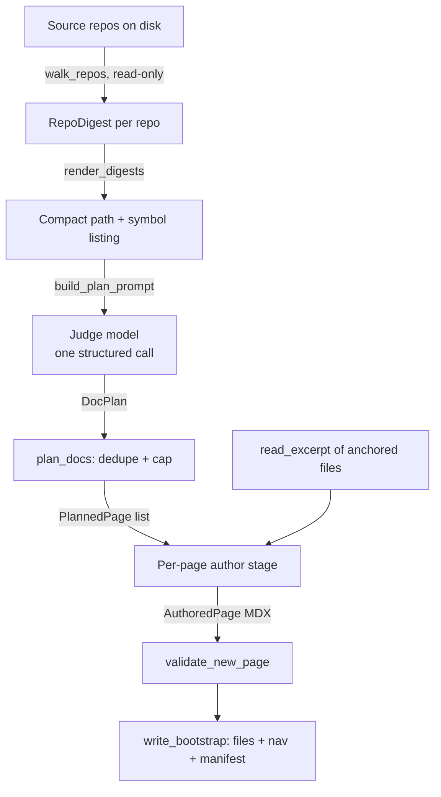

docsync is a tool that generates and maintains a documentation site from source code. It has two modes: an **update pipeline** that edits *existing* pages from a code diff, and a **bootstrap** flow that authors a *whole site from scratch* given a snapshot of one or more repositories. This page walks through the bootstrap flow, which is built from three core phases — **ingest**, **plan**, and **author** — plus the validate/emit/PR steps that wrap them.

<Note>
Bootstrap and the update pipeline are complementary. The update pipeline (`pipeline.py`) starts from a *diff* and surgically edits pages that already exist. Bootstrap (`bootstrap.py`) starts from a *snapshot* and produces a structured, sequenced site where none existed before. Both share the same data contracts in `models.py` and both meter every LLM call through an injectable `client`.
</Note>

## The shape of a bootstrap run

The `bootstrap` module documents its own stages, B1 through B6:

```text
B1 ingest   → RepoDigest per repo (ingest.walk_repos, read-only)
B2 plan     → DocPlan: an ordered, sectioned IA (one judge-model call) + dedupe
B3 author   → full MDX per page, kind-specific prompt (Opus, parallel, metered)
B4 validate → validate_new_page (absolute gates — no original to diff)
B5 emit     → write files + ordered nav sections + manifest anchors (write_bootstrap)
B6 PR       → pr.open_pr (the CLI wires this)
```

The three phases this page focuses on are **B1 ingest**, **B2 plan**, and **B3 author** — the path from raw source files to finished MDX. The diagram below shows how data flows between them.



<CardGroup cols={3}>
  <Card title="B1 — Ingest" icon="folder-tree">
    Walk each repo read-only and distill every source file into a lightweight `SourceUnit` (path, kind, top-level symbol names — never the body).
  </Card>
  <Card title="B2 — Plan" icon="sitemap">
    One judge-model call turns the digests into a `DocPlan`: an ordered, sectioned information architecture, then dedupe against what already exists.
  </Card>
  <Card title="B3 — Author" icon="pen-nib">
    For each planned page, read excerpts of its anchored source and ask the author model to write a complete MDX page — in parallel, metered.
  </Card>
</CardGroup>

## Phase B1 — Ingest: a lightweight snapshot

Ingest lives in `ingest.py`. Its job is to turn a set of repositories into something small enough to hand an LLM in a single prompt. The key insight, stated in the module docstring, is that bootstrap starts from a *snapshot* rather than a diff, so it walks the whole repo but reads as little as possible from each file.

### Walking a repo, read-only

`walk_repo()` performs a strictly read-only `os.walk` over a checkout. It never writes to the repo. Two mechanisms keep the walk cheap:

- **Directory pruning.** Directories in `DEFAULT_EXCLUDE_DIRS` — `.git`, `node_modules`, `.venv`, `__pycache__`, `dist`, `build`, `tests`, `migrations`, `.docsync`, and others — are pruned *in place* so `os.walk` never even descends into them.
- **Include globs.** Only files whose basename matches `DEFAULT_INCLUDE` (`*.py`, `*.ts`, `*.tsx`) are read.

Each matched file becomes a `SourceUnit`:

```python
units.append(
    SourceUnit(path=rel, kind=_kind(rel), symbols=extract_symbols(rel, text))
)
```

A `SourceUnit` is deliberately tiny — it holds only the repo-relative `path`, a coarse `kind` tag (`"python"`, `"typescript"`, or `"other"`), and a list of top-level `symbols`. **The file body is never stored.** As the `SourceUnit` docstring puts it: a whole service repo's worth of these has to fit in the planner's context, so excerpts are fetched per-page only at author time.

Units are returned in sorted path order for determinism, and an optional `max_files` cap (0 = unlimited) bounds how many files are ingested.

### Extracting symbols

`extract_symbols()` dispatches by language:

<Tabs>
  <Tab title="Python (AST)">
    `_python_symbols()` parses the file with `ast.parse` and collects **only module-level** function/class definitions and module-level assignment names. Nested helpers and methods are intentionally skipped — they are "noise for anchoring." If the file fails to parse (syntax error, partial file, Python 2), it falls back to a line regex (`_PY_DEF_OR_CLASS`) so ingest never crashes on one bad file.
  </Tab>
  <Tab title="TypeScript (regex)">
    There is no TS parser in-tree, so `_TS_EXPORT_RE` does a best-effort scan for top-level `export` declarations — `function`, `const`, `let`, `var`, `class`, `interface`, `type`, and `enum`.
  </Tab>
  <Tab title="Other">
    Any other file kind returns an empty symbol list.
  </Tab>
</Tabs>

### Ingesting a whole platform

`walk_repos()` takes a list of `(repo_id, path)` pairs and returns one `RepoDigest` per repo, in spec order. Each walk is independent and read-only. This is what lets bootstrap plan a *cross-repo* site — for example, ingesting all four Keep services for a single platform-wide doc plan.

```python
digests = walk_repos([
    ("keep-api-gateway", "/path/to/keep-api-gateway"),
    ("keep-event-handler", "/path/to/keep-event-handler"),
    ("keep-workflows", "/path/to/keep-workflows"),
    ("keep-ui", "/path/to/keep-ui"),
])
```

A `RepoDigest` bundles the `repo` id, the absolute `root` it was walked from, and the list of `units`.

## Phase B2 — Plan: an LLM-designed information architecture

Planning lives in `bootstrap.plan_docs()` and is the only place bootstrap asks the *judge* model to design the site. It runs as a **single structured call**.

### Rendering digests for the prompt

Before prompting, `render_digests()` flattens the digests into a compact, per-repo listing of files and their top-level symbols:

```text
## repo: keep-api-gateway
- src/routes/alerts.py  ::  router, get_alerts, create_alert
- src/services/search_engine.py  ::  SearchEngine
…
```

To stop a large platform from overflowing the planner's context, each repo's block is capped at `_DIGEST_MAX_CHARS_PER_REPO` (12,000 chars). When the budget is hit, the listing is truncated with a marker noting how many files were dropped.

### What the planner is asked to produce

`build_plan_prompt()` constructs the system and user messages. The system prompt frames the model as a senior technical writer designing a *complete site* for a platform with no docs, and is specific about the output. It also injects a **size target** derived from `config.thoroughness` (`light | medium | high`, via `_PLAN_SIZE_TARGET`): `light` plans a small, essential spine (~3–6 pages), `medium` a focused site (~7–15 pages), and `high` a comprehensive page-per-subsystem layout; it defaults to `medium` when unset. The system prompt then continues:

- Organize pages into **ordered sections**, using the vocabulary and order of `SECTION_ORDER` where they apply: **Getting Started → Concepts → Architecture → Reference → Operations**.
- Use three page **kinds**:
  - `guide` — task-oriented onboarding (Getting Started, how-to, setup/run).
  - `concept` — narrative explanations of a subsystem or cross-service flow (prose, not API tables).
  - `reference` — code-anchored API / data-model pages.
- Each page must provide a `page_path` (a new kebab-case `.mdx` under a section folder), `title`, `kind`, `section`, `order`, a one-sentence `summary`, and **sources** anchoring it to real code.

The anchoring rule is the heart of how the site stays maintainable: **reference pages anchor to specific files + symbols; concept/guide pages anchor to broader globs** over the subsystem(s) they describe, with few or no symbols. Every page must carry at least one source with a real repo from the list, and the planner is told not to propose a page whose path or route already exists.

The user message embeds the rendered digests and an explicit list of pages/routes that **already exist** (from `_existing_page_paths()` and the adapter's `nav_routes()`), so the model avoids proposing collisions.

### The DocPlan and post-processing

The call uses the SDK's structured-output helper, validating directly against the `DocPlan` pydantic model:

```python
with cost.stage("plan"):
    resp = client.messages.parse(
        model=config.models.judge_model,
        max_tokens=_PLAN_MAX_TOKENS,
        system=[{"type": "text", "text": system}],
        messages=[{"role": "user", "content": user}],
        output_format=DocPlan,
    )
raw_plan: DocPlan = resp.parsed_output
```

A `DocPlan` is intentionally a **flat** list of `PlannedPage` objects, not nested sections — the docstring notes flat structured output is far more reliable through the CLI backend. The ordering is reconstructed in code by `DocPlan.ordered_sections()`, which:

1. Buckets pages by `section`.
2. Sorts sections by the canonical `SECTION_ORDER`, with any unknown sections appended in first-appearance order.
3. Sorts pages within a section by `(order, title)`.

After the model responds, `plan_docs()` **dedupes** the plan: it drops any planned page whose path or route collides with an existing page/route or an earlier plan entry, and returns those dropped paths as a `skipped` list. An optional `max_pages` applies *after* dedupe to cap the total.

<Note>
`PlannedPage.judge_required` is a derived property that returns `True` for `concept` and `guide` kinds. This is what keeps narrative pages live without thrashing: because they anchor to a whole subsystem, an "autopass" would fire a costly edit on every change in that subsystem. Routing them through the judge means an edit only happens when a change actually invalidates the page. Reference pages, with precise anchors, can autopass.
</Note>

## Phase B3 — Author: full MDX, page by page

With a deduped plan in hand, bootstrap authors each page. As the module docstring notes, this stage uses **Opus**, runs **in parallel**, and is **metered** — and unlike the update pipeline, it writes a full page from a kind-specific prompt rather than editing an existing one.

### Resolving a page's source code

A `PlannedPage` carries `sources` — a list of `PlannedSource`, each with a `repo`, fnmatch `globs`, and optional `symbols`. To author the page, bootstrap resolves those anchors back to real files. `_repo_units()` builds a map from repo id to its `(root, [unit paths])`, and the planned globs are matched against those paths with `fnmatch`. Up to `_MAX_EXCERPT_FILES` (6) files are excerpted into the author prompt.

The actual file text — never stored during ingest — is read here, lazily, with `read_excerpt()`:

```python
def read_excerpt(root, rel_path, *, max_chars=_EXCERPT_MAX_CHARS) -> str:
    fp = Path(root) / rel_path
    try:
        text = fp.read_text(encoding="utf-8")
    except (OSError, UnicodeDecodeError):
        return ""
    if len(text) > max_chars:
        return text[:max_chars] + "\n… (truncated)\n"
    return text
```

Two robustness choices matter here: a missing or unreadable file returns `""` so one bad path can't sink an otherwise-fine page, and content over `_EXCERPT_MAX_CHARS` (8,000) is truncated with a marker to keep the author prompt bounded.

The author stage produces an `AuthoredPage` — a structured response whose single field, `content`, is the complete `.mdx` file text including frontmatter and body.

### Why excerpts are read late, not early

The split between ingest and author is a deliberate budget strategy:

<Steps>
  <Step title="Ingest reads everything, keeps almost nothing">
    Every source file is read once to extract symbols, but only `path`, `kind`, and symbol names are retained. This keeps a whole platform small enough to plan in one prompt.
  </Step>
  <Step title="Plan decides which files matter">
    The planner anchors each page to globs/symbols. Most files in a repo never become an excerpt for any page.
  </Step>
  <Step title="Author reads bodies only for what it needs">
    Only the files anchored by a page the planner actually chose to author get their text read — and only up to 6 of them, each capped at 8,000 chars.
  </Step>
</Steps>

## Phases B4–B6 — Validate, emit, and PR

The three core phases hand off to three wrap-up steps.

**B4 — Validate.** Authored pages are checked by `validate_new_page`. Because bootstrap pages are brand new, there is no original to diff against, so validation applies *absolute gates* rather than the comparative checks the update pipeline uses.

**B5 — Emit.** `write_bootstrap` writes the page files, emits ordered nav sections (driven by `ordered_sections()` / `SECTION_ORDER`), and records **manifest anchors** so each page is mapped back to the code it documents. The path helpers `_normalize_page_path()` (a clean docs-root-relative page path, gaining the active adapter's `page_extension` — `.mdx` for Mintlify, `.md` for plain Markdown — only when the model omitted one) and `_route_of()` (the extensionless nav route) keep paths and routes consistent with the adapter's expectations. The active adapter is resolved via `make_adapter(config.adapter)`, so a non-Mintlify site emits pages without touching a nav manifest.

**B6 — PR.** The CLI wires `pr.open_pr` to open the generated site as a pull request.

<Warning>
The manifest written in B5 is what links the generated site back to the update pipeline. Narrative pages are anchored to broad subsystem globs and flagged `judge_required`, so a later `docsync run` keeps them live — re-evaluating them through the judge — without firing an edit on every unrelated change in those subsystems.
</Warning>

## Cost metering runs through every phase

A single thread runs through all of bootstrap's LLM work: **every LLM call goes through an injectable `client`, wrapped in a `MeteredClient`**, so token usage and estimated cost land on the result's `usage`. The planning call is additionally bracketed by `cost.stage("plan")`, and the author stage by its own stage, so spend is attributed per phase. This mirrors the update pipeline, where the same `MeteredClient` wrapping records usage onto `result.usage`.

## How bootstrap and the update pipeline relate

The two flows are best understood side by side.

| | Bootstrap (`bootstrap.py`) | Update pipeline (`pipeline.py`) |
|---|---|---|
| Starts from | A whole-platform **snapshot** (`RepoDigest`s) | A single **`CodeDiff`** |
| Produces | A full, sectioned site (many new pages) | Surgical edits to **existing** pages |
| Core LLM stages | Plan (judge) → Author (Opus) | Map impact → Edit → optional critique |
| Validation | `validate_new_page` (absolute gates) | `validate_page` (compares original vs. new) |
| Shared seams | `models.py` data contracts, injectable metered `client`, validation adapters (`get_adapter`) | same |

In short: bootstrap creates the site and the manifest that anchors each page to code; the update pipeline then uses that manifest to keep the site in sync as the code changes — with narrative concept/guide pages routed through the judge precisely because they were planned with broad anchors and `judge_required`.