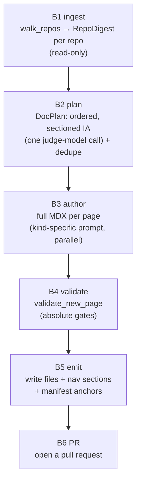

Most documentation tooling assumes one repo: the docs live next to the code, and a change in that code is "near" the page it affects. The Keep platform breaks that assumption. It is four independently-versioned repositories — `keep-ui`, `keep-api-gateway`, `keep-event-handler`, and `keep-workflows` — but a developer reading the docs wants *one* site with a coherent reading flow, where an "Introduction" or "Data Flow" page can describe how an alert crosses all four services at once.

`docsync` is built for exactly this shape: many source repos, one docs repo. This page explains the strategies it uses to make that work — how it ingests a whole platform, plans a unified site, and (most importantly) keeps every page anchored to the code it documents so updates stay coordinated.

<Note>
The docs repo (for example `keep-developer-docs`) is itself a separate repository. It owns a `.docsync/` directory holding the config, the page-to-source **manifest**, and per-repo **cursors**. The source repos are never written to — they are walked strictly read-only.
</Note>

## The core problem: docs and code live apart

When code and docs share a repo, a diff tells you almost everything: the changed files sit right next to the pages, and a human reviewer notices when one drifts from the other. Across repos, none of that holds. A change in `keep-event-handler/alert_deduplicator/` has no inherent relationship to a page in `keep-developer-docs/concepts/`. Something has to *record* that relationship.

That something is the **manifest** — the heart of multi-repo mapping. Every page declares which repos, file globs, and symbols it documents. Code changes flow in from any source repo; the manifest is what lets docsync ask "which pages does this change touch?" and act only on those.

<CardGroup cols={3}>
  <Card title="One docs repo" icon="book">
    All pages, nav, config, manifest, and cursors live in a single docs repository.
  </Card>
  <Card title="Many source repos" icon="code-branch">
    Each page anchors to one or more source repos by id, glob, and symbol.
  </Card>
  <Card title="Coordinated updates" icon="arrows-rotate">
    Changes from any repo map back to the affected pages through manifest anchors.
  </Card>
</CardGroup>

## Anchoring: the contract between a page and its code

Every page in the manifest carries a list of **sources**. A `ManifestSource` is repo-qualified, so a single page can legitimately span several repos:

```python
class ManifestSource(BaseModel):
    """One source-of-truth location a doc page is anchored to."""
    repo: str  # matches CodeDiff.repo
    globs: list[str] = Field(default_factory=list)   # fnmatch globs over changed paths
    symbols: list[str] = Field(default_factory=list)  # symbol names (supports trailing *)
```

The `repo` field is the join key. It is the same identifier used throughout the pipeline — a `RepoDigest.repo`, a `CodeDiff.repo`, a `PlannedSource.repo` — so a change arriving from `keephq/keep-api-gateway` can be matched against any page whose sources name that repo.

How precisely a page is anchored depends on its **kind**, and this distinction drives the whole maintenance strategy:

| Kind | Anchors to | Why |
|------|-----------|-----|
| `reference` | specific files **+ symbols** | precise, code-anchored API/data-model pages |
| `concept` | **broad globs** over a subsystem, few/no symbols | narrative prose about a flow, not a symbol table |
| `guide` | broad globs, loosely anchored | task-oriented onboarding |

The planner is explicitly instructed to follow this rule: *"Reference pages should anchor to specific files + symbols; concept/guide pages should anchor to BROADER globs over the subsystem(s) they describe (few/no symbols)."* That difference is not cosmetic — it changes how often a page is re-authored, as the next section explains.

## Keeping narrative pages live without churn

A concept page like "How an alert becomes an incident" anchors to a whole subsystem. If that broad anchor triggered an edit on *every* commit touching the subsystem, you would re-run a costly authoring pass constantly — most of those changes don't actually invalidate the narrative.

docsync solves this with a single derived flag, `judge_required`:

```python
@property
def judge_required(self) -> bool:
    """Narrative pages route through the judge (not anchor-autopass) when updated.

    A concept/guide page anchors to a whole subsystem, so an autopass would fire a
    costly Opus edit on every change there; routing through the judge means an edit
    only happens when the change actually invalidates the page.
    """
    return self.kind in ("concept", "guide")
```

The strategy is a deliberate split:

<Steps>
  <Step title="Reference pages autopass on their anchors">
    A precise file+symbol anchor is a strong signal. When the anchored code changes, the page almost certainly needs an edit, so the match goes straight to authoring.
  </Step>
  <Step title="Concept and guide pages route through a judge">
    Because their anchors are broad, a match is only a *candidate*. A judge model decides whether the change genuinely invalidates the narrative before any expensive edit fires.
  </Step>
</Steps>

This is why bootstrap stamps narrative pages with `judge_required` in the manifest — it is what lets `docsync run` keep them live across unrelated changes without firing an edit on every commit.

<Tip>
The same trailing-`*` symbol convention works in both `PlannedSource` and `ManifestSource` (`symbols: list[str]  # symbol names (supports trailing *)`), so a reference page can anchor to a prefix family like `process_event*` without enumerating every variant.
</Tip>

## Bootstrapping a unified site from many repos

When a platform has no docs at all, `docsync bootstrap` authors a structured, sequenced site from a whole-platform snapshot. The pipeline runs in six stages:



The multi-repo magic is concentrated in the first two stages.

### B1 — ingest every repo, read-only

`walk_repos` takes a list of `(repo_id, path)` pairs and produces one `RepoDigest` per repo. Each digest is deliberately lightweight: paths plus top-level symbol names, **never file bodies**.

```python
def walk_repos(specs, *, include_globs=DEFAULT_INCLUDE, exclude_dirs=DEFAULT_EXCLUDE_DIRS, max_files=0):
    """Read-only walk of several repos → one RepoDigest each.

    `specs` is a list of ``(repo_id, path)`` pairs. Used by `docsync bootstrap` to
    ingest a whole platform (e.g. all four Keep services) for a cross-repo doc plan.
    """
```

Why so lean? Because a whole platform's worth of digests has to fit into a *single* planner prompt. Symbol extraction is AST-based for Python (module-level defs, classes, and assignments only — nested helpers are noise for anchoring), with a regex fallback when a file won't parse and a best-effort export scan for TypeScript. Directories that never hold documentable source — `node_modules`, `tests`, `migrations`, `.git`, `.docsync`, and more — are pruned during the walk so thousands of irrelevant files are never even read.

The actual source text is fetched later, per page, only for the pages the planner decides to author (`read_excerpt`, also read-only, truncated to a budget).

### B2 — plan one site across all repos

The planner receives a compact rendering of every repo's digest and the list of pages that already exist, then returns a `DocPlan`. The system prompt names all the repos up front and tells the model the site may span them:

> *"Include platform-level narrative pages (an Introduction, an Architecture overview, a cross-service data-flow page) as concept/guide kind — these may span MULTIPLE repos."*

Two cross-repo invariants are enforced in the prompt:

<Warning>
**Every page must anchor to a real repo.** The prompt requires that *"Every page MUST have at least one source with a real repo from the list."* A page with no source has no way to ever receive coordinated updates — it would be orphaned the moment it's written.
</Warning>

The plan is kept **flat** (a section-tagged list of pages), not a nested tree, because flat structured output is far more reliable through the LLM backend. The reading-flow order is reconstructed in code afterwards by `DocPlan.ordered_sections()`, which buckets pages by section and sorts them along a canonical sequence:

```python
SECTION_ORDER: tuple[str, ...] = (
    "Getting Started",
    "Concepts",
    "Architecture",
    "Reference",
    "Operations",
)
```

Sections in `SECTION_ORDER` come first in that order; any others follow in first-appearance order, and pages within a section sort by `order` then title. This is how a flat list of pages drawn from four repos becomes one coherent, navigable site.

### Deduping against what already exists

Bootstrap is not only a green-field tool — it can extend a site that already has pages. `plan_docs` defends the existing docs against collisions:

```python
def plan_docs(digests, docs_root, config, *, client, max_pages=None):
    """Ask the judge model for a sectioned DocPlan, then dedupe collisions + cap.

    Returns (plan, skipped). `skipped` lists planned page paths dropped for colliding
    with an existing page/route or an earlier plan entry. `max_pages` caps AFTER dedupe.
    """
```

It gathers every `.mdx`/`.md` already on disk (`_existing_page_paths`, skipping anything under `.docsync`) and every existing nav route, hands both lists to the planner as "do not propose these," and then *also* drops any survivor that still collides — with an existing page, an existing route, or an earlier plan entry. The `max_pages` cap is applied **after** dedupe so the limit counts real, novel pages.

## Wiring new pages into the shared manifest

Emitting the site (B5) does more than write `.mdx` files — it appends each new page's anchors to the manifest so the update pipeline can find them later. This is the step that closes the loop between "a page exists" and "a page receives coordinated updates."

`merge_manifest_pages` is built to coexist with a hand-curated manifest:

```python
def merge_manifest_pages(docs_repo: Path, pages: list[ManifestPage]) -> list[str]:
    """Append `pages` to `.docsync/manifest.yml`, preserving existing comments.

    Idempotent on `path`: a page already in the manifest is skipped. Creates the
    manifest (with a header) if absent. Returns the page paths actually added.
    """
```

Three properties make this safe to run repeatedly against a shared file:

<CardGroup cols={3}>
  <Card title="Comment-preserving" icon="comment">
    A dedicated round-trip YAML instance (`_rt_yaml`) preserves the file's curated comments and key order. The note in `config.py` is blunt: never merge through the plain safe loader or the hand-authored comments are lost.
  </Card>
  <Card title="Idempotent on path" icon="equals">
    A page whose `path` is already in the manifest is skipped, so re-running bootstrap never duplicates anchors.
  </Card>
  <Card title="Minimal diffs" icon="minimize">
    `_manifest_page_dict` omits guardrails that match the model defaults, emitting `max_diff_lines`, `allow_frontmatter_edit`, or `judge_required` only when they differ — keeping the manifest diff small and reviewable.
  </Card>
</CardGroup>

## Idempotency across repos: per-repo cursors

The last piece of the multi-repo strategy is making sure the same change from a given repo never produces two PRs. docsync tracks, per source repo, the last head SHA it has already processed — in `.docsync/state/cursors.json`, the only mutable persisted state, committed by the GitHub Action.

```python
def already_processed(docs_repo: Path, repo: str, head_sha: str) -> bool:
    """Idempotency check: has this head_sha for this repo already produced a PR?"""
    return load_cursors(docs_repo).get(repo) == head_sha
```

Because the cursor map is keyed by `repo`, each source repository advances independently:

<Steps>
  <Step title="A change lands in one source repo">
    The Action computes that repo's new `head_sha` and checks `already_processed` against the cursor map.
  </Step>
  <Step title="docsync maps the change to affected pages">
    Using the manifest anchors, only pages naming that repo (and matching its changed globs/symbols) are candidates.
  </Step>
  <Step title="The cursor advances for that repo alone">
    After a successful run, `advance_cursor` records the new `head_sha` for *that* repo. The other three repos' cursors are untouched, so their independent histories never interfere.
  </Step>
</Steps>

This keying is what lets four repositories — each with its own CI, its own cadence, its own SHAs — feed a single docs repo without stepping on one another.

## Strategies, summarized

<CardGroup cols={2}>
  <Card title="Anchor every page to real code" icon="anchor">
    No page ships without at least one source naming a real repo. The manifest is the only thing connecting cross-repo code changes to the pages they affect.
  </Card>
  <Card title="Match anchor precision to page kind" icon="ruler">
    Reference pages get tight file+symbol anchors and autopass; concept/guide pages get broad subsystem globs and route through a judge to avoid churn.
  </Card>
  <Card title="Plan the whole platform at once" icon="sitemap">
    Ingest all repos into lightweight digests, plan one ordered, sectioned site that can span repos, and dedupe against what already exists.
  </Card>
  <Card title="Track state per source repo" icon="list-check">
    Comment-preserving, idempotent manifest merges plus per-repo cursors keep independently-versioned repos coordinated without duplication.
  </Card>
</CardGroup>

The throughline: in a multi-repo world, the relationship between docs and code is not implicit in directory layout — it has to be written down. docsync writes it down in the manifest, derives maintenance behavior from each page's kind, and uses per-repo cursors so any number of independent repositories can keep one shared documentation site honest.