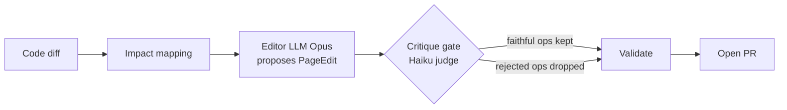

docsync generates documentation edits with a powerful model, but a generation step alone is not a quality guarantee. Two distinct mechanisms keep the output honest:

- A **critique gate** that runs after every proposed edit, asking a cheap second model whether each edit faithfully reflects the code diff that motivated it — and dropping the ones that don't.
- A **regression-eval harness** that turns docsync's overall accuracy into a single reproducible number, scoring which pages it touches against a labeled golden set of real PRs.

The first protects an individual run from hallucinated or over-reaching edits. The second protects the *project* from accuracy regressions over time. This page explains how each works and how they fit together.

<CardGroup cols={2}>
  <Card title="Critique gate" icon="shield-check">
    Stage 4.5 — an adversarial Haiku reviewer judges each edit op against the diff and flags the unjustified ones for removal before validation.
  </Card>
  <Card title="Eval harness" icon="chart-line">
    Runs docsync over a golden set of labeled PRs and reports micro-averaged precision / recall / F1 at the page level.
  </Card>
</CardGroup>

## Where critique sits in the pipeline

The docsync pipeline flows `diff → impact → edits → validate → PR`. The critique gate is **Stage 4.5**: it runs immediately after the editor (Opus) proposes a `PageEdit` for a page, and before that edit is validated.



The key idea is asymmetric cost. The editor is an expensive model that writes prose; the judge is a cheap model that answers one narrow yes/no question per edit. Spending a small Haiku call to catch a hallucinated Opus edit is far cheaper than shipping a wrong doc change — so the gate "cuts false positives at low cost."

## What the judge actually decides

The judge's entire job is **faithfulness to the diff** — nothing else. It is explicitly told *not* to assess writing quality, style, or whether the docs could be better. The reasoning rule it follows is deliberately one-sided:

<Steps>
  <Step title="Keep an op if the diff changed it">
    An op is kept when it reflects something the diff actually changed. Crucially, an op that merely *adds* undocumented-but-correct information about a real diff change is acceptable and must be kept.
  </Step>
  <Step title="Reject an op only if the diff did not change it">
    An op is rejected only when it is about something the diff never touched — a hallucinated symbol, an unrelated section, or an over-reaching rewrite of content the diff didn't motivate.
  </Step>
  <Step title="Return a flat verdict">
    The judge lists the exact <code>find</code> strings of the ops to drop, and sets <code>faithful</code> to true only when that list is empty.
  </Step>
</Steps>

The verdict is intentionally a flat model so the structured-output backend has nothing nested to validate:

```python
class CritiqueVerdict(BaseModel):
    faithful: bool
    rejected_finds: list[str] = Field(default_factory=list)
    reason: str = ""
```

- `faithful` is `True` iff every kept op is justified by the diff — i.e. there is nothing left to reject.
- `rejected_finds` holds the exact `find` strings of the ops the judge wants dropped.
- `reason` is a short, human-readable explanation of the call.

<Note>
`faithful` is purely derived from `rejected_finds`: it is true exactly when that list is empty. The two fields cannot disagree by contract.
</Note>

## How the critique call is built

The critique prompt gives the judge everything it needs to compare claims against reality: the changed paths and symbols, the rendered diff, and every proposed edit op (its `find`, `replace`, and `rationale`).

Prompt construction is split from the LLM call so it can be unit-tested without a client. `build_critique_prompt` assembles the user message:

```python
def build_critique_prompt(diff, page_path, page_edit) -> str:
    changed_paths = ", ".join(diff.changed_paths()) or "(none)"
    changed_symbols = ", ".join(diff.all_symbols()) or "(none)"
    return (
        f"# Documentation page: {page_path}\n\n"
        f"# Code change\n\n"
        f"changed paths: {changed_paths}\n"
        f"changed symbols: {changed_symbols}\n\n"
        f"{render_diff(diff)}\n\n"
        f"# Proposed edit ops\n\n"
        f"{_render_ops(page_edit)}\n\n"
        "For each op, decide whether it is DIRECTLY justified by the diff above. "
        "List the exact `find` string of every op that is NOT justified in "
        "`rejected_finds`. ..."
    )
```

The `changed_paths()` and `all_symbols()` helpers come from the shared `CodeDiff` contract — `all_symbols()` deduplicates symbol names across all changed files, giving the judge the cross-boundary signal it needs without raw line numbers.

The system prompt states the invariants (adversarial reviewer, judge faithfulness only, keep-vs-reject rules) and is sent with `cache_control: ephemeral` so the invariant prefix is cached across pages — only the per-page user message changes.

`critique_page_edit` ties it together via the shared `llm.parse` wrapper that every docsync stage uses for its structured-output call:

```python
def critique_page_edit(client, *, diff, page_path, page_edit,
                       model=None, system_extra=""):
    system_text = _build_system_prompt()
    if system_extra:
        system_text = f"{system_text}\n{system_extra}"
    user_prompt = build_critique_prompt(diff, page_path, page_edit)

    return llm.parse(
        client,
        stage="critique",
        model=model or _JUDGE_MODEL,   # "claude-haiku-4-5"
        max_tokens=_MAX_TOKENS,        # 2000 — the verdict is tiny
        system=system_text,            # wrapped in a cached system block by llm.parse
        user=user_prompt,
        output_format=CritiqueVerdict,
    )
```

A few deliberate choices worth calling out:

- **Cheap by default.** The judge model defaults to `claude-haiku-4-5` (`_JUDGE_MODEL`), and `max_tokens` is capped at `2000` (`_MAX_TOKENS`) — enough for a bool, a short list of strings, and a reason. A small budget keeps the call cheap and non-streaming.
- **Injectable client.** `client` is passed in, so tests can supply a fake and exercise the logic offline.
- **Cost-tracked.** `llm.parse` runs the call inside `cost.stage("critique")`, so its token spend is attributed to the critique stage.
- **Overridable.** `model` overrides the judge, and `system_extra` is appended to the cached system prefix when callers need to add context.

## Applying the verdict

Once the judge returns, `apply_critique` is a pure helper that produces a new `PageEdit` with the flagged ops removed. It matches ops on their exact `find` string and preserves original order:

```python
def apply_critique(page_edit, verdict) -> PageEdit:
    rejected = set(verdict.rejected_finds)
    kept = [op for op in page_edit.edits if op.find not in rejected]
    return PageEdit(edits=kept, no_change_reason=page_edit.no_change_reason)
```

<Warning>
If the judge rejects **every** op, the returned `PageEdit` has an empty `edits` list — and the pipeline then treats the page as a no-change. A page that survives the editor can still end up untouched if the critique finds nothing faithful. The input `PageEdit` is never mutated.
</Warning>

### A worked example

Suppose a diff renames the function `dedup_alert` to `deduplicate_alert`, and the Opus editor proposes two ops:

| Op | `find` | Justified by the diff? |
|----|--------|------------------------|
| #0 | `dedup_alert(...)` | Yes — the rename is in the diff |
| #1 | `the retention window defaults to 30 days` | No — the diff never touched retention |

The judge returns:

```json
{
  "faithful": false,
  "rejected_finds": ["the retention window defaults to 30 days"],
  "reason": "Op #1 describes retention behavior the diff does not change."
}
```

`apply_critique` keeps op #0 and drops op #1. The page still gets its correct rename edit, but the hallucinated retention claim never reaches validation or the PR.

## Which pages get judged at all

Not every page routes through an LLM gate. The page's `kind` decides this, via `PlannedPage.judge_required`:

```python
@property
def judge_required(self) -> bool:
    return self.kind in ("concept", "guide")
```

- **`reference`** pages are code-anchored (precise anchors) and can *autopass* — the anchor itself is strong evidence the page needs updating.
- **`concept`** and **`guide`** pages anchor to a whole subsystem. An autopass there would fire a costly Opus edit on *every* change in that subsystem. Routing them through the judge means an edit only happens when the change actually invalidates the page.

This is the same economy as the critique gate, applied one level up: spend a cheap judgment to avoid an expensive, often-unnecessary rewrite.

## Measuring accuracy: the eval harness

The critique gate improves a single run. The **eval harness** (`eval.py`) answers a different question: *is docsync getting better or worse over time?* It does so by scoring docsync against a **golden set** — labeled real PRs, each annotated with the doc pages docsync is expected to edit.

A golden case is one such PR:

```python
class GoldenCase(BaseModel):
    repo: str   # canonical owner/name (the matcher normalizes forks)
    base: str   # base ref/sha of the compare
    head: str   # head ref/sha of the compare
    label: str  # human-readable description of what the PR does
    expected_pages: list[str] = Field(default_factory=list)  # EDIT-stage expectations
```

Golden sets load from JSON via `load_golden`, which accepts either a top-level list or an object with a `"cases"` key.

### Two evaluation modes

<Tabs>
  <Tab title="map (free, no LLM)">
    `mode="map"` measures the **mapping** (recall-oriented) stage. The "actual" pages are the unique `page_path` values from `find_anchor_candidates` (optionally augmented by the embedding recall-net when `use_embeddings` is on). No judge, no editor, no cost — so it's the fast feedback loop.
  </Tab>
  <Tab title="full (end-to-end)">
    `mode="full"` runs the real LLM edit pipeline (`pipeline.run`) and takes the pages it actually *edits* (`PipelineResult.changed()`). This measures end-to-end **edit precision** and requires an Anthropic `client`. A shared `UsageMeter` accumulates token and cost usage across every case.
  </Tab>
</Tabs>

<Note>
`expected_pages` in the golden set are **edit-stage** expectations: the pages docsync should actually *edit*. Some PRs legitimately *map* a page without *editing* it — e.g. a soft-delete route that adds new, undocumented behavior, or a watcher task added in a lifespan. The mapping stage anchors those pages (a watched source file changed), but the edit stage correctly produces no change because nothing in the existing text is invalidated.

So `mode="map"` is *expected* to over-select against edit-stage labels, lowering map-mode precision. That gap between mapping recall and edit precision is the documented, intended behavior of the two-stage design — read map-mode and full-mode scores accordingly.
</Note>

### Scoring is pure and micro-averaged

Each case is scored at the page level into true positives, false positives, and false negatives. The scoring function depends only on the two page sets:

```python
def score_case(expected: set[str], actual: set[str]) -> tuple[int, int, int]:
    tp = len(expected & actual)   # pages in both
    fp = len(actual - expected)   # selected but not expected
    fn = len(expected - actual)   # expected but missed
    return tp, fp, fn
```

The aggregate **micro-averages**: it sums the confusion counts across all cases first, then computes the rates once. Larger cases therefore contribute proportionally more, and every rate guards against division by zero by returning `0.0`:

```python
def aggregate(results) -> tuple[float, float, float]:
    tp = sum(r.tp for r in results)
    fp = sum(r.fp for r in results)
    fn = sum(r.fn for r in results)
    precision = tp / (tp + fp) if (tp + fp) else 0.0
    recall    = tp / (tp + fn) if (tp + fn) else 0.0
    f1 = (2 * precision * recall / (precision + recall)
          if (precision + recall) else 0.0)
    return precision, recall, f1
```

The run produces an `EvalReport` — the per-case `CaseResult` rows plus the micro-averaged `precision`, `recall`, `f1`, the case count, and (in `mode="full"`) the accumulated `RunUsage`.

### Running the harness

`run_eval` walks every golden case, builds its diff, computes the actual pages for the chosen mode, scores it, and aggregates. The diff is built via an injectable `diff_fn(repo, base, head)` that defaults to the real GitHub path — so tests stay offline by supplying their own.

```python
report = run_eval(
    cases, docs_repo, config, manifest,
    mode="map",            # or "full" (needs client=...)
    use_embeddings=False,
    client=None,
    diff_fn=None,          # defaults to docsync.diff.diff_github
)
print(report.precision, report.recall, report.f1)
```

<Warning>
The harness is resilient by design: a failure while processing one case is caught and recorded as a case with `actual=[]` (and a note appended), rather than aborting the whole run. One broken fixture won't sink the entire report — but it *will* show up as missed pages (false negatives) for that case, so scan the per-case results, not just the aggregate.
</Warning>

## How the two mechanisms reinforce each other

The critique gate and the eval harness operate at different timescales but pull in the same direction:

| | Critique gate | Eval harness |
|---|---|---|
| **Scope** | One page in one run | The whole pipeline across many PRs |
| **Question** | "Is this edit faithful to the diff?" | "How accurate is docsync overall?" |
| **Cost** | One cheap Haiku call per page | Free in `map`; full LLM cost in `full` |
| **Output** | A filtered `PageEdit` | An `EvalReport` (precision / recall / F1) |
| **When** | Every generation, automatically | On demand, to guard against regressions |

The critique gate raises edit **precision** on the spot by dropping unfaithful ops. The eval harness *measures* that precision (in `mode="full"`) and the mapping recall (in `mode="map"`) so you can confirm the gate — and every other stage — is still doing its job as the codebase evolves. Together they make docsync's quality both **enforced per-run** and **observable over time**.